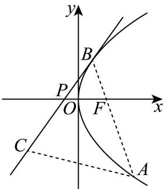
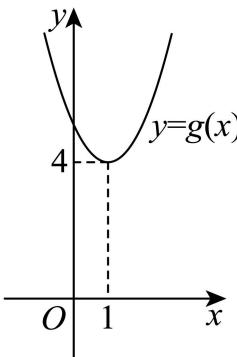
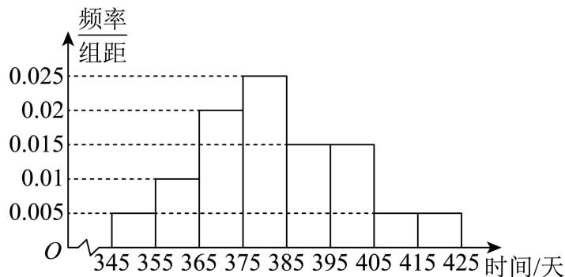
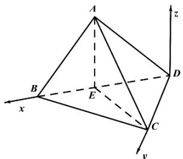

## 一、单项选择题（本题共8小题，每小题5分，共40分）

1. $\left(1 - 3\mathrm{i}\right)^2 =$ （ ）A. $-8 + 6\mathrm{i}$ B. $-8 - 6\mathrm{i}$ C. $8 + 6\mathrm{i}$ D. $8 - 6\mathrm{i}$

【详解】 $(1 - 3\mathrm{i})^2 = 1 - 6\mathrm{i} + (3\mathrm{i})^2 = 1 - 9 - 6\mathrm{i} = -8 - 6\mathrm{i}$

2. 已知集合 $A = \{0,1,3,6,9\}$ ， $B = \{x|\sqrt{x} = x\}$ ，则 $A \cap B = (\quad)$ A. $\{0,1\}$ B. $\{3,6\}$ C. $\{0,1,9\}$ D. $\{0,3,9\}$

【答案】A 【解析】

【详解】由题可得 $B = \{0,1\}$ ，所以 $A \cap B = \{0,1\}$

3. 已知 $\left|\vec{a}+\vec{b}\right|=1,\quad\left|\vec{a}-\vec{b}\right|=\sqrt{3}$ ，则 $\vec{a}\cdot\vec{b}=$ （）
A. $\frac{1}{2}$ B. $\frac{1}{3}$ C. $-\frac{1}{3}$ D. $-\frac{1}{2}$

【答案】D

【解析】

【详解】由 $\left|\vec{a}+\vec{b}\right|=1$ ，得 $\left|\vec{a}+\vec{b}\right|^{2}=1$ ，

所以 $\left(\vec{a} +\vec{b}\right)^2 = 1$ ，即 $\vec{a}^2 +2\vec{a}\cdot \vec{b} +\vec{b}^2 = 1$

由 $|\vec{a} -\vec{b}| = \sqrt{3}$ ，得 $|\vec{a} -\vec{b}|^2 = 3$

所以 $\left(\vec{a} -\vec{b}\right)^2 = 3$ ，即 $\vec{a}^2 -2\vec{a}\cdot \vec{b} +\vec{b}^2 = 3.$

两式相减，得 $4\vec{a}\cdot \vec{b} = -2$

所以 $\vec{a} \cdot \vec{b} = -\frac{1}{2}$ .

4. 已知双曲线 $C: \frac{x^2}{a^2} - \frac{y^2}{b^2} = 1 (a > 0, b > 0)$ 过点 $(1,0)$ 和 $\left(\frac{\sqrt{7}}{2}, 3\right)$ ，则双曲线 $C$ 的渐近线方程是（）A. $y = \pm 3\sqrt{2} x$ B. $y = \pm 2\sqrt{3} x$ C. $y = \pm \frac{\sqrt{3}}{6} x$ D. $y = \pm \frac{\sqrt{2}}{6} x$

【答案】B

【解析】

【分析】把点(1,0)和 $\left(\frac{\sqrt{7}}{2},3\right)$ 代入双曲线方程求出a,b，再求出渐近线方程即可.
【详解】把点(1,0)和 $\left(\frac{\sqrt{7}}{2},3\right)$ ，代入双曲线方程可得 $\left\{\begin{aligned}\frac{1}{a^{2}}=1\\\frac{7}{4}-\frac{9}{b^{2}}=1\Rightarrow\left\{\begin{aligned}a^{2}&=1\\ b^{2}&=12\\ a&>0,b>0\end{aligned}\right.\Rightarrow\left\{\begin{aligned}a&=1\\ b&=2\sqrt{3}\end{aligned}\right.,\right.$ 所以双曲线方程为 $x^{2}-\frac{y^{2}}{12}=1$ ，

故该双曲线渐近线方程为 $y = \pm 2\sqrt{3}x$ .

5. 已知棱台的上下底面均为有一个角为 $60^{\circ}$ 的菱形, 且上下底面的边长分别为 2 和 3 , 若该棱台的高为 $\sqrt{3}$ , 则该棱台的体积为 ( )

A. $\frac{19}{12}$ B. $\frac{19}{6}$ C. $\frac{19}{4}$ D. $\frac{19}{2}$

【答案】D

【解析】

【分析】分别求出棱台的上底面面积和下底面面积，再根据棱台的体积公式求得该棱台的体积.
【详解】由题意，得棱台的上底面面积为 $2\times\frac{1}{2}\times2\times2\times\sin60^{\circ}=2\sqrt{3}$ ，

下底面面积为 $2 \times \frac{1}{2} \times 3 \times 3 \times \sin 60^{\circ} = \frac{9\sqrt{3}}{2}$ ,

所以该棱台的体积为 $\frac{1}{3} \times \left(2\sqrt{3} + \sqrt{2\sqrt{3} \times \frac{9\sqrt{3}}{2}} + \frac{9\sqrt{3}}{2}\right) \times \sqrt{3} = \frac{1}{3} \times \left(2\sqrt{3} + 3\sqrt{3} + \frac{9\sqrt{3}}{2}\right) \times \sqrt{3} = \frac{19}{2}$ .

6. 现有甲、乙、丙、丁等8人分成A、B两个技术小组，要求每组4人，且甲、乙必须在一起，丙、丁不能在一起，则不同的分配方案有（）
A. 10 种    B. 12 种    C. 16 种    D. 24 种

【答案】C

【解析】

【分析】对甲、乙两人都在 A 小组和 B 小组进行分类，结合计数原理求解即可.

【详解】情况 1：甲、乙两人都在 A 小组，

安排丙、丁：丙、丁中必须有一个在 A 组，另一个在 B 组.

若丙在 A 组，丁在 B 组：此时 A 组已有 $\{甲, 乙, 丙\}$ ，还差 1 人；

$B$ 组已有{丁}，还差3人，

则从剩余 4 人中选 1 人进 A 组，方案数为 $C_{4}^{1}=4$ .

若丁在 A 组，丙在 B 组：同理，方案数为 $C_{4}^{1}=4$ .

所以当甲、乙在 A 组时，方案数为 $4 + 4 = 8$ 种.

情况 2：甲、乙两人都在 B 小组，

甲、乙在 B 组的情况与在 A 组的情况完全一致，

安排丙、丁：同样是丙在 A 组或丁在 A 组两种情况，方案数各为 $C_{4}^{1}=4$ ，

所以当甲、乙在 B 组时，方案数为 $4 + 4 = 8$ 种.

故所有分配方案共有 $8+8=16$ 种.

7. 已知 $\alpha$ 为第二象限角，且 $3\sin 2\alpha \cos \alpha = 8\sin \alpha \cos 2\alpha$ ，则 $\frac{1 + \sin \alpha}{2 - \cos \alpha} = (\quad)$ A. $\frac{3}{4}$ B. $\frac{3}{5}$ C. $\frac{1}{2}$ D. $\frac{15}{12}$

【答案】C

【解析】

【分析】利用二倍角公式化简可得 $3\cos^2\alpha = 4(2\cos^2\alpha - 1)$ ，结合角的范围分别求出 $\cos \alpha$ ， $\sin \alpha$ 即可求解.

【详解】由 $3\sin 2\alpha \cos \alpha = 8\sin \alpha \cos 2\alpha$ ，得： $6\sin \alpha \cos^2\alpha = 8\sin \alpha (\cos^2\alpha -\sin^2\alpha)$

因为 $\alpha$ 是第二象限角，所以 $\sin\alpha>0,\quad\cos\alpha<0$

化简得： $3\cos^{2}\alpha=4(2\cos^{2}\alpha-1)$ ，即 $\cos^{2}\alpha=\frac{4}{5}$

由于 $\cos\alpha<0$ ，解得： $\cos\alpha=-\frac{2\sqrt{5}}{5}$

因为 $\sin\alpha>0$ ，所以 $\sin\alpha=\sqrt{1-\cos^{2}\alpha}=\frac{\sqrt{5}}{5}$

所以 $\frac{1 + \sin\alpha}{2 - \cos\alpha} = \frac{1 + \frac{\sqrt{5}}{5}}{2 + \frac{2\sqrt{5}}{5}} = \frac{1}{2}$

8. 已知函数 $f(x)$ 为偶函数，且满足 $f(x) + f(x - 2) = 0$ ，且当 $x \in \left[\frac{3}{2}, 3\right]$ 时， $f(x) = x^2 + ax + b$ ，则（）A. $a = -2, b = -3$ B. $a = -2, b = 3$ C. $a = -4, b = -3$ D. $a = -4, b = 3$

【答案】D

【解析】

【分析】根据 $f(x) + f(x - 2) = 0$ 推出周期性 $T = 4$ ，分析可得 $f(1.5) = f(2.5)$ ，得到 $a$ ，再由 $f(-1) = 0$ 可得 $b$ .  
【详解】 $f(x) + f(x - 2) = 0$ ，则 $f(x + 2) + f(x) = 0$ ， $f(x + 4) = -f(x + 2) = f(x)$ ，即 $f(x)$ 的周期为 4，  
结合奇偶性，周期性，故 $f(1.5) = f(-2.5) = f(2.5)$ ，  
在[1.5,3]上满足 $f(1.5) = f(2.5)$ ，说明 $f(x) = x^2 + ax + b$ 的对称轴为 $x = 2$ ，  
则 $-\frac{a}{2} = 2$ ，解得 $a = -4$ ，  
又根据 $f(x) + f(x - 2) = 0$ 知 $f(1) + f(-1) = 0$ ，而 $f(1) = f(-1)$ ，  
则 $f(-1) = 0$ ，于是 $f(3) = f(-1) = 0$ ，  
即 $f(3) = 9 + 3a + b = 9 - 12 + b = 0$ ，解得 $b = 3$

## 二、多项选择题（本题共3小题，每小题6分，共18分．全部选对的得6分，部分选对的得部分分，有选错的得0分）

9. 已知圆 $O: x^{2} + y^{2} = 1$ ，圆 $A: x^{2} + y^{2} - 6x - 8y + k = 0$ ，则下列说法正确的是（）
A. 点 $A$ 的坐标为 $(-3, -4)$ B. $k = 9$ 时，圆 $A$ 与 $x$ 轴相切
C. 当 $k = -11$ 时，圆 $A$ 与圆 $O$ 相切

D. 当圆 $A$ 与圆 $O$ 相交时, 两交点所在的直线方程为 $6x + 8y - k - 2 = 0$ 【答案】BC 【解析】

【分析】对于 A，求出 $\odot A$ 的圆心坐标即可判断；
对于 B，利用圆心 A 到 x 的距离即可判断；
对于 C，求出两个圆的圆心距与半径之差，半径之和比较即可判断；
对于 D，将两个圆的方程相减化简即可求解.

【详解】由 $\odot A: x^2 + y^2 - 6x - 8y + k = 0$ ，化简可得 $(x - 3)^2 + (y - 4)^2 = 25 - k$ ，

所以 k < 25， $\odot A$ 的圆心 $A(3,4)$ ，半径 $r = \sqrt{25 - k}$ ，故 A 错误；

对于 B，由 k=9 ，得 $\odot A$ 的半径 $r=\sqrt{25-k}=4$ ，所以圆心 $A(3,4)$ 到 x 轴的距离 d=4=r ，即 $\odot A$ 与 x 轴相切，故 B 正确；

对于 C，由 k = -11，得 $\odot A$ 的半径 $r = \sqrt{25 - k} = 6$ ，由于 $\odot O$ 的圆心为 $(0, 0)$ ，半径 $r' = 1$ ，所以 $\left|OA\right| = 5 = r - r'$ ，则 $\odot O$ 与 $\odot A$ 内切，故 C 正确；

对于 D，由 $\left(x^{2}+y^{2}-6x-8y+k\right)-\left(x^{2}+y^{2}-1\right)=0$ ，化简得： $6x+8y-k-1=0$ ，
所以 $\odot O$ 与 $\odot A$ 两个交点所在直线的方程为 $6x + 8y - k - 1 = 0$ ，故 D 错误.

10. 已知等比数列 $\left\{a_{n}\right\}$ 的公比 $q \neq 1$ ，且 $a_{1} > 0$ ， $2a_{3} = a_{1} + a_{2}$ ，记数列 $\left\{a_{n}\right\}$ 的前 n 项和为 $S_{n}$ ，则（）A. $q = -\frac{1}{2}$ B. $S_{n} > \frac{2}{3}a_{1}$ C. $2S_{n+2}=S_{n+1}+S_{n}$ D. $S_{1}+S_{2}+\cdots+S_{n}>\frac{2n}{3}a_{1}$

【答案】ACD

【解析】

【分析】设等比数列 $\{a_{n}\}$ 的公比为 $q$ ，根据条件列出关于 $q$ 的方程，求解可得 $q$ 的值，判断A；利用特值法可判断B；根据等比数列的前 $n$ 项和公式，求得 $S_{n + 1} + S_n$ ， $S_{n + 2}$ ，化简可判断C；求出 $\sum_{k = 1}^{n}S_{k}$ ，由 $\left(-\frac{1}{2}\right)^n$ 的取值情况，结合不等式的性质，判断D.

【详解】设等比数列 $\{a_{n}\}$ 的公比为 $q$ ，则 $2a_{1}q^{2} = a_{1}q + a_{1}$ ，即 $a_1(2q^2 - q - 1) = 0$

因为 $a_1 > 0$ ，所以 $2q^2 - q - 1 = 0$ ，即 $(2q + 1)(q - 1) = 0$

因为 $q \neq 1$ ，所以 $q - 1 \neq 0$ ，所以 $2q + 1 = 0$ ，即 $q = -\frac{1}{2}$ ，

所以 A 正确.

因为 $a_1 > 0$ ，则 $S_{2} = \frac{1}{2} a_{1} <   \frac{2}{3} a_{1}$ ，所以B错误.

$$
S _ {n + 2} = \frac {a _ {1} \left[ 1 - \left(- \frac {1}{2}\right) ^ {n + 2} \right]}{1 - \left(- \frac {1}{2}\right)} = \frac {2 a _ {1}}{3} \left[ 1 - \left(- \frac {1}{2}\right) ^ {n + 2} \right] S _ {n + 1} + S _ {n} = \frac {a _ {1} \left[ 1 - \left(- \frac {1}{2}\right) ^ {n + 1} \right]}{1 - \left(- \frac {1}{2}\right)} + \frac {a _ {1} \left[ 1 - \left(- \frac {1}{2}\right) ^ {n} \right]}{1 - \left(- \frac {1}{2}\right)}
$$

$$
= \frac {2 a _ {1}}{3} \left[ 1 - \left(- \frac {1}{2}\right) ^ {n + 1} + 1 - \left(- \frac {1}{2}\right) ^ {n} \right]
$$

$$
= \frac {2 a _ {1}}{3} \left[ 2 - \left(- \frac {1}{2}\right) ^ {n + 1} (1 - 2) \right]
$$

$$
= \frac {2 a _ {1}}{3} \left[ 2 + \left(- \frac {1}{2}\right) ^ {n + 1} \right]
$$

$$
= 2 \times \frac {2 a _ {1}}{3} \left[ 1 - \left(- \frac {1}{2}\right) ^ {n + 2} \right]
$$

$$
= 2 S _ {n + 2}.
$$

所以C正确

$$
\sum_ {k = 1} ^ {n} S _ {k} = \frac {a _ {1} \left[ 1 - \left(- \frac {1}{2}\right) ^ {1} \right]}{1 - \left(- \frac {1}{2}\right)} + \frac {a _ {1} \left[ 1 - \left(- \frac {1}{2}\right) ^ {2} \right]}{1 - \left(- \frac {1}{2}\right)} + \dots + \frac {a _ {1} \left[ 1 - \left(- \frac {1}{2}\right) ^ {n} \right]}{1 - \left(- \frac {1}{2}\right)}
$$

$$
= \frac {2 a _ {1}}{3} \left[ 1 - \left(- \frac {1}{2}\right) ^ {1} + 1 - \left(- \frac {1}{2}\right) ^ {2} + \dots + 1 - \left(- \frac {1}{2}\right) ^ {n} \right]
$$

$$
= \frac {2 a _ {1}}{3} \left[ n - \left(- \frac {1}{2}\right) ^ {1} - \left(- \frac {1}{2}\right) ^ {2} \dots - \left(- \frac {1}{2}\right) ^ {n} \right]
$$

$$
= \frac {2 a _ {1}}{3} \left[ n - \left(- \frac {1}{2}\right) \times \frac {1 - \left(- \frac {1}{2}\right) ^ {n}}{1 - \left(- \frac {1}{2}\right)} \right]
$$

$$
= \frac {2 n a _ {1}}{3} + \frac {2 a _ {1}}{9} \left[ 1 - \left(- \frac {1}{2}\right) ^ {n} \right]
$$

当 n 为奇数时， $1-\left(-\frac{1}{2}\right)^{n}=1+\left(\frac{1}{2}\right)^{n}>0$ ;
当 n 为偶数时，因为 $\left(\frac{1}{2}\right)^{n}<\frac{1}{2}$ ; 所以 $1-\left(-\frac{1}{2}\right)^{n}=1-\left(\frac{1}{2}\right)^{n}\geq\frac{1}{2}>0$ ,
所以 $\frac{2a_{1}}{9}\left[1-\left(-\frac{1}{2}\right)^{n}\right]>0$ ，即 $\sum_{k=1}^{n}S_{k}>\frac{2na_{1}}{3}$ .
所以 D 正确.

11. 已知抛物线 $E: y^{2} = 8x$ ，有一斜率为 $k(k > 0)$ 的直线 $l$ 过点 $(-1,0)$ ，点 $A$ 在抛物线 $E$ 上， $B, C$ 两点在直线 $l$ 上，且 $\triangle ABC$ 为等边三角形，则（）  
A. 抛物线 $E$ 的准线方程为 $x = -2$ B. 当直线 $l$ 与抛物线 $E$ 无交点时， $k > \sqrt{2}$ C. 若直线 $l$ 与抛物线 $E$ 相交于唯一一点 $B$ ，则抛物线 $E$ 的焦点在直线 $AB$ 上  
D. 当 $k = 2$ 时， $\triangle ABC$ 面积的最小值为 $\frac{\sqrt{3}}{15}$

【答案】ABD

【解析】

【分析】A 选项，根据抛物线方程得 p，进而得出准线方程；B 选项，设直线 l 为 $y = k(x + 1)$ ，和抛物线方程联立消去 x，令 $\Delta < 0$ 求解；C 选项，先根据直线和抛物线相切，求出切点 B，假设 AB 过焦点，则得到 $k_{AB}$ ，根据两直线的夹角的公式推出 $\angle ABC$ 的正切值，从而判断；D 选项，可将问题转化为抛物线上一点到直线的距离最小值来处理.

【详解】A 选项， $y^{2}=8x=2px$ ，则 p=4，故准线 $x=-\frac{p}{2}=-2$ ，A 选项正确；
B 选项，设直线 l 为 $y = k(x + 1)$ ，则 $8y = 8kx + 8$ ，
联立 $y^{2}=8x$ 得到， $ky^{2}-8y+8k=0$ 直线和抛物线无交点，则 $\Delta = 64 - 32k^{2} < 0$ 结合 k > 0 ，解得 $k > \sqrt{2}$ ，B 选项正确；
C 选项，由联立方程 $ky^{2}-8y+8k=0$ ，

若 l 与 E 相交于唯一点 B，只可能是相切，

则 $\Delta = 64 - 32k^{2} = 0$ ，解得 $k = \sqrt{2}$ ，

此时 $\sqrt{2} y^2 - 8y + 8\sqrt{2} = 0$ ，解得 $y = 2\sqrt{2}$ ，进而得 $x = 1$ ，则 $B(1, 2\sqrt{2})$ ，

若 $AB$ 过焦点 $F$ （如图），由于 $B(1,2\sqrt{2}), F(2,0)$ ， $k_{BF} = -2\sqrt{2}$ ，而 $k_{BC} = \sqrt{2}$ ，

根据倾斜角的定义， $\tan \angle BFx = -2\sqrt{2}$ ， $\tan \angle BPF = \sqrt{2}$

而 $\angle ABC = \angle BFx - \angle BPF$ ，此时 $\angle ABC$ 的正切值为 $\frac{-2\sqrt{2} - \sqrt{2}}{1 - 4} = \sqrt{2} \neq \sqrt{3}$

即 $\angle ABC \neq 60^{\circ}$ ，这与 $\triangle ABC$ 为等边三角形矛盾，C 选项错误；

D 选项，当 k=2 ，此时直线方程为 $y=2x+2$ ，

设 $A\left(\frac{t^2}{8}, t\right)$ ，则 $A$ 到 $l$ 的距离为 $d = \frac{\left|\frac{t^2}{4} - t + 2\right|}{\sqrt{5}} = \frac{\frac{(t - 2)^2}{4} + 1}{\sqrt{5}} \geq \frac{1}{\sqrt{5}}$ ，

即等边三角形的高的最小值为 $\frac{1}{\sqrt{5}}$ ，此时面积 $S = \frac{1}{2}\times d\times \frac{2d}{\sqrt{3}} = \frac{d^2}{\sqrt{3}}\geq \frac{\sqrt{3}}{15}$ ，D选项正确.

C 选项方法二：求得 $B(1,2\sqrt{2})$ ，则 $\overrightarrow{BP} = (-2, -2\sqrt{2})$ ， $\overrightarrow{BF} = (1, -2\sqrt{2})$

$$
\cos \angle P B F = \frac {\overrightarrow {B P} \cdot \overrightarrow {B F}}{\left| \overrightarrow {B P} \right| \cdot \left| \overrightarrow {B F} \right|} = \frac {- 2 + (- 2 \sqrt {2}) ^ {2}}{\sqrt {(- 2) ^ {2} + (- 2 \sqrt {2}) ^ {2}} \sqrt {1 ^ {2} + (- 2 \sqrt {2}) ^ {2}}} = \frac {\sqrt {3}}{3} \neq \frac {1}{2},
$$

则 $\angle\angle PBF\neq60^{\circ}$ ，抛物线 E 的焦点不在直线 AB 上，故 C 错误.

D 选项方法二：A 到 BC 的最小距离可转化为抛物线和 BC 平行的切线，求得两平行线的距离即可，由于 $k_{BC} = 2$ ，设直线 m 为 $y = 2x + p$ ，

联立 $y^{2}=8x$ ，得到 $y^{2}-4y+4p=0$ ，

由 $\Delta = 0 \Rightarrow p = 1$ ，此时直线 m 为 $y = 2x + 1$ ，

由平行线的距离公式可推出 $l, m$ 直线间距离为 $\frac{1}{\sqrt{5}}$ ，其余同上.

## 三、填空题（本题共3小题，每小题5分，共15分）

12. 设 $S_{n}$ 为等差数列 $\left\{a_{n}\right\}$ 的前 n 项和，若 $a_{1} = -1$ ， $a_{4} = 5$ ，则 $S_{6} =$ \_\_\_\_ .

【答案】24

【解析】

【分析】根据等差数列通项公式求出公差，再结合求和公式求解即可.

【详解】由等差数列通项公式 $a_{n}=a_{1}+(n-1)d$ ，

代入 $a_4 = 5, a_1 = -1$ 可得 $5 = -1 + (4 - 1)d$ ，解得 $d = 2$ .

因为 $a_{6} = a_{1} + 5d = -1 + 5 \times 2 = 9$ ，所以 $S_{6} = \frac{6(a_{1} + a_{6})}{2}$ ，

故 $S_{6} = 3 \times (-1 + 9) = 3 \times 8 = 24$

13. 若函数 $f(x)=2^{x}+2^{2-x}-m$ 有两个零点，则 m 的取值范围是 \_\_\_\_.

【答案】 $(4, + \infty)$

【解析】

【分析】方法一：令 $t = 2^{x}$ ，则 $2^{x} + 2^{2 - x} - m = 0$ 即 $t + \frac{4}{t} -m = 0$ ， $t^2 -mt + 4 = 0(t > 0)$ 转化为一元二次方程 $t^2 -mt + 4 = 0$ 有两个正根的问题.

方法二：把函数 $f(x)=2^{x}+2^{2-x}-m$ 有两个零点转化为方程 $2^{x}+2^{2-x}-m=0$ 有两个实数根的问题，再转化为 $2^{x}+2^{2-x}=m$ ，即函数 $y=2^{x}+2^{2-x}$ 与函数 y=m 交点问题.

【详解】令 $f(x)=2^{x}+2^{2-x}-m=0$ ，得 $2^{x}+2^{2-x}-m=0$ ，即 $2^{x}+2^{2-x}=m$ ，

方法一：

令 $t = 2^{x}$ ，则 $2^{x} + 2^{2 - x} - m = 0$ ，即 $t + \frac{4}{t} -m = 0$ ， $t^2 -mt + 4 = 0(t > 0)$ 则一元二次方程 $t^2 -mt + 4 = 0(t > 0)$ 有两个正根，  
那么 $\left\{ \begin{array}{l}\Delta = m^2 -16 > 0\\ t_1 + t_2 = m > 0 \end{array} \right.\Rightarrow \left\{ \begin{array}{ll}m > 4\text{或} m <   - 4\\ m > 0 \end{array} \right.\Rightarrow m > 4,$ 所以， $m$ 的取值范围是 $(4, + \infty)$ 方法二：  
设 $g(x) = 2^{x} + 2^{2 - x} = 2^{x} + \frac{4}{2^{x}}$ ，那么设 $u = 2^{x}$ ，则 $g(u) = u + \frac{4}{u},(u > 0)$ 由于 $g(u)$ 在(0,2)上单调递减，在 $(2, + \infty)$ 上单调递增，  
故 $g(x)$ 在 $(- \infty ,1)$ 上单调递减，在 $(1, + \infty)$ 上单调递增，且 $g(1) = 4$ 根据函数图象可知，函数 $f(x)$ 有两个零点，则 $m$ 的取值范围是 $(4, + \infty)$

14. 已知球 O 的体积为 $V_{0}=4\sqrt{3}\pi$ ，点 A, B, C, D 均在球表面上，若 $\triangle ABC$ 为正三角形，且 DA=DB=DB= $\sqrt{2}$ ，则 $S_{\triangle ABC}=$ \_\_\_\_.

【答案】 $\frac{5\sqrt{3}}{4}$

【解析】

【分析】根据球的体积得出球的半径，由正三棱锥的对称性得出球心的位置，然后由勾股定理，列方程组求解.

【详解】由球的体积公式， $V_{0}=\frac{4}{3}\pi R^{3}=4\sqrt{3}\pi$ ，解得 $R=\sqrt{3}$ ，

设 $\triangle ABC$ 的外心为H，连接DH，

由题意知 DH 为该三棱锥的高，所以该三棱锥的外接球的球心 O 在 DH 上，

不妨设O在线段DH上，连接AO,DO,AH，

设 $\triangle ABC$ 的边长为 $\sqrt{3} x$ ，由正弦定理可得， $AH = \frac{\sqrt{3}x}{2\sin 60^{\circ}} = x$

再设 OH = y，由题知， $\left\{\begin{aligned}x^{2}+y^{2}&=3\\ x^{2}+\left(y+\sqrt{3}\right)^{2}&=2\end{aligned}\right.$

解得 $y = -\frac{2}{\sqrt{3}}$ （负值表示球心 $O$ 在线段 $DH$ 的延长线上，实际情况如右图），

所以 $x^{2}=\frac{5}{3}$ ,

由三角形面积公式， $S_{\triangle ABC} = \frac{1}{2}\times (\sqrt{3} x)^{2}\times \sin 60^{\circ} = \frac{5\sqrt{3}}{4}.$

## 四、解答题（本大题共5小题，共77分．解答应写出文字说明、证明过程或演算步骤.）

15. 某工厂抽取一批电子元件检测，记录第一次出故障的时间（天），然后绘制出如下有关于“首次故障时间”与“对应频率”的频率分布直方图：

（1）求第一四分位数和中位数；

(2) 设 $\hat{p}$ 为首次故障时间小于 365 天的概率估计值.

(i) 求 $\hat{p}$ ;

(ii) 已知该工厂向某用户销售了 100 件电子元件, X 为这 100 件产品首次出现故障时间小于 365 天的件数,

若 $X\sim B(100,\hat{p})$ ，求 $E(X)$ 和 $D(X)$ .

【答案】（1）第一四分位数为 370，中位数为 381；

(2) (i) 0.15; (ii) $E(X) = 15$ , $D(X) = 12.75$ .

【解析】

【分析】（1）根据百分位数的定义，先确定其大致位置，然后列方程求解；

（2）根据直方图，先求出小于365天的频率，作为概率的估计值，然后利用二项分布的期望和方差求解.

【小问 1 详解】

由直方图可知，[345,365]的频率为 $0.015 \times 10 = 0.15 < 0.25$ ，

[345,375]的频率为 $0.035 \times 10 = 0.35 > 0.25$

故第一四分位数在[365,375]上，设为 $x$ ，则 $(x - 365)\times 0.02 + 0.15 = 0.25$ ，解得 $x = 370$

[345,375]的频率为 $0.035 \times 10 = 0.35 < 0.5$

[345,385]的频率为 $0.06 \times 10 = 0.6 > 0.5$

故中位数在[375,385]上，设为 $y$ ，则 $(y - 375)\times 0.025 + 0.35 = 0.5$ ，解得 $y = 381$

故第一四分位数为 370，中位数为 381；

【小问 2 详解】

由直方图可知，小于365天的频率为 $(0.005 + 0.01)\times 10 = 0.15$ ，故 $\hat{p} = 0.15$

根据二项分布的期望和方差公式，

$$
E (X) = 1 0 0 \times 0. 1 5 = 1 5, D (X) = 1 0 0 \times 0. 1 5 \times 0. 8 5 = 1 2. 7 5
$$

16. 如图，在三棱锥 A-BCD 中，点 E 在 BD 上， $AE \perp CE$ ， $AE \perp DE$ ， $CD \perp AD$ 。

（1）求证： $CD \perp AB$ ；

（2）若 $DE = 2$ ， $BE = 1$ ， $AE = \sqrt{2}$ ， $CD = 2\sqrt{3}$ ．求直线 $AD$ 与平面 $ABC$ 所成角的正弦值.

【答案】（1）证明：

因为 $AE \perp CE$ 且 $AE \perp DE$ ， $CE \cap DE = E$ ，且 $CE, DE \subset$ 平面 $BCD$ ，

所以 $AE \perp$ 平面 $BCD$ .

因为 $CD \subset$ 平面 $BCD$ ，所以 $AE \perp CD$ .

又 $AD \perp CD$ ， $AE \cap AD = A$ ， $AE \subset$ 平面ABD，

$AD \subset$ 平面 ABD， $CD \not\subset$ 平面 ABD，

所以 $CD \perp$ 平面ABD，

故 $CD \perp AB$ .

(2) $\frac{\sqrt{6}}{3}$

【解析】

【分析】（1）根据题意可得 $AE \perp CD$ ， $AD \perp CD$ ，再结合线面垂直的性质定理证明即可；

（2）法一：建立空间直角坐标系，求解向量 $AD$ 和平面 $ABC$ 的法向量，再结合向量法求解线面夹角；法二：利用体积法解出设点 $D$ 到平面 $ABC$ 的距离为 $h$ ，进而计算线面夹角.

【小问 1 详解】

略

【小问 2 详解】

如图所示，以 $D$ 为原点， $DE$ 所在直线为 $x$ 轴， $DC$ 所在直线为 $y$ 轴，过点 $D$ 且垂直于平面 $BCD$ 的直线为 $z$ 轴，建立空间直角坐标系，

可得 $D(0,0,0)$ ， $C(0,2\sqrt{3},0)$ ， $E(2,0,0)$ ， $B(3,0,0)$

因为 $AE \perp DE$ 且 $AE = \sqrt{2}$ ，所以 $A(2,0,\sqrt{2})$ .

所以 $\overrightarrow{AD} = (-2,0, - \sqrt{2})$ ， $\overrightarrow{AB} = (1,0, - \sqrt{2})$ ， $\overrightarrow{AC} = (-2,2\sqrt{3}, - \sqrt{2})$

设平面 ABC 的法向量 $\vec{n}=(x,y,z)$ ，则 $\left\{\begin{aligned}\vec{n}\cdot\overrightarrow{AB}&=x-\sqrt{2}z=0\\\vec{n}\cdot\overrightarrow{AC}&=-2x+2\sqrt{3}y-\sqrt{2}z=0\end{aligned}\right.$

可得 $x=\sqrt{2}z$ ，令 z=2，则： $x=2\sqrt{2}$ ， $y=\sqrt{6}$ ，即 $\vec{n}=(2\sqrt{2},\sqrt{6},2)$ .
设 AD 与平面 ABC 所成的角为 $\theta$ :

所以 $\sin\theta=\frac{|\overrightarrow{AD}\cdot\vec{n}|}{|\overrightarrow{AD}|\cdot|\vec{n}|}=\frac{\left|(-2)\times2\sqrt{2}+0+(-\sqrt{2})\times2\right|}{\sqrt{(-2)^{2}+0^{2}+(-\sqrt{2})^{2}}\times\sqrt{(2\sqrt{2})^{2}+(\sqrt{6})^{2}+2^{2}}}$ $=\frac{6\sqrt{2}}{\sqrt{6}\times3\sqrt{2}}=\frac{\sqrt{6}}{3}$ ,

所以 AD 与平面 ABC 所成的角为 $\frac{\sqrt{6}}{3}$ .

法二：在 $\mathrm{Rt}_{\triangle}ADE$ 中， $AD = \sqrt{AE^2 + DE^2} = \sqrt{\left(\sqrt{2}\right)^2 + 2^2} = \sqrt{6}$

在 Rt△ABE 中， $AB=\sqrt{AE^{2}+BE^{2}}=\sqrt{\left(\sqrt{2}\right)^{2}+1^{2}}=\sqrt{3}$

由（1）知 $CD \perp$ 平面 $ADE$ ，则 $CD \perp DE, CD \perp AD$ .

在 $\mathrm{Rt}_{\triangle}BDC$ 中， $BC = \sqrt{BD^2 + CD^2} = \sqrt{3^2 + (2\sqrt{3})^2} = \sqrt{21}$

在 $\mathrm{Rt}_{\triangle}ADC$ 中， $AC = \sqrt{AD^2 + CD^2} = \sqrt{6 + 12} = 3\sqrt{2}$

$$
\because A B ^ {2} + A C ^ {2} = (\sqrt {3}) ^ {2} + (3 \sqrt {2}) ^ {2} = 2 1 = B C ^ {2}
$$

$\therefore \triangle ABC$ 为直角三角形，则 $S_{\triangle ABC} = \frac{1}{2} AB\cdot AC = \frac{1}{2}\times \sqrt{3}\times 3\sqrt{2} = \frac{3\sqrt{6}}{2}.$

设点 D 到平面 ABC 的距离为 h，AD 与平面 ABC 所成角为 $\theta$ ，

由 $V_{D-ABC}=V_{A-BCD}$ 得:

$\frac{1}{3}S_{\triangle ABC}\cdot h=\frac{1}{3}S_{\triangle BCD}\cdot AE$ ，即 $\frac{1}{3}\cdot\frac{3\sqrt{6}}{2}\cdot h=\frac{1}{3}\cdot\left(\frac{1}{2}\cdot3\cdot2\sqrt{3}\right)\cdot\sqrt{2}$

解得： $h = 2$

所以 $\sin \theta = \frac{h}{AD} = \frac{2}{\sqrt{6}} = \frac{\sqrt{6}}{3}$ .

17. 在 $\triangle ABC$ 中，已知 $\cos B = \frac{3}{4}$ ， $\cos^2 (A + C) + \sin A\sin C = 1$ 。

（1）证明： $\triangle ABC$ 为钝角三角形；

（2）若 $\triangle ABC$ 的面积为 $\frac{\sqrt{7}}{4}$ ，求 $\triangle ABC$ 的周长.

【答案】（1）证明：由 $A + B + C = \pi$ ，则 $\cos(A + C) = -\cos B = -\frac{3}{4}$ ，

又 $\cos^2 (A + C) + \sin A\sin C = 1$ ，得 $\frac{9}{16} +\sin A\sin C = 1$ ，则 $\sin A\sin C = \frac{7}{16}$

由两角和的余弦公式， $\cos (A + C) = \cos A\cos C - \sin A\sin C = -\frac{3}{4}$

结合 $\sin A\sin C = \frac{7}{16}$ 可知 $\cos A\cos C = -\frac{5}{16} < 0$

则 $\cos A, \cos C$ 异号，必然一个为负，

又 $A, C \in (0, \pi)$ ，即 $A, C$ 中必有一个是钝角；

(2) $3+\sqrt{2}$

【解析】

【分析】（1） $\cos (A + C) = -\cos B$ ，结合题设得出 $\sin A\sin C = \frac{7}{16}$ ，然后由两角和的余弦展开得到 $\cos A\cos C < 0$ ，进而得解；

（2）先推出三角形面积公式的变形式 $S_{\triangle ABC} = 2R^2 \sin A \sin B \sin C$ ，解得 $R$ ，由正弦定理进而得出 $b$ ，然后列余弦定理和面积公式的关于 $a, c$ 的方程组求解.

【小问 1 详解】

略

【小问 2 详解】

方法一：由正弦定理和三角形的面积公式，

$$
S _ {\triangle A B C} = \frac {1}{2} a b \sin C = \frac {1}{2} (2 R \sin A) (2 R \sin B) \sin C = 2 R ^ {2} \sin A \sin B \sin C,
$$

(R 是 $\triangle ABC$ 外接圆半径)

又 $\sin A\sin C = \frac{7}{16}$ ， $\sin B = \sqrt{1 - \left(\frac{3}{4}\right)^2} = \frac{\sqrt{7}}{4}$ ，则 $\frac{\sqrt{7}}{4} = 2R^2\cdot \frac{7\sqrt{7}}{64}$ ，解得 $R = \frac{2\sqrt{14}}{7}$

又 $\sin B = \frac{\sqrt{7}}{4}$ ，则 $b = 2R\sin B = \sqrt{2}$

由余弦定理 $b^{2} = a^{2} + c^{2} - 2ac\cos B$ ，即 $a^2 +c^2 -\frac{3}{2} ac = 2$

又 $\frac{1}{2} ac\sin B = \frac{\sqrt{7}}{8} ac = \frac{\sqrt{7}}{4}$ ，则 $ac = 2$

于是 $a^2 + c^2 - \frac{3}{2} ac = 2$ ，即 $a^2 + c^2 = 5$ ，

$(a+c)^{2}=a^{2}+2ac+c^{2}=9$ ，解得 $a+c=3$ ，

故 $\triangle ABC$ 周长为 $(a + c) + b = 3 + \sqrt{2}$ .

方法二：由 $\cos^{2}(A+C)+\sin A\sin C=1$ ，则 $\cos^{2}B+\sin A\sin C=1$

即 $\sin A\sin C = 1 - \cos^2 B = \sin^2 B$

由正弦定理可得， $ac=b^{2}$ ，

由三角形面积公式， $S_{\triangle ABC}=\frac{1}{2}ac\sin B=\frac{1}{2}ac\times\frac{\sqrt{7}}{4}=\frac{\sqrt{7}}{4}$

得到 ac=2，则 $b=\sqrt{2}$ ，其余同上.

18. 椭圆 $E: \frac{x^2}{a^2} + y^2 = 1 (a > 1)$ ，过右焦点且与 $x$ 轴垂直的直线被 $E$ 截得的长度为 $\sqrt{2}$ .

(1) 求 E 的离心率.

（2） $O$ 为坐标原点，给定点 $G(t_0,0)(t_0\neq 0)$ ， $A(x_0,y_0)(y_0\neq 0)$ 在 $E$ 上，过点 $A$ 作 $y$ 轴的垂线，垂足为 $B$ ， $AO$ 与 $GB$ 交于点 $P$ ．当 $A$ 在 $E$ 上运动时， $P$ 的轨迹为 $M$ ：

（i）求 $M$ 的方程，并说明 $M$ 是什么曲线；

（ii） $M$ 是否有中心点？当 $t_0$ 为何值时， $M$ 有中心点？当 $M$ 有中心点时，平移 $M$ 到 $M'$ ，使 $O$ 为 $M'$ 的中心点，说明 $M'$ 的形状.

【答案】(1) $\frac{\sqrt{2}}{2}$

(2) (i) $M$ 的方程为 $\left(\frac{1}{2} - \frac{1}{t_0^2}\right)x^2 + y^2 + \frac{2}{t_0}x - 1 = 0(y \neq 0)$ ; 当 $|t_0| > \sqrt{2}$ 时, $t_0^2 - 2 > 0$ , 则方程表示椭圆去掉与 $x$ 轴交点; 当 $0 < |t_0| < \sqrt{2}$ 时, $t_0^2 - 2 < 0$ , 则方程表示双曲线去掉与 $x$ 轴交点; 当 $t_0 = \pm \sqrt{2}$ 时, 轨迹 $M$ 的方程为 $y^2 + \frac{2}{t_0}x - 1 = 0(y \neq 0)$ , 为抛物线去掉与 $x$ 轴交点;

(ii) 当 $t_0 = \pm \sqrt{2}$ 时，轨迹 $M$ 的方程为 $y^2 + \frac{2}{t_0} x - 1 = 0 (y \neq 0)$ ，为抛物线去掉与 $x$ 轴交点，无中心点；当 $t_0 \neq \pm \sqrt{2}$ 时， $M$ 有中心点 $\left(-\frac{2t_0}{t_0^2 - 2}, 0\right)$ ，平移 $M$ 到 $M'$ ，使 $O$ 为 $M'$ 的中心点时，此时 $M'$ 的方程为

$$
\frac {\left(t _ {0} ^ {2} - 2\right) ^ {2} x ^ {2}}{4 t _ {0} ^ {4}} + \frac {t _ {0} ^ {2} - 2}{2 t _ {0} ^ {2}} y ^ {2} = 1 (y \neq 0),
$$

当 $|t_0| > \sqrt{2}$ 时， $M'$ 形状为椭圆去掉与 $x$ 轴交点，当 $0 < |t_0| < \sqrt{2}$ 时， $M'$ 形状为双曲线去掉与 $x$ 轴交点.

【解析】

【分析】（1）利用过右焦点垂直于 $x$ 轴的直线被 $E$ 所截线段长为 $\sqrt{2}$ ，通过求出坐标解出线段的长，求得 $a, b, c$ 再求出离心率；

(2) (i) 通过联立方程求出点 P 的坐标, 再反解出点 A 的坐标代入椭圆方程, 从而求出 P 的轨迹 M 的方程;

（ii）先讨论 $t_0$ 在不同取值时，中心存在的情况；再假设中心点坐标为 $(m, n)$ ，求出中心坐标的表达式，再通过平移求出 $M'$ 的方程，再讨论不同情况下 $M'$ 的形状.

【小问 1 详解】

设椭圆 $\frac{x^2}{a^2} + y^2 = 1$ 的右焦点为 $(c,0)$ ，其中 $c = \sqrt{a^2 - 1}$ ，

那么过右焦点且垂直于 x 轴的直线为 x = c ，代入椭圆得

$\frac{c^{2}}{a^{2}}+y^{2}=1$ ，即 $y^{2}=1-\frac{c^{2}}{a^{2}}=1-\frac{a^{2}-1}{a^{2}}=\frac{1}{a^{2}}$

所以 $y = \pm \frac{1}{a}$ ，由于截线段长为 $\frac{2}{a} = \sqrt{2}$ ，解得 $a = \sqrt{2}$

故 $c = \sqrt{2 - 1} = 1$ ，离心率 $e = \frac{c}{a} = \frac{1}{\sqrt{2}} = \frac{\sqrt{2}}{2}$

【小问 2 详解】

(i) 方法一:

由(1)知椭圆方程为 $\frac{x^{2}}{2} + y^{2} = 1$ ，由于点 $A(x_{0}, y_{0})$ 满足 $\frac{x_{0}^{2}}{2} + y_{0}^{2} = 1$ ，且 $y_{0} \neq 0$ ，过 A 作 y 轴的垂线，交 y 轴于点 $B(0, y_{0})$ ，

那么当 $x_0 = 0$ 时，点 $A(0, \pm 1)$ ，点 $P$ 与点 $A(0, \pm 1)$ 重合；

当 $x_0 \neq 0$ 时，直线 $AO$ 方程为： $y = \frac{y_0}{x_0} x$ ，直线 $GB$ 方程为： $\frac{x}{t_0} + \frac{y}{y_0} = 1$ ，即 $y=-\frac{y_{0}}{t_{0}}x+y_{0}$ 联立 $\left\{\begin{aligned}y&=\frac{y_{0}}{x_{0}}x\\ y&=-\frac{y_{0}}{t_{0}}x+y_{0}\end{aligned}\right.$ ，解得 $\left\{\begin{aligned}x&=\frac{x_{0}t_{0}}{x_{0}+t_{0}}\\ y&=\frac{y_{0}t_{0}}{x_{0}+t_{0}}\end{aligned}\right.$ 即点 $P\left(\frac{x_{0}t_{0}}{x_{0}+t_{0}},\frac{y_{0}t_{0}}{x_{0}+t_{0}}\right)(y_{0}\neq0)$ ，

设 $P(x,y)$ ，则由 $\left\{\begin{aligned}x&=\frac{x_{0}t_{0}}{x_{0}+t_{0}}\\ y&=\frac{y_{0}t_{0}}{x_{0}+t_{0}}\end{aligned}\right.\Rightarrow\left\{\begin{aligned}x_{0}&=\frac{xt_{0}}{t_{0}-x}\\ y&=\frac{yt_{0}}{t_{0}-x}\end{aligned}\right.(y\neq0)$ ，

代入椭圆方程 $\frac{x_{0}^{2}}{2}+y_{0}^{2}=1$ 得 $\frac{1}{2}\left(\frac{xt_{0}}{t_{0}-x}\right)^{2}+\left(\frac{yt_{0}}{t_{0}-x}\right)^{2}=1$ ，即 $\frac{t_{0}^{2}x^{2}}{2(t_{0}-x)^{2}}+\frac{t_{0}^{2}y^{2}}{(t_{0}-x)^{2}}=1$ 两边乘以 $\frac{(t_{0}-x)^{2}}{t_{0}^{2}}$ 得 $\frac{x^{2}}{2}+y^{2}=\frac{(t_{0}-x)^{2}}{t_{0}^{2}}$ 整理得 $\left(\frac{1}{2}-\frac{1}{t_{0}^{2}}\right)x^{2}+y^{2}+\frac{2}{t_{0}}x-1=0$ ，

把点 $P(0,\pm1)$ 代入，仍然成立，

故轨迹 M 的方程为 $\left(\frac{1}{2}-\frac{1}{t_{0}^{2}}\right)x^{2}+y^{2}+\frac{2}{t_{0}}x-1=0(y\neq0)$ ;

方法二：

由于 $G(t_{0},0)(t_{0}\neq0)$ ，点 B 在 y 轴，故直线 GB 必有斜率；

设直线 GB 方程为 $y=k(x-t_{0})$ ， $P(u,v)$ ，那么点 $B(0,-kt_{0})$ ，

由于 AB ⊥ y 轴，则 $y_{0}=-kt_{0}$ ，

由于点 P, O, A 三点共线，则 $\overrightarrow{OP}/\overrightarrow{OA}\Rightarrow x_{0}v=-kt_{0}u$ ，

因为点 P 在直线 GB 上，所以， $\left\{\begin{aligned}x_{0}v&=-kt_{0}u\\ v&=k(u-t_{0})\end{aligned}\right.\Rightarrow\left\{\begin{aligned}x_{0}&=\frac{t_{0}u}{t_{0}-u}\\ y&=-kt_{0}=\frac{x_{0}v}{u}=\frac{t_{0}v}{t_{0}-u}(v\neq0)\end{aligned}\right.$ ，

把 $A(x_{0},y_{0})$ 代入椭圆 E 方程： $\frac{x_{0}^{2}}{2}+y_{0}^{2}=1$ ，得 $\frac{1}{2}\left(\frac{ut_{0}}{t_{0}-u}\right)^{2}+\left(\frac{vt_{0}}{t_{0}-v}\right)^{2}=1$ ，即 $\frac{t_{0}^{2}u^{2}}{2(t_{0}-u)^{2}}+\frac{t_{0}^{2}v^{2}}{(t_{0}-u)^{2}}=1$ ，

整理化简，得 $\left(\frac{1}{2}-\frac{1}{t_{0}^{2}}\right)u^{2}+v^{2}+\frac{2}{t_{0}}u-1=0$

故轨迹 M 的方程为 $\left(\frac{1}{2}-\frac{1}{t_{0}^{2}}\right)x^{2}+y^{2}+\frac{2}{t_{0}}x-1=0(y\neq0)$ ;

当 $|t_0| > \sqrt{2}$ 时， $t_0^2 - 2 > 0$ ，则方程表示椭圆去掉与 $x$ 轴交点；

当 $0 < |t_0| < \sqrt{2}$ 时， $t_0^2 - 2 < 0$ ，则方程表示双曲线去掉与 $x$ 轴交点；

当 $t_0 = \pm \sqrt{2}$ 时，轨迹 $M$ 的方程为 $y^{2} + \frac{2}{t_{0}} x - 1 = 0(y\neq 0)$ ，为抛物线去掉与 $x$ 轴交点；

(ii) 当 $\frac{1}{2} - \frac{1}{t_0^2} = 0$ 即 $t_0^2 = 2$ 时，轨迹 $M$ 的方程为 $y^2 + \frac{2}{t_0} x - 1 = 0 (y \neq 0)$ ，为抛物线去掉与 $x$ 轴交点，无中心点；

当 $\frac{1}{2} -\frac{1}{t_0^2}\neq 0$ 即 $t_0\neq \pm \sqrt{2}$ 且 $t_0\neq 0$ 时，设轨迹 $M$ 的中心点为 $(m,n)$ ，那么

若点 $P(x,y)$ 在轨迹 $M$ 上，那么点 $(2m - x,2n - y)$ ，也在轨迹 $M$ 上，则

$$
\left\{ \begin{array}{l} \left(\frac {1}{2} - \frac {1}{t _ {0} ^ {2}}\right) x ^ {2} + y ^ {2} + \frac {2}{t _ {0}} x - 1 = 0 (y \neq 0) \\ \left(\frac {1}{2} - \frac {1}{t _ {0} ^ {2}}\right) (2 m - x) ^ {2} + (2 n - y) ^ {2} + \frac {2}{t _ {0}} (2 m - x) - 1 = 0 \end{array} , \right.
$$

两式相减得， $\left(\frac{1}{2}-\frac{1}{t_{0}^{2}}\right)(2x-2m)\cdot2m+(2y-2n)\cdot2n+\frac{2}{t_{0}}\cdot(2x-2m)=0$

整理，得 $\left[m\left(\frac{1}{2} -\frac{1}{t_0^2}\right) + \frac{1}{t_0}\right](x - m) + (y - n)n = 0$

要使用等式恒成立，则

$$
\left\{ \begin{array}{l} m \left(\frac {1}{2} - \frac {1}{t _ {0} ^ {2}}\right) + \frac {1}{t _ {0}} = 0 \\ n = 0 \end{array} \Rightarrow \left\{ \begin{array}{l} m = - \frac {2 t _ {0}}{t _ {0} ^ {2} - 2} \text {即中心点为} \left(- \frac {2 t _ {0}}{t _ {0} ^ {2} - 2}, 0\right), \\ n = 0 \end{array} \right. \right.
$$

所以 M 有中心点当且仅当 $t_{0} \neq \pm\sqrt{2}$ 且 $t_{0} \neq 0$ ，且中心坐标为 $\left(-\frac{2t_{0}}{t_{0}^{2}-2}, 0\right)$ .
将 M 平移使其中心与原点重合，设 $P(x_{1}, y_{1})$ 平移后的点为 $P'(x, y)$ ，那么$\overrightarrow{PP'} = \left(\frac{2t_0}{t_0^2 - 2}, 0\right)$ ，即 $\left\{ \begin{array}{l} x - x_1 = \frac{2t_0}{t_0^2 - 2} \\ y - y_1 = 0 \end{array} \right. \Rightarrow \left\{ \begin{array}{l} x_1 = x - \frac{2t_0}{t_0^2 - 2} \\ y_1 = y \end{array} \right.$

代入轨迹 M 方程可得 $\left(\frac{1}{2}-\frac{1}{t_{0}^{2}}\right)\left(x-\frac{2t_{0}}{t_{0}^{2}-2}\right)^{2}+y^{2}+\frac{2}{t_{0}}\left(x-\frac{2t_{0}}{t_{0}^{2}-2}\right)-1=0(y\neq0)$ ,

整理化简，得 $x^{2} + \frac{2t_{0}^{2}}{t_{0}^{2} - 2} y^{2} = \frac{4t_{0}^{4}}{\left(t_{0}^{2} - 2\right)^{2}}$ ，即 $\frac{\left(t_0^2 - 2\right)^2 x^2}{4t_0^4} + \frac{t_0^2 - 2}{2t_0^2} y^2 = 1(y \neq 0)$

即 $M'$ 的方程为 $\frac{\left(t_{0}^{2}-2\right)^{2}x^{2}}{4t_{0}^{4}}+\frac{t_{0}^{2}-2}{2t_{0}^{2}}y^{2}=1(y\neq0)$ ,

当 $|t_0| > \sqrt{2}$ 时， $t_0^2 - 2 > 0$ ，则方程表示椭圆去掉与 $x$ 轴交点；

当 $0 < |t_0| < \sqrt{2}$ 时， $t_0^2 - 2 < 0$ ，则方程表示双曲线去掉与 $x$ 轴交点，

综上，当 $t_0 = \pm \sqrt{2}$ 时，轨迹 $M$ 的方程为 $y^2 +\frac{2}{t_0} x - 1 = 0(y\neq 0)$ ，为抛物线去掉与 $x$ 轴交点，无中心点；当 $t_0\neq \pm \sqrt{2}$ 时， $M$ 有中心点 $\left(-\frac{2t_0}{t_0^2 - 2},0\right)$ ，平移 $M$ 到 $M^{\prime}$ ，使 $O$ 为 $M^{\prime}$ 的中心点时，此时 $M^{\prime}$ 的方程为 $\frac{\left(t_0^2 - 2\right)^2x^2}{4t_0^4} +\frac{t_0^2 - 2}{2t_0^2} y^2 = 1(y\neq 0),$

当 $|t_0| > \sqrt{2}$ 时， $M'$ 形状为椭圆去掉与 $x$ 轴交点，当 $0 < |t_0| < \sqrt{2}$ 时， $M'$ 形状为双曲线去掉与 $x$ 轴交点.

19. 已知函数 $f(x) = xe^{x} + ax + b$ ，曲线 $y = f(x)$ 在点 $(0, f(0))$ 处的切线为 $y = -2x + 1$ .

(1) 求 a, b;

（2）当 $x > 0$ 时， $f(x + m) - f(x) > m$ ，求 $m$ 的取值范围；

（3）当 $x > 0$ 时， $f(x + k) + f(k - x) > 2f(k)$ ，求 $k$ 的最小值.

【答案】（1） $a = -3, b = 1$

(2) $\left[2\ln 2, +\infty\right)$

(3) -2

【解析】

【分析】（1）结合导数几何意义建立方程求解；

（2）法一：构造差函数 $g(x) = (x + m)\mathrm{e}^{x + m} - x\mathrm{e}^x - 4m$ ，结合导函数符号的变化分类讨论函数的单调性，进而由恒成立求解参数范围即可；法二：先由必要性探路分析界点，当 $x \to 0^+$ ， $g(x) \to me^m - 4m$ 确定界点 $0, 2\ln 2$ ；再结合界点分类讨论即可；

（3）法一：构造差函数，结合端点效应分析界点，再分类讨论可得；法二：分离参数，结合洛必达法则求解.

【小问 1 详解】

$$
f (x) = x e ^ {x} + a x + b, x \in \mathbf {R},
$$

由切点 $(0,f(0))$ 在直线 $y=-2x+1$ 上，也在函数 $f(x)$ 图象上，

可知 $f(0) = -2 \times 0 + 1 = 1$ 且 $f(0) = 0 \cdot e^{0} + a \cdot 0 + b = b$ ，可得 b = 1；

由 $f'(x)=(x+1)e^{x}+a$ ，则切线的斜率为 $f'(0)=1+a=-2$

解得 a = -3 ;

故 $a = -3, b = 1$ .

【小问 2 详解】

由（1）知， $f(x)=xe^{x}-3x+1$ ，

则 $f(x + m) - f(x) - m = (x + m)\mathrm{e}^{x + m} - x\mathrm{e}^x -3(x + m) + 3x - m$

$$
= (x + m) \mathrm{e} ^ {x + m} - x \mathrm{e} ^ {x} - 4 m,
$$

故题意可转化为 $(x+m)\mathrm{e}^{x+m}-xe^{x}-4m>0$ 对任意 $x\in R^{+}$ 恒成立，

法一：令 $g(x)=(x+m)\mathrm{e}^{x+m}-xe^{x}-4m,\quad x>0$

则 $g'(x)=(x+m+1)e^{x+m}-(x+1)e^{x}=e^{x}\left[(x+m+1)e^{m}-(x+1)\right]$ ,

当 $m > 0$ 时，由 $x + m + 1 > x + 1 > 0$ 且 $\mathrm{e}^m >1 > 0$

则 $(x+m+1)e^{m}-(x+1)>0$ ，即 $g'(x)>0$ ，

则 $g(x)$ 在 $(0,+\infty)$ 上单调递增，又 $g(0)=me^{m}-4m$ ，

要使 $g(x)>0$ 对任意 $x\in R^{+}$ 恒成立，

则 $m\mathrm{e}^{m} - 4m\geq 0$ ，解得 $m\geq 2\ln 2$

当 $m = 0$ 时， $f(x + m) - f(x) = 0 > 0$ 不成立；

当 $m < 0$ 时， $0 < \mathrm{e}^{m} < 1$ ， $x + m + 1 < x + 1$ ，且 $x + 1 > 0$ ，

则 $(x + m + 1)e^{m} - (x + 1) <   (x + 1)e^{m} - (x + 1) = (x + 1)(e^{m} - 1) <   0$

即 $g'(x) < 0$ ，则 $g(x)$ 在 $(0, +\infty)$ 上单调递减，

又当 $x \to +\infty$ 时， $g(x) \to -\infty$ ，不满足题意；

综上所述，m 的取值范围为 $\left[2\ln2,+\infty\right)$ .

法二：

不等式 $(x+m)\mathrm{e}^{x+m}-x\mathrm{e}^{x}-4m>0$ 可转化为 $\frac{(x+m)\mathrm{e}^{x+m}-x\mathrm{e}^{x}-4m}{\mathrm{e}^{x}}>0$ ，

即 $(x + m)\mathrm{e}^{m} - x - \frac{4m}{\mathrm{e}^{x}} >0$ 对任意 $x\in \mathbf{R}^{+}$ 恒成立，

当 $m = 0$ 时， $f(x + m) - f(x) = 0 > 0$ 不成立；

当 $m < 0$ 时，设 $h(x) = (x + m)\mathrm{e}^{m} - x - \frac{4m}{\mathrm{e}^{x}}$ ， $x > 0$

当 $x \to +\infty$ 时，由 $m < 0$ ，可知 $\mathbf{e}^m - 1 < 0$

$$
h (x) = \left(\mathrm{e} ^ {m} - 1\right) x + m \mathrm{e} ^ {m} - \frac {4 m}{\mathrm{e} ^ {x}} \rightarrow - \infty ,
$$

这与 $h(x) > 0$ 对任意 $x \in \mathbf{R}^{+}$ 恒成立矛盾；

当 $0 < m < 2\ln 2$ 时， $h(0) = m\mathrm{e}^{m} - 4m = m(\mathrm{e}^{m} - 4) < 0$

$$
h (2 \ln 2) = h (\ln 4) = (m + \ln 4) \mathrm{e} ^ {m} - \ln 4 - m > (m + \ln 4) \cdot 1 - \ln 4 - m = 0,
$$

由 $h'(x)=\mathrm{e}^{m}-1+\frac{4m}{\mathrm{e}^{x}}>0$ ，故 $h(x)$ 在 $(0,+\infty)$ 上单调递增，

故 $h(x)$ 在 $(0,+\infty)$ 上存在唯一零点，设为 $x_{0}$ ，

且当 $0 < x < x_0$ 时， $h(x) < h(x_0) = 0$ ，即 $\frac{(x + m)\mathrm{e}^{x + m} - x\mathrm{e}^x - 4m}{\mathrm{e}^x} < 0$ ，

此时不等式 $f(x + m) - f(x) > m$ 不成立；

当 $m \geq 2\ln 2$ 时， $h'(x) = \mathrm{e}^m - 1 + \frac{4m}{\mathrm{e}^x} > 0$ ，

则 $h(x)$ 在 $(0,+\infty)$ 上单调递增，

由 $x > 0$ ，故 $h(x) > h(0) = m\mathrm{e}^{m} - 4m\geq 0$

故不等式 $(x+m)\mathrm{e}^{m}-x-\frac{4m}{\mathrm{e}^{x}}>0$ ，即 $f(x+m)-f(x)>m$ 恒成立，

综上所述，m 的取值范围为 $\left[2\ln2,+\infty\right)$ ;

【小问 3 详解】

法一：设 $F(x)=f(x+k)+f(k-x)-2f(k),x>0$

则 $F'(x)=f'(x+k)-f'(k-x)=(x+k+1)\mathrm{e}^{x+k}-(k-x+1)\mathrm{e}^{k-x}$

$$
= (x + k + 1) \mathrm{e} ^ {x + k} + (x - k - 1) \mathrm{e} ^ {k - x}
$$

令 $\tau(x)=(x+k+1)\mathrm{e}^{x+k}+(x-k-1)\mathrm{e}^{k-x}$

则 $\tau'(x)=(x+k+2)e^{x+k}+(2+k-x)e^{k-x}$

其中 $F(0)=0$ ， $F'(0)=0$ ， $\tau'(0)=2(k+2)e^{k}$ .

当 $k = -2$ 时， $\tau^{\prime}(x) = x\mathrm{e}^{x - 2} + (-x)\mathrm{e}^{-2 - x} = x\mathrm{e}^{-2}(\mathrm{e}^{x} - \mathrm{e}^{-x}) > 0$

则 $F'(x)$ 在 $(0,+\infty)$ 上单调递增，故 $F'(x)>F'(0)=0$ ，

故 $F(x)$ 在 $(0,+\infty)$ 上单调递增，故 $F(x)>F(0)=0$ ，

即当 x > 0 时， $f(x + k) + f(k - x) > 2f(k)$ 恒成立，满足题意；

当 $k > -2$ 时，设 $\varphi (k) = (x + k + 2)\mathrm{e}^{x + k} + (2 + k - x)\mathrm{e}^{k - x}$

$$
= \left[ e ^ {x} (k + x + 2) + e ^ {- x} (k - x + 2) \right] e ^ {k}
$$

$$
= \left[ \left(e ^ {x} + e ^ {- x}\right) (k + 2) + x \left(e ^ {x} - e ^ {- x}\right) \right] e ^ {k},
$$

由 $x > 0, k > -2$ ，可知 $\mathbf{e}^x + \mathbf{e}^{-x} > 0$ 且 $k + 2 > 0$ ，

则 $\left(e^{x} + e^{-x}\right)(k + 2) + x\left(e^{x} - e^{-x}\right) > 0$ ，可知 $\varphi (k)$ 在 $(-2, + \infty)$ 上单调递增，

故 $\varphi(k) > \varphi(-2) = x e^{x-2} + (-x)e^{-2-x} = x e^{-2}(e^{x} - e^{-x}) > 0$ ，即 $\tau'(x) > 0$ ，

故 $F'(x)$ 在 $(0,+\infty)$ 上单调递增，故 $F'(x)>F'(0)=0$ ，

故 $F(x)$ 在 $(0,+\infty)$ 上单调递增，故 $F(x)>F(0)=0$ ，

即当 x > 0 时， $f(x + k) + f(k - x) > 2f(k)$ 恒成立，满足题意；

当 $k < -2$ 时，此时 $\tau'(0) = 2(k + 2)\mathrm{e}^k < 0$ ，又 $F'(0) = 0$

则存在正实数 $x_0$ ，使得 $\forall x\in (0,x_0)$ ， $F^{\prime}(x) <   0$

则 $F(x)$ 在 $(0, x_{0})$ 上单调递减，则 $F(x) < F(0) = 0$ ，

即当 $0 < x < x_{0}$ ， $f(x + k) + f(k - x) < 2f(k)$ ，不满足题意；

综上所述， $k \geq -2$ ，即 k 的最小值为 -2。

法二：由 $f(x+k)+f(k-x)>2f(k)$ 可得

$$
(k + x) e ^ {x + k} - 3 (k + x) + 1 + (k - x) e ^ {k - x} - 3 (k - x) + 1 > 2 \left(k e ^ {k} - 3 k + 1\right),
$$

则 $(k + x)e^{x + k} + (k - x)e^{k - x} > 2ke^k$ ，即 $(k + x)e^{x} + (k - x)e^{-x} > 2k$

则 $k\left(e^{x} + e^{-x} - 2\right) > x\left(e^{-x} - e^{x}\right)$ ,

由 $x > 0$ ，可知 $\mathbf{e}^x +\mathbf{e}^{-x} > 2$ ，则 $\mathbf{e}^x +\mathbf{e}^{-x} - 2 > 0$

故原不等式可转化为 $k > \frac{x(e^{-x} - e^{x})}{e^{x} + e^{-x} - 2}$ ,

$$
\frac {x \left(e ^ {- x} - e ^ {x}\right)}{e ^ {x} + e ^ {- x} - 2} = \frac {x \left(e ^ {- \frac {x}{2}} + e ^ {\frac {x}{2}}\right) \left(e ^ {- \frac {x}{2}} - e ^ {\frac {x}{2}}\right)}{\left(e ^ {- \frac {x}{2}} - e ^ {\frac {x}{2}}\right) ^ {2}} = \frac {x \left(e ^ {- \frac {x}{2}} + e ^ {\frac {x}{2}}\right)}{e ^ {- \frac {x}{2}} - e ^ {\frac {x}{2}}} = - \frac {x (e ^ {x} + 1)}{e ^ {x} - 1},
$$

设 $G(x) = -\frac{x(e^x + 1)}{e^x - 1}, x > 0$

$$
G ^ {\prime} (x) = - \frac {\left[ (x + 1) e ^ {x} + 1 \right] \left(e ^ {x} - 1\right) - x e ^ {x} \left(e ^ {x} + 1\right)}{\left(e ^ {x} - 1\right) ^ {2}} = - \frac {e ^ {2 x} - 2 x e ^ {x} - 1}{\left(e ^ {x} - 1\right) ^ {2}},
$$

设 $M(x)=\mathrm{e}^{2x}-2x\mathrm{e}^{x}-1,\quad x>0$ ，令 $t=\mathrm{e}^{x}$

则 $H(t) = t^2 - 2t\ln t - 1, \quad t > 1$

由 $H^{\prime}(t) = 2t - 2(1 + \ln t) = 2(t - 1 - \ln t)$

再令 $P(t) = t - 1 - \ln t, t > 1$

$P'(t)=1-\frac{1}{t}=\frac{t-1}{t}>0$ ，故 $P(t)$ 在 $(1,+\infty)$ 上单调递增，

故 $P(t) > P(1) = 0$ ，则 $H^{\prime}(t) > 0$ ，故 $H(t)$ 在 $(1, + \infty)$ 上单调递增，

所以 $H(t)>H(1)=0$ ，即 $M(x)>0, G'(x)<0$

故 $G(x)$ 在 $(0, +\infty)$ 上单调递减，

又由洛必达法则可知 $\lim_{x\to 0}G(x) = -\lim_{x\to 0}\frac{(x + 1)\mathrm{e}^x + 1}{\mathrm{e}^x} = -2$

故要使当 x > 0 时， $k > G(x)$ 恒成立，则 $k \geq -2$ ，

即 k 的最小值为 -2.
