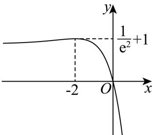
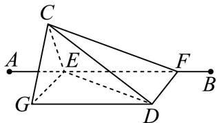
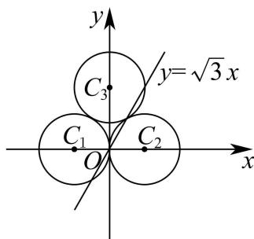
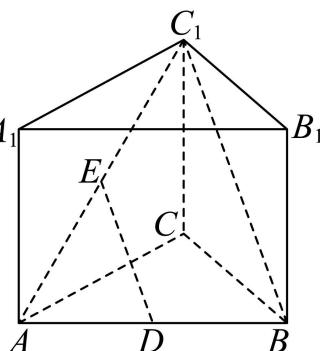
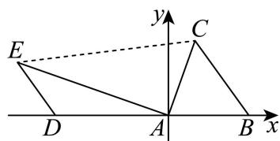

# 2026年普通高等学校招生全国统一考试

# 数学

## 注意事项：

1. 答卷前，考生务必将自己的姓名、考生号、考场号、座位号填写在答题卡上.

2. 回答选择题时，选出每小题答案后，用铅笔把答题卡上对应题目的答案标号涂黑。如需改动，用橡皮擦干净后，再选涂其他答案标号。回答非选择题时，将答案写在答题卡上，写在本试卷上无效。

3. 考试结束后，将本试卷和答题卡一并交回.

## 一、选择题：本题共8小题，每小题5分，共40分．在每小题给出的四个选项中，只有一项是符合题目要求的.

1. 样本数据 6,8,4,5,12 的中位数为（）
A. 5    B. 6    C. 8    D. 9

【答案】B  
【解析】  
【分析】结合中位数定义可得.  
【详解】将已知数据从小到大排序为4,5,6,8,12，则中位数为6.

2. 已知平面向量 $\vec{a}$ ， $\vec{b}$ 不共线，且 $2\vec{a} + y\vec{b} = x\vec{a} - 3\vec{b}$ ，则（）
A. x = 2, y = -3
B. x = -2, y = 3
C. x = 2, y = 3
D. x = -2, y = -3

【分析】由平面向量基本定理可得.

【详解】由题意可知平面向量 $\vec{a}, \vec{b}$ 不共线，且 $2\vec{a} + y\vec{b} = x\vec{a} - 3\vec{b}$

则 $\left\{\begin{aligned}x&=2\\ y&=-3\end{aligned}\right.$

3. 已知集合 $A = \left\{\sin \frac{7\pi}{6}, \cos \frac{5\pi}{3}, \tan \frac{5\pi}{4}\right\}$ , $B = \left\{-\frac{\sqrt{3}}{2}, -\frac{1}{2}, 1\right\}$ , 则 $A \cap B = (\quad)$

A. $\left\{-\frac{\sqrt{3}}{2}, -\frac{1}{2}\right\}$ B. $\left\{-\frac{\sqrt{3}}{2}, 1\right\}$ C. $\left\{-\frac{1}{2}, 1\right\}$ D. $\left\{-\frac{\sqrt{3}}{2}, -\frac{1}{2}, 1\right\}$

【解析】

【详解】因为 $\sin\frac{7\pi}{6}=\sin\left(\pi+\frac{\pi}{6}\right)=-\sin\frac{\pi}{6}=-\frac{1}{2}$ ， $\cos\frac{5\pi}{3}=\cos\left(2\pi-\frac{\pi}{3}\right)=\cos\frac{\pi}{3}=\frac{1}{2}$ ， $\tan\frac{5\pi}{4}=\tan\left(\pi+\frac{\pi}{4}\right)=\tan\frac{\pi}{4}=1,$

即集合 $A = \left\{-\frac{1}{2},\frac{1}{2},1\right\}$ ，且集合 $B = \left\{-\frac{\sqrt{3}}{2}, - \frac{1}{2},1\right\}$ ，所以 $A\cap B = \left\{-\frac{1}{2},1\right\}$

4. 曲线 $y = 5x + 8\ln x$ 在点(1,5)处的切线方程为（）
A. $y = 3x + 2$ B. $y = 5x$ C. $y = 8x - 3$ D. $y = 13x - 8$

【详解】因为 $y=5x+8\ln x$ ，则 $y'=5+\frac{8}{x}$ ，当 x=1 时， $y'=13$ ，
所以曲线 $y=5x+8\ln x$ 在点 $(1,5)$ 处的切线方程为 $y-5=13(x-1)$ ，
即 y=13x-8.

5. 已知抛物线 $C_{1}: y^{2} = 2p_{1}x$ （ $p_{1} > 0$ ）和 $C_{2}: x^{2} = 2p_{2}y$ （ $p_{2} > 0$ ）均经过点(4,8)，则 $C_{1}$ 的焦点与 $C_{2}$ 的焦点之间的距离为（）

A. 12 B. $4\sqrt{5}$ C. 6 D. $\frac{\sqrt{65}}{2}$

【答案】D 【解析】

【分析】将已知点代入抛物线方程求解参数 $p_1, p_2$ ，再结合抛物线焦点坐标公式得到两个焦点坐标，最后代入距离公式计算即可.

【详解】∵ 抛物线 $C_{1}: y^{2} = 2p_{1}x (p_{1} > 0)$ 经过点 (4,8)，

∴ 将 x=4, y=8 代入 $C_{1}$ 的方程得 $8^{2}=2p_{1}\cdot4$ ，即 $64=8p_{1}$ ，解得 $p_{1}=8$ .

∴ $C_{1}$ 的焦点坐标为 $F_{1}\left(\frac{p_{1}}{2},0\right)$ ，即 $F_{1}(4,0)$ .

∵ 抛物线 $C_{2}: x^{2} = 2p_{2}y (p_{2} > 0)$ 经过点 $(4,8)$ ,

∴ 将 x=4, y=8 代入 $C_{2}$ 的方程得 $4^{2}=2p_{2}\cdot8$ ，即 $16=16p_{2}$ ，解得 $p_{2}=1$ .

∴ $C_{2}$ 的焦点坐标为 $F_{2}\left(0,\frac{p_{2}}{2}\right)$ ，即 $F_{2}\left(0,\frac{1}{2}\right)$ .

根据两点间距离公式， $F_{1}$ 与 $F_{2}$ 之间的距离为：

$$
\left| F _ {1} F _ {2} \right| = \sqrt {(4 - 0) ^ {2} + \left(0 - \frac {1}{2}\right) ^ {2}} = \sqrt {1 6 + \frac {1}{4}} = \sqrt {\frac {6 5}{4}} = \frac {\sqrt {6 5}}{2}.
$$

6. 已知函数 $f(x) = \frac{x + 2}{\mathrm{e}^x + a}$ 的最大值为 1，则 $a = (\quad)$ A. $\frac{1}{2}$ B. 1 C. $\frac{3}{2}$ D. 2

【答案】B

【解析】

【详解】法1：（1）当a<0时，由 $e^{x}+a\neq0$ ，解得 $x\neq\ln(-a)$ ，

故函数 $f(x)$ 定义域为 $(-\infty, \ln(-a)) \cup (\ln(-a), +\infty)$ .

①当 $a < -\frac{1}{\mathrm{e}^2}$ 时， $\ln (-a) + 2 > 0$

当 $x \to \ln (-a)^+$ ，则 $f(x) \to +\infty$ ，故不存在最大值，不合题意；

②当 $a = -\frac{1}{\mathrm{e}^2}$ 时，此时 $f(x) = \frac{x + 2}{\mathrm{e}^x - \mathrm{e}^{-2}}$ ， $f(0) = \frac{2}{1 - \mathrm{e}^{-2}} > 2$

故最大值不为1，不合题意；

③当 $-\frac{1}{e^{2}}<a<0$ 时， $\ln(-a)+2<0$ ，

当 $x \to \ln(-a)^{-}$ ，则 $f(x) \to +\infty$ ，故不存在最大值，不合题意；

（2）当 $a \geq 0$ 时，则 $\mathbf{e}^x + a > 0$ ，则函数 $f(x)$ 定义域为 $\mathbf{R}$ .

且由 $f(x)$ 最大值为1可知， $x + 2 \leq \mathrm{e}^x + a$

即 $a \geq x + 2 - e^{x}$ 对任意 $x \in R$ 恒成立，且等号能取到.

设 $g(x) = x + 2 - \mathrm{e}^{x}$ ，则 $g^{\prime}(x) = 1 - \mathrm{e}^{x}$

当 $x < 0$ 时， $g'(x) > 0$ ， $g(x)$ 单调递增；

当 $x > 0$ 时， $g'(x) < 0$ ， $g(x)$ 单调递减；

故 $g(x)\leq g(0) = 1$ ，当且仅当 $x = 0$ 时， $g(x)_{\mathrm{max}} = 1$

由 $a \geq x + 2 - \mathrm{e}^x$ 对任意 $x \in \mathbf{R}$ 恒成立，可知 $a \geq 1$

又当 $a > 1$ 时，恒有 $g(x) < 1 < a$ ，取不到等号，所以有 $a = 1$ ，

故选：B.

法2: $f(x)=\frac{x+2}{\mathrm{e}^{x}+a}$ ,

由选项知 a > 0，则定义域为 R，

故最大值必在极值点处取到，不妨设此极值点为 $x_{0}$ ，

$$
f ^ {\prime} (x) = \frac {(\mathrm{e} ^ {x} + a) - (x + 2) \mathrm{e} ^ {x}}{(\mathrm{e} ^ {x} + a) ^ {2}} = \frac {- (x + 1) \mathrm{e} ^ {x} + a}{(\mathrm{e} ^ {x} + a) ^ {2}},
$$

则由 $f'(x_{0})=0$ ，可得 $a=(x_{0}+1)\mathrm{e}^{x_{0}}$ ①，

且 $f(x_0) = \frac{x_0 + 2}{\mathrm{e}^{x_0} + a} = 1$ ，即 $a = x_0 + 2 - \mathrm{e}^{x_0}$ ②，

联立①②解得 $\left\{\begin{aligned}x_{0}&=0\\ a&=1\end{aligned}\right.$

验证：当 $a = 1$ 时， $f(x) = \frac{x + 2}{\mathrm{e}^x + 1}$ ，

则 $f'(x)=\frac{-(x+1)e^{x}+1}{(e^{x}+1)^{2}}$ ,

设 $g(x) = -(x + 1)\mathrm{e}^x +1$ ，则 $g^{\prime}(x) = -(x + 2)\mathrm{e}^{x}$

当 x<-2 时， $g'(x)>0$ ，则 $g(x)$ 在 $(-∞,-2)$ 上单调递增；

当 $x > -2$ 时， $g'(x) < 0$ ，则 $g(x)$ 在 $(- \infty, -2)$ 上单调递减；

$g(x)_{\max}=g(-2)=\frac{1}{e^{2}}+1$ ，且 $g(0)=0$ ，

且当 $x \to -\infty$ ， $g(x) \to 0$ ；当 $x \to +\infty$ ， $g(x) \to -\infty$ ；

作出函数 $g(x)$ 的大致图象，

当 $x < 0$ 时， $g(x) > 0, f'(x) > 0$ ， $f(x)$ 在 $(0, +\infty)$ 上单调递增；  
当 $x > 0$ 时， $g(x) < 0, f'(x) < 0$ ， $f(x)$ 在 $(0, +\infty)$ 上单调递减；  
则 $f(x)_{\max} = f(0) = 1$ ，满足题意，故 $a = 1$ 。  
法3：由选项知 $a > 0$ ，则定义域为 $\mathbf{R}$ ，  
由 $f(0) = \frac{2}{1 + a} \leq 1 (a > 0)$ ，解得 $a \geq 1$ 。  
同法2验证可得，故 $a = 1$ 满足题意，由选项唯一可得。  
法4：由选项知 $a > 0$ ，则定义域为 $\mathbf{R}$ ，  
由 $f(0) = \frac{2}{1 + a} \leq 1 (a > 0)$ ，解得 $a \geq 1$ 。  
验证：当 $a = 1$ 时，由不等式 $\mathrm{e}^x \geq x + 1$ 可得 $\mathrm{e}^x + 1 \geq x + 2$ ，故 $f(x) = \frac{x + 2}{\mathrm{e}^x + 1} \leq 1$ ，当且仅当 $x = 0$ 时等号成立，故 $a = 1$ 满足题意，由选项唯一可得。

7. 一百零八塔位于宁夏回族自治区青铜峡市，以其独特的建筑格局和深远的历史文化闻名遐迩。该塔群共有108座塔，依山势自上而下排成12行，将第i行中塔的座数记为 $a_{i}(i=1,2,\cdots,12)$ ，其中 $a_{1}=1$ ， $a_{2}=a_{3}=3$ ， $a_{4}=a_{5}=5$ ，且 $a_{6}$ ， $a_{7}$ ，…， $a_{12}$ 是一个首项为7，公差为2的等差数列。将 $a_{1}$ ， $a_{2}$ ，…， $a_{12}$ 分为6组，每组2个数，使得每组的2个数之和可构成一个项数为6且公差为 $d(d>0)$ 的等差数列，则 $d=(\quad)$ A. 2 B. 4 C. 6 D. 8

【分析】由条件求出数列 $\{a_{n}\}$ 的前12项的和，设新数列为 $\{b_{n}\}$ ，设其公差为 $d$ ，由条件可得 $b_{1} + \frac{5}{2} d = 18$ ，结合选项判断即可.

【详解】由已知 $a_1 = 1$ ， $a_2 = a_3 = 3$ ， $a_4 = a_5 = 5$ ， $a_i = 7 + 2(i - 6) = 2i - 5$ ， $i = 6,7,8,9,10,11,12$ 所以数列 $\{a_{n}\}$ 的前12项的和为 $1 + 6 + 10 + \frac{(7 + 19)\times 7}{2} = 17 + 91 = 108$ ，设新数列为 $\{b_n\}$ ， $n = 1,2,3,4,5,6$ ，由已知数列 $\{b_n\}$ 为等差数列，设其公差为 $d$ ， $d > 0$ 又 $\{a_{n}\}$ 的前12项都为奇数， $\{b_{n}\}$ 所有项都为偶数，由已知 $d$ 为正偶数， $b_{1}$ 为正偶数，则 $6b_{1} + \frac{6\times 5}{2}\times d = 108$ ，故 $b_{1} + \frac{5}{2} d = 18$ 若 $d = 2$ ，则 $b_{1} = 13$ ，矛盾，若 $d = 6$ ，则 $b_{1} = 3$ ，矛盾，若 $d = 8$ ，则 $b_{1} = -2$ ，矛盾，若 $d = 4$ ，则 $b_{1} = 8$ ，此时可取 $b_{1} = a_{1} + a_{6} = 8$ ， $b_{2} = a_{2} + a_{7} = 12$ ， $b_{3} = a_{4} + a_{8} = 16$ ， $b_{4} = a_{3} + a_{11} = 20$ ， $b_{5} = a_{5} + a_{12} = 24$ ， $b_{6} = a_{9} + a_{10} = 28$ ，满足要求；

8. 设 $U = \left\{\left(x_{1}, x_{2}, x_{3}\right) \mid x_{i} \in \{-2, -1, 1, 2\}, i = 1, 2, 3\right\}$ 为空间中64个点构成的集合，点 $P(1, 1, 1)$ ，记样本空间 $\Omega = \complement_{U} P$ ，从 $\Omega$ 中随机取一个点，定义随机变量 $X$ 如下：对 $\Omega$ 中的每个点 $A(x_{1}, x_{2}, x_{3})$ ，令 $X(A) = x_{1} + x_{2} + x_{3}$ ，则 $X$ 的数学期望值为（）  
A. $-\frac{1}{21}$ B. $-\frac{1}{63}$ C. 0 D. $\frac{1}{7}$

【答案】A

【解析】

【分析】由题意可知 $n(\Omega)=63$ . 解法一：根据古典概型求相应的概率，进而可得期望；解法二：可得 $P(X=-3)=\frac{4}{63}$ ， $P(X=3)=\frac{3}{63}$ ，根据对称性运算求解；解法三：根据点的特征结合古典概型运算求解.

【详解】由题意可知： $n(\Omega)=4\times4\times4-1=63$ ，且随机变量X的取值为-6，-5，-4，-3，-2，-1，0，1，2，3，4，5，6.

解法一：依题意，可得 $P(X=-6)=P(X=6)=\frac{1}{63}$ ,

$$
P (X = - 5) = P (X = 5) = P (X = - 4) = P (X = 4) = \frac {3}{6 3},
$$

$$
P (X = - 3) = \frac {4}{6 3}, \quad P (X = 3) = \frac {3}{6 3}
$$

$$
P (X = - 2) = P (X = 2) = P (X = - 1) = P (X = 1) = \frac {9}{6 3}, \quad P (X = 0) = \frac {6}{6 3}
$$

$$
E (X) = (- 6 + 6) \times \frac {1}{6 3} + (- 5 + 5 - 4 + 4) \times \frac {3}{6 3} - 3 \times \frac {4}{6 3} + 3 \times \frac {3}{6 3} + (- 2 + 2 - 1 + 1) \times \frac {9}{6 3} + 0 \times \frac {6}{6 3} = - \frac {1}{2 1};
$$

解法二：根据对称性可知： $P(X=-6)=P(X=6)$ ， $P(X=-5)=P(X=5)$ ， $P(X=-4)=P(X=4)$ ，

$$
P (X = - 2) = P (X = 2), \quad P (X = - 1) = P (X = 1)
$$

$$
P (X = - 3) = \frac {4}{6 3}, P (X = 3) = \frac {3}{6 3}
$$

所以 $E(X) = -3 \times \frac{4}{63} + 3 \times \frac{3}{63} = -\frac{1}{21}$ ;

解法三：因为 $x_{i}\in \{-2, - 1,1,2\} , i\in \{1,2,3\}$

对于任意一点 $\left(x_{1},x_{2},x_{3}\right)$ ，均存在 $\left(-x_{1},-x_{2},-x_{3}\right)$ 与之对应，可知这两点的坐标和为0，

因为 $P(1,1,1)$ ，样本空间 $\Omega = \complement_U P$

可知样本空间 $\Omega$ 中存在唯一点 $(-1, -1, -1)$ 与点 $P(1, 1, 1)$ 对应，

所以 $\Omega$ 中所有点的坐标和的总和为 -1-1-1=-3，

故 $E(X)=\frac{-3}{63}=-\frac{1}{21}$ .

## 二、选择题：本题共3小题，每小题6分，共18分．在每小题给出的四个选项中，有多项符合题目要求．全部选对的得6分，部分选对的得部分分，有选错的得0分.

9. 设 $z = 3 + 2\mathrm{i}$ ，则（ ）A. $\overline{z} = 3 - 2\mathrm{i}$ B. $|z| = 5$ C. $z^2 = 5 + 12\mathrm{i}$ D. $\frac{z + 3}{z - \mathrm{i}} \in \mathbb{R}$

【答案】ACD

【解析】

【详解】对于 A 选项，复数 $z = a + bi$ 的共轭复数 $\overline{z} = a - bi$ ，因此 $\overline{z} = 3 - 2i$ ，A 选项正确.
对于 B 选项，复数的模 $|z|=\sqrt{a^{2}+b^{2}}$ ，因此 $|z|=\sqrt{3^{2}+2^{2}}=\sqrt{13}\neq5$ ，B 选项错误.

对于 C 选项，∵ $z = 3 + 2i$ ，

$\therefore z^{2} = (3 + 2\mathrm{i})^{2} = 3^{2} + 2\times 3\times 2\mathrm{i} + (2\mathrm{i})^{2} = 9 + 12\mathrm{i} - 4 = 5 + 12\mathrm{i}$ ，该选项正确.对于D选项， $\because$ 分子 $z + 3 = 3 + 2\mathrm{i} + 3 = 6 + 2\mathrm{i}$ ，分母 $z - \mathrm{i} = 3 + 2\mathrm{i} - \mathrm{i} = 3 + \mathrm{i}$ $\therefore \frac{z + 3}{z - \mathrm{i}} = \frac{6 + 2\mathrm{i}}{3 + \mathrm{i}} = \frac{(6 + 2\mathrm{i})(3 - \mathrm{i})}{(3 + \mathrm{i})(3 - \mathrm{i})} = \frac{18 - 6\mathrm{i} + 6\mathrm{i} - 2\mathrm{i}^2}{9 - \mathrm{i}^2} = \frac{20}{10} = 2,\quad 2$ 是实数，故 $\frac{z + 3}{z - \mathrm{i}}\in R$ ，该选项正确.10.在空间中， $A$ 、 $B$ 为两个定点，动点 $C$ 到直线 $AB$ 的距离为2，动点 $D$ 到直线 $AB$ 的距离为1．若二面角 $C - AB - D$ 为 $60^{\circ}$ ，则（）A. $\angle CAD\geq 60^{\circ}$ B. $CD\geq \sqrt{3}$ C.当 $AB\bot CD$ 时， $CD\bot$ 平面ABD D.当 $AB\bot$ 平面ACD时， $AC\bot AD$

【答案】BC

【解析】

【分析】做出满足条件的图，过点 C 作 $CE \perp AB$ ，E 为垂足，过点 D 作 $DF \perp AB$ ，F 为垂足，过点 E 作 EG // FD，由条件可得 $\angle CEG = 60^{\circ}$ ，解三角形可得 $CG = \sqrt{3}$ ，由此判断 B，当点 A 与点 E 的距离无限大时，可得 $\angle CAD$ 趋向于 $0^{\circ}$ ，排除 A，先证明 $AB \perp$ 平面 CDG，结合 $AB \perp CD$ ，证明 D, G 重合，由此证明 $CD \perp$ 平面 ABD，由 $AB \perp$ 平面 ACD 推出点 A 与点 E 重合，点 D 与点 G 重合，判断 D.

【详解】不失一般性作图如下，

过点 C 作 $CE \perp AB$ ，E 为垂足，过点 D 作 $DF \perp AB$ ，F 为垂足，

过点 E 作 EG // FD，EG = FD，连接 GD，

则 $EG \perp AB$ ，因为二面角 C - AB - D 为 $60^{\circ}$ ，

所以 $\angle CEG = 60^{\circ}$ ，由已知 CE = 2, DF = 1，

所以 $CG^{2} = 4 + 1 - 2 \times 2 \times 1 \times \cos 60^{\circ} = 3$ ，所以 $CG = \sqrt{3}$ ，

故 $CG \perp EG$ ， $CD \geq CG = \sqrt{3}$ ，B 正确；

当点 A 与点 E 的距离无限大时，CA，AD 无限大，CA, CD 无限靠近 AB，

此时 $\angle CAD$ 趋向于 $0^{\circ}$ ，A 错误；

因为 $AB \perp CE, AB \perp EG$ ， $CE \cap EG = E$ ，CE, EG ⊂ 平面 CEG，

所以 AB ⊂ 平面 CEG，又 CG ⊂ 平面 CEG，所以 AB ⊂ CG，

若 AB ⊂ CD，D, G 不重合，结合 $CG \cap CD = C$ ，CG, CD ⊂ 平面 CDG，

可得 $AB \perp$ 平面 $CDG$ ， $DG \subset$ 平面 $CDG$ ，

所以 $AB \perp DG$ ，矛盾，所以 $D, G$ 重合，

因为 $AB \perp CG$ ， $CG \perp EG$ ， $EG \cap EF = E$ ， $EG, EF \subset$ 平面 $EFDG$ ，

所以 $CG \perp$ 平面 $EFDG$ ，故 $CD \perp$ 平面 $ABD$ ，C 正确；

因为 $AB \perp$ 平面 $CEG$ ，若 $AB \perp$ 平面 $ACD$ ，

则平面 $CEG$ 与平面 $ACD$ 重合，此时点 $A$ 与点 $E$ 重合，点 $D$ 与点 $G$ 重合，

故 $AC$ 与 $AD$ 的夹角为 $60^\circ$ ，D 错误，

11. 已知圆 $C_1: (x + 1)^2 + y^2 = 1$ ，圆 $C_2: (x - 1)^2 + y^2 = 1$ ，圆 $C_3: x^2 + (y - \sqrt{3})^2 = 1$ ，直线 $l: y = kx + b$ 与 $C_1, C_2, C_3$ 均有两个交点。记 $l$ 被 $C_1, C_2, C_3$ 截得的弦长分别为 $s_1, s_2, s_3$ ，则（）

A. $k$ 可以取任意实数

B. 满足 $s_1 = s_2 = s_3$ 的直线 $l$ 共有 3 条

C. 满足 $s_1 + s_2 + s_3 = 3$ 的直线 $l$ 多于 3 条

D. 当 $b = 0$ 时， $s_1 + s_2 + s_3$ 的最大值为 $\frac{2\sqrt{21}}{3}$

【解析】

【分析】已知三个圆均为半径 r=1 的等圆，圆心分别为 $C_{1}(-1,0)$ 、 $C_{2}(1,0)$ 、 $C_{3}(0,\sqrt{3})$ ，利用弦长公式 $s_{i}=2\sqrt{1-d_{i}^{2}}$ （ $d_{i}$ 为直线 l 到对应圆心的距离，且 $d_{i}<1$ 以保证直线与圆有两个交点），逐个分析选项即可。
【详解】记直线 $l: y = kx + b$ 到 $C_{1}, C_{2}, C_{3}$ 的距离分别为 $d_{1}, d_{2}, d_{3}$ ，则 $d_{1} = \frac{|b - k|}{\sqrt{1 + k^{2}}}$ ， $d_{2} = \frac{|b + k|}{\sqrt{1 + k^{2}}}$ ， $d_{3}=\frac{|b-\sqrt{3}|}{\sqrt{1+k^{2}}}$ .

$$
\because
$$

$$
\therefore d _ {1} <   1, d _ {2} <   1, d _ {3} <   1
$$

$$
s _ {i} = 2 \sqrt {1 - d _ {i} ^ {2}} (i = 1, 2, 3)
$$

$$
d _ {1} <   1
$$

$$
k - \sqrt {1 + k ^ {2}} <   b <   k + \sqrt {1 + k ^ {2}}
$$

解 $d_{2} < 1$ ，得 $-k - \sqrt{1 + k^{2}} < b < -k + \sqrt{1 + k^{2}}$

不妨取 k > 0，

$\because k + \sqrt{1 + k^2} > -k + \sqrt{1 + k^2} > 0 > k - \sqrt{1 + k^2} > -k - \sqrt{1 + k^2}$

$\therefore k - \sqrt{1 + k^2} < b < -k + \sqrt{1 + k^2}$ 记 $A = (k - \sqrt{1 + k^2}, - k + \sqrt{1 + k^2})$

解 $d_{3} < 1$ ，得 $\sqrt{3} -\sqrt{1 + k^2} < b <   \sqrt{3} +\sqrt{1 + k^2}$ ，记 $B = \left(\sqrt{3} -\sqrt{1 + k^2},\sqrt{3} +\sqrt{1 + k^2}\right)$

当 $\sqrt{3} -\sqrt{1 + k^2}\geq -k + \sqrt{1 + k^2}$ ，即 $k = \frac{\sqrt{3}}{3}$ 时， $A\cap B = \emptyset$

此时不存在这样的直线 l 与三个圆都相交.

∴ k 不能取任意实数，A 错误.

B: $\because s_{1}=s_{2}=s_{3}$ ,

$$
\therefore d _ {1} = d _ {2} = d _ {3}.
$$

由 $d_{1} = d_{2}$ 得 $\vert b - k\vert = \vert b + k\vert$ ，平方得 $-4bk = 0$ ，即 $k = 0$ 或 $b = 0$

①当 $k = 0$ 时，直线为 $y = b$ ，由 $d_{1} = d_{3}$ 得 $\vert b\vert = \vert b - \sqrt{3}\vert$ ，解得 $b = \frac{\sqrt{3}}{2}$

此时 $d_{1} = \frac{\sqrt{3}}{2} < 1$ ，符合条件，对应直线1条.

②当 $b = 0$ 时，直线为 $y = kx$ ，由 $d_{1} = d_{3}$ 得 $\frac{|k|}{\sqrt{1 + k^2}} = \frac{\sqrt{3}}{\sqrt{1 + k^2}}$ ，解得 $k = \pm \sqrt{3}$

此时 $d_{1} = \frac{\sqrt{3}}{2} < 1$ ，符合条件，对应直线2条.

综上，共3条直线满足条件，B正确.

C: 令 b=0，

$$
\therefore s _ {1} = s _ {2} = 2 \sqrt {1 - \frac {k ^ {2}}{1 + k ^ {2}}} = \frac {2}{\sqrt {1 + k ^ {2}}}, s _ {3} = 2 \sqrt {1 - \frac {3}{1 + k ^ {2}}} = \frac {2 \sqrt {k ^ {2} - 2}}{\sqrt {1 + k ^ {2}}},
$$

令 $t = \sqrt{k^2 - 2} (t > 0)$ ，则 $k^2 = t^2 + 2$

$$
\therefore s _ {1} + s _ {2} + s _ {3} = \frac {2 (2 + t)}{\sqrt {t ^ {2} + 3}}.
$$

令 $s_{1}+s_{2}+s_{3}=3$ ，即 $\frac{4+2t}{\sqrt{t^{2}+3}}=3$ ，

平方整理可得 $5t^{2}-16t+11=0$ ，解得 $t=\frac{11}{5}$ 或 t=1，即 $k=\pm\sqrt{3}$ 或 $k=\pm\frac{\sqrt{171}}{5}$ ，
经验证，此时 $d_{1}, d_{2}, d_{3}$ 均小于1，满足题目要求，此时已有4条直线，多于3条，C正确.
D: 当 b=0 时， $d_{1}=d_{2}=\frac{|k|}{\sqrt{1+k^{2}}}$ ， $d_{3}=\frac{\sqrt{3}}{\sqrt{1+k^{2}}}$ ∴ $s_{1}=s_{2}=2\sqrt{1-\frac{k^{2}}{1+k^{2}}}=\frac{2}{\sqrt{1+k^{2}}}$ ， $s_{3}=2\sqrt{1-\frac{3}{1+k^{2}}}=\frac{2\sqrt{k^{2}-2}}{\sqrt{1+k^{2}}}$ 令 $t=\sqrt{k^{2}-2}(t>0)$ ，则 $k^{2}=t^{2}+2$ ∴ $s_{1} + s_{2} + s_{3} = \frac{2(2+t)}{\sqrt{t^{2} + 3}}$ .
设 $f(t)=\frac{t+2}{\sqrt{t^{2}+3}}(t>0)$ ，求导得 $f'(t)=\frac{3-2t}{(t^{2}+3)^{\frac{3}{2}}}$ 令 $f'(t)=0$ 得 $t=\frac{3}{2}$ ，此时 $f(t)$ 取最大值 $f\left(\frac{3}{2}\right)=\frac{\frac{3}{2}+2}{\sqrt{\left(\frac{3}{2}\right)^{2}+3}}=\frac{7}{\sqrt{21}}=\frac{\sqrt{21}}{3}$ ∴ $s_{1} + s_{2} + s_{3}$ 的最大值为 $2 \times \frac{\sqrt{21}}{3} = \frac{2\sqrt{21}}{3}$ ，D 正确.

【点睛】方法点睛：本题考查直线与圆的位置关系，核心是利用弦长公式将弦

长关系转化为圆心到直线的距离关系，最值问题可通过换元结合导数求解，多选题可逐个验证选项，结合特殊情形快速判断正误.

## 三、填空题：本题共3小题，每小题5分，共15分.

12. 双曲线 $5x^{2}-6y^{2}=1$ 的离心率为 \_\_\_\_. 【答案】 $\frac{\sqrt{66}}{6}$

【解析】

【分析】先将给定双曲线方程化为标准形式，确定 $a^2$ 、 $b^{2}$ ，再利用双曲线中 $a, b, c$ 的关系求出 $c$ ，最后根据离心率定义计算结果.

【详解】将双曲线 $5x^{2} - 6y^{2} = 1$ 化为标准方程，得 $\frac{x^2}{\frac{1}{5}} -\frac{y^2}{\frac{1}{6}} = 1$ ，则 $a^2 = \frac{1}{5},b^2 = \frac{1}{6}$

因此 $c^2 = a^2 + b^2 = \frac{1}{5} + \frac{1}{6} = \frac{11}{30}$ ，则离心率为 $e = \frac{c}{a} = \sqrt{\frac{c^2}{a^2}} = \sqrt{\frac{\frac{11}{30}}{\frac{1}{5}}} = \sqrt{\frac{11}{6}} = \frac{\sqrt{66}}{6}$ .

13. 已知 $f(x) = 2\sin (ax + \theta)$ （ $a \in \mathbf{Z}$ ， $0 \leq \theta < 2\pi$ ）是偶函数， $f(x)$ 在区间 $\left(0, \frac{\pi}{2}\right)$ 单调递增．则 $\theta =$ \_\_\_\_, $f\left(\frac{2\pi}{3}\right)=$ \_\_\_\_.

【答案】 ①. $\frac{3\pi}{2}$ ②. 1

【解析】

【分析】根据单调性和周期性可得 $|a|=1,2$ . 解法一：根据偶函数可得 $\theta=\frac{\pi}{2},\frac{3\pi}{2}$ ，并代入结合单调性检验即可；解法二：根据题意可得 $f'(0)=0$ ，即可得 $\theta=\frac{\pi}{2},\frac{3\pi}{2}$ ，根据导数与单调性的关系分析求解；解法三：分析可知 $f(x)$ 在 x=0 处取到极小值，可得 $\theta=\frac{3\pi}{2}$ ，进而可得结果.

【详解】设函数 $f(x)$ 的最小正周期为 T，由题意可知 $a \neq 0$ ，

因为函数 $f(x)$ 在 $\left(0, \frac{\pi}{2}\right)$ 内单调递增，则 $\frac{T}{2} \geq \frac{\pi}{2}$ ，即 $T \geq \pi$ ，

可得 $\frac{2\pi}{|a|} \geq \pi$ ，解得 $|a| \leq 2$ ，

且 $a \in \mathbf{Z}$ , $a \neq 0$ , 则 $|a| = 1,2$ ,

解法一：因为函数 $f(x) = 2\sin (ax + \theta)$ 为偶函数，

则 $\theta = k_{1}\pi +\frac{\pi}{2},k_{1}\in \mathbf{Z}$ ，且 $0\leq \theta <  2\pi$

则 $k_{1} = 0,1$ ， $\theta = \frac{\pi}{2},\frac{3\pi}{2}$

若 $\theta = \frac{\pi}{2}$ ，则 $f(x) = 2\sin \left(ax + \frac{\pi}{2}\right) = 2\cos ax = 2\cos (|a|x),$

即 $f(x) = 2\cos x$ 或 $f(x) = 2\cos 2x$ ，不符合题意，

若 $\theta = \frac{3\pi}{2}$ ，则 $f(x) = 2\sin \left(ax + \frac{3\pi}{2}\right) = -2\cos ax = -2\cos (|a|x)$ ，

即 $f(x) = -2\cos x$ 或 $f(x) = -2\cos 2x$ ，符合题意；

且 $f\left(\frac{2\pi}{3}\right) = -2\cos \frac{2\pi}{3} = 1$ 或 $f\left(\frac{2\pi}{3}\right) = -2\cos \frac{4\pi}{3} = -2\cos \left(\pi +\frac{\pi}{3}\right) = 2\cos \frac{\pi}{3} = 1;$

综上所述： $\theta = \frac{3\pi}{2}$ ， $f\left(\frac{2\pi}{3}\right) = 1$

解法二：因为 $f'(x)=2a\cos(ax+\theta)$ ,

若函数 $f(x)$ 为偶函数，则 $f'(0)=2a\cos\theta=0$ ，即 $\cos\theta=0$ ，

且 $0 \leq \theta < 2\pi$ ，则 $\theta = \frac{\pi}{2}, \frac{3\pi}{2}$ ，

若 $\theta = \frac{\pi}{2}$ ，则 $f(x) = 2\sin \left(ax + \frac{\pi}{2}\right) = 2\cos ax = 2\cos (|a|x), f'(x) = -2|a|\sin (|a|x),$

即 $f'(x) = -2\sin x < 0$ 或 $f'(x) = -4\sin 2x < 0$ 在 $\left(0, \frac{\pi}{2}\right)$ 内恒成立，

可知函数 $f(x)$ 在 $\left(0, \frac{\pi}{2}\right)$ 内单调递减，不符合题意，

若 $\theta = \frac{3\pi}{2}$ ，则 $f(x) = 2\sin \left(ax + \frac{3\pi}{2}\right) = -2\cos ax = -2\cos (|a|x), f'(x) = 2|a|\sin (|a|x)$ ，

即 $f^{\prime}(x) = 2\sin x > 0$ 或 $f^{\prime}(x) = 4\sin 2x > 0$ 在 $\left(0, \frac{\pi}{2}\right)$ 内恒成立，

可知函数 $f(x)$ 在 $\left(0, \frac{\pi}{2}\right)$ 内单调递增，符合题意，

且 $f\left(\frac{2\pi}{3}\right) = -2\cos \frac{2\pi}{3} = 1$ 或 $f\left(\frac{2\pi}{3}\right) = -2\cos \frac{4\pi}{3} = -2\cos \left(\pi +\frac{\pi}{3}\right) = 2\cos \frac{\pi}{3} = 1;$

综上所述： $\theta=\frac{3\pi}{2}$ ， $f\left(\frac{2\pi}{3}\right)=1$ .

解法三：因为函数 $f(x)=2\sin(ax+\theta)$ 为偶函数，且函数 $f(x)$ 在 $\left(0,\frac{\pi}{2}\right)$ 内单调递增，

可知 $f(x)$ 在 $x = 0$ 处取到极小值，则 $\theta = 2k_{2}\pi -\frac{\pi}{2}$ ， $k_{2}\in \mathbf{Z}$ ，且 $0\leq \theta <  2\pi$

则 $k_{2} = 1$ ， $\theta = \frac{3\pi}{2}$ ，则 $f(x) = 2\sin \left(ax + \frac{3\pi}{2}\right) = -2\cos ax = -2\cos (|a|x)$

即 $f(x) = -2\cos x$ 或 $f(x) = -2\cos 2x$ ，符合题意；

且 $f\left(\frac{2\pi}{3}\right) = -2\cos \frac{2\pi}{3} = 1$ 或 $f\left(\frac{2\pi}{3}\right) = -2\cos \frac{4\pi}{3} = -2\cos \left(\pi +\frac{\pi}{3}\right) = 2\cos \frac{\pi}{3} = 1.$

14. 设实数 q 满足：存在数列 $\left\{a_{n}\right\}$ ，使得对于任意 $n \in N^{*}$ ，均有 $a_{1} + a_{2} + \cdots + a_{3n} = n^{2} + n$ ，且 $\left\{a_{n}\right\}$ 中有某连续 9 项 $a_{k}$ ， $a_{k+1}$ ， $\cdots$ ， $a_{k+8}$ 是公比为 q 的等比数列．则 q 的最大值为 \_\_\_\_.

【答案】 $\sqrt[3]{\frac{3}{2}}$

【解析】

【分析】由前 $3n$ 项和公式推出每连续三项的和 $T_{n} = 2n$ 。将连续9项按起始位置模3分类，每类中利用三项块和等于 $2n$ 得到关于公比 $q$ 的比例关系，通过相邻块和之比解得 $q^{3}$ 的上界，即可取得最大值。

【详解】令 $T_{n}=a_{3n-2}+a_{3n-1}+a_{3n}$ ，由题意得 $T_{n}=(n^{2}+n)-[(n-1)^{2}+(n-1)]=2n$ ，

因此每个三项块 $B_{n}$ 的和为 $2n$ ：

设这 9 项为 $x, xq, xq^2, \cdots, xq^8$ ，记 $C = 1 + q + q^2$ 。由于 $C > 0$ ，且完整三项块和均为正，

下面按 $k$ 除以3的余数讨论.

若 $k = 3m + 1(m\geq 0)$ ，这9项正好包含三个完整三项块，

得 $xC = 2(m + 1)$ ， $xq^{3}C = 2(m + 2)$ ， $xq^{6}C = 2(m + 3)$

于是 $q^3 = \frac{m + 2}{m + 1}$ 且 $q^3 = \frac{m + 3}{m + 2}$ ，矛盾，故这种起点不存在.

若 $k = 3m + 2(m \geq 0)$ ，其中两个完整三项块为第 $m + 2$ 块，第 $m + 3$ 块，

得 $xq^{2}C = 2(m + 2)$ ， $xq^{5}C = 2(m + 3)$ ，所以 $q^3 = \frac{m + 3}{m + 2}\leq \frac{3}{2}$

若 $k = 3m(m \geq 1)$ ，其中两个完整三项块为第 $m + 1$ 块，第 $m + 2$ 块，

得 $xqC = 2(m + 1)$ ， $xq^4 C = 2(m + 2)$ ，所以 $q^3 = \frac{m + 2}{m + 1}\leq \frac{3}{2}.$

综上 $q^3 \leq \frac{3}{2}$ ，所以 $q \leq \sqrt[3]{\frac{3}{2}}$ ，即 $q$ 的最大值为 $\sqrt[3]{\frac{3}{2}}$ .

## 四、解答题：本题共5小题，共77分．解答应写出文字说明、证明过程或演算步骤.

15. 如图，在直三棱柱 $ABC - A_{1}B_{1}C_{1}$ 中， $\angle ACB = 90^{\circ}$ ， $AC = BC$ ， $D$ ， $E$ 分别为 $AB$ ， $AC_{1}$ 的中点.

（1）证明： $DE \parallel$ 平面 $BCC_{1}B_{1}$ ;

(2) 设 $CC_{1} = 2$ , 直线 $DE$ 与平面 $ACC_{1}A_{1}$ 所成的角为 $45^{\circ}$ , 求直线 $DE$ 到平面 $BCC_{1}B_{1}$ 的距离. 【答案】(1) 由题意证明如下:

如图，作出符合题意的图形，连接 $BC_{1}$ ，

在 $\triangle ABC_{1}$ 中，D，E 分别为 AB， $AC_{1}$ 中点，∴ $DE \parallel BC_{1}$ ，

∵ $DE \not\subset$ 平面 $BCC_{1}B_{1}$ ， $BC_{1} \subset$ 平面 $BCC_{1}B_{1}$ ，

∴ DE// 平面 $BCC_{1}B_{1}$ .

(2) 距离为 1.

【解析】

【分析】（1）通过证明 $DE \parallel BC_{1}$ ，即可得出结论；

（2）方法一：设出 $AC = BC = 2t (t > 0)$ ，建立空间直角坐标系并表达出各点的坐标，得出向量 $\overrightarrow{ED}$ 与面

$ACC_{1}A_{1}$ 的一个法向量的表达式，根据直线 DE 与平面 $ACC_{1}A_{1}$ 所成的角为 $45^{\circ}$ 求出参数 t，借助几何关系即可求出 DE 到面 $BCC_{1}B_{1}$ 的距离.

方法二：利用直线 $DE$ 与平面 $ACC_{1}A_{1}$ 所成的角为 $45^{\circ}$ ，求出 $AC = BC = CC_{1} = 2$ ，借助几何关系即可求出 $DE$ 到面 $BCC_{1}B_{1}$ 的距离.

【小问 1 详解】

略

【小问 2 详解】

法一：由题意及（1）得， $CC_{1}=2$

在直三棱柱 $ABC-A_{1}B_{1}C_{1}$ 中， $\angle ACB=90^{\circ}$ ，设 $AC=BC=2t(t>0)$ ，

四边形 $ACC_{1}A_{1}$ 与四边形 $BCC_{1}B_{1}$ 是矩形，

$$
\therefore A C \perp B C, A C \perp C C _ {1}, B C \perp C C _ {1}
$$

建立空间直角坐标系，如下图所示，

得到 $A(2t,0,0)$ ， $B(0,2t,0)$ ， $C(0,0,0)$ ， $D(t,t,0)$ ， $E(t,0,1)$ ，

$\therefore \overrightarrow{ED} = (0,t, - 1)$ ，面 $ACC_{1}A_{1}$ 的一个法向量为 $\vec{n_1} = (0,1,0)$

∵直线 DE 与平面 $ACC_{1}A_{1}$ 所成的角为 $45^{\circ}$ ,

设直线 $DE$ 与平面 $ACC_{1}A_{1}$ 所成的角为 $\theta$

$$
\therefore \sin \theta = \cos \left\langle \overrightarrow {E D}, \overrightarrow {n _ {1}} \right\rangle = \frac {\left| \overrightarrow {E D} \cdot \overrightarrow {n _ {1}} \right|}{\left| \overrightarrow {E D} \right| \cdot \left| \overrightarrow {n _ {1}} \right|} = \frac {\left| 0 + t \times 1 + 0 \right|}{\sqrt {0 + t ^ {2} + (- 1) ^ {2}} \times \sqrt {0 + 1 ^ {2} + 0}} = \sin 4 5 ^ {\circ}
$$

解得 $t = 1$ ， $\therefore A(2,0,0)$ ， $B(0,2,0)$ ， $C(0,0,0)$ ， $D(1,1,0)$ ， $E(1,0,1)$

∵ $DE \parallel$ 面 $BCC_{1}B_{1}$ ，∴由几何知识得，DE 到面 $BCC_{1}B_{1}$ 的距离为 $x_{D}=1$ .

法二：由题意及（1）得，

在直三棱柱 $ABC - A_{1}B_{1}C_{1}$ 中， $\angle ACB = 90^{\circ}$ ， $AC = BC$

四边形 $ACC_{1}A_{1}$ 与四边形 $BCC_{1}B_{1}$ 是矩形，

$$
\therefore A C \perp B C, A C \perp C C _ {1}, B C \perp C C _ {1}
$$

$\because AC \cap CC_{1} = C, AC \subset \text{平面 } ACC_{1}A_{1}, CC_{1} \subset \text{平面 } ACC_{1}A_{1}, BC \not\subset \text{平面 } ACC_{1}A_{1}$

∴ BC ⊥ 平面 $ACC_{1}A_{1}$ ， $\angle BCC_{1}=90^{\circ}$

∴由几何知识得， $\angle BC_{1}C$ 即为直线 $BC_{1}$ 与平面 $ACC_{1}A_{1}$ 所成的角，

直线 DE 与平面 $ACC_{1}A_{1}$ 所成的角为 $45^{\circ}$ ,

在 $\triangle ABC_{1}$ 中， $D$ ， $E$ 分别为 $AB$ ， $AC_{1}$ 中点， $DE / / BC_{1}$

∴直线 $BC_{1}$ 与平面 $ACC_{1}A_{1}$ 所成的角为 $45^{\circ}$ ，即 $\angle BC_{1}C = 45^{\circ}$ ，

在 $\mathrm{Rt}\triangle BCC_1$ 中， $\angle BC_1C = 45^\circ$ ， $\angle BCC_{1} = 90^{\circ}$ ， $CC_{1} = 2$

$$
\therefore A C = B C = C C _ {1} = 2
$$

在 Rt△ABC 中， $AC \perp BC$ ，AC = BC，

$\triangle ABC$ 为等腰直角三角形，过点 D 作 $DF \parallel AC$ ，

则点 F 为 BC 中点， $DF = \frac{1}{2} AC = 1$ ， $DF \perp BC$ ，

由几何知识得， $DE$ 到面 $BCC_{1}B_{1}$ 的距离即为 $DF = 1$

16. 已知在 $\triangle ABC$ 中， $AB = 3$ ， $BC = 2\sqrt{3}$ ， $\cos B = \frac{\sqrt{3}}{3}$

(1) 求 $\cos A$ ;

（2）设 D，E 两点满足：D 在 BA 的延长线上， $DE \parallel BC$ ， $AE \perp AC$ 。若 $DE = \sqrt{6}$ ，求 CE。
【答案】（1） $\frac{1}{3}$

(2) $3\sqrt{5}$

【解析】

【分析】（1）由已知两边及夹角，先用余弦定理求第三边 AC，再用余弦定理求 $\cos A$ ;

（2）建立坐标系，设出点 $D$ 坐标，由平行关系得点 $E$ 的坐标，利用垂直条件求参数，由 $DE$ 长度解出 $t$ ，再计算 $CE$ ：

【小问 1 详解】

在 $\triangle ABC$ 中， $AB = 3$ ， $BC = 2\sqrt{3}$ ， $\cos B = \frac{\sqrt{3}}{3}$

由余弦定理可知 $AC^{2}=AB^{2}+BC^{2}-2\cdot AB\cdot BC\cdot\cos B=9+12-2\times3\times2\sqrt{3}\times\frac{\sqrt{3}}{3}=9$

故 $AC = 3$ 。再由余弦定理得 $\cos A = \frac{AB^2 + AC^2 - BC^2}{2 \cdot AB \cdot AC} = \frac{9 + 9 - 12}{2 \times 3 \times 3} = \frac{6}{18} = \frac{1}{3}$ 。

【小问 2 详解】

以 A 为原点，AB 为 x 轴正方向建立平面直角坐标系如图：

则 $A(0,0)$ ， $B(3,0)$ ，由 $AC = 3$ ， $\cos A = \frac{1}{3}$ 得 $C(1,2\sqrt{2})$

$D$ 在 $BA$ 延长线上，设 $AD = t > 0$ ，则 $D(-t,0)$ ， $\overrightarrow{BC} = (-2,2\sqrt{2})$ ， $DE / / BC$

设 $\overrightarrow{DE} = \lambda (-2,2\sqrt{2})$ ，则 $E(-t - 2\lambda ,2\sqrt{2}\lambda)$

由 $AE \perp AC$ ，得 $\overrightarrow{AE} \cdot \overrightarrow{AC} = 0$ ，故 $(-t - 2\lambda) \times 1 + (2\sqrt{2}\lambda) \times 2\sqrt{2} = 0 \Rightarrow -t + 6\lambda = 0 \Rightarrow \lambda = \frac{t}{6}$ .

于是 $DE = |\lambda |\cdot |\overrightarrow{BC}| = \frac{t}{6}\times 2\sqrt{3} = \frac{\sqrt{3}}{3} t.$

已知 $DE = \sqrt{6}$ ，则 $\frac{\sqrt{3}}{3} t = \sqrt{6} \Rightarrow t = 3\sqrt{2}$ ，则 $\lambda = \frac{\sqrt{2}}{2}$ .

代入得 $E(-4\sqrt{2},2)$ ，而 $C(1,2\sqrt{2})$ ，

故 $CE = \sqrt{(1 + 4\sqrt{2})^2 + (2\sqrt{2} - 2)^2} = \sqrt{(33 + 8\sqrt{2}) + (12 - 8\sqrt{2})} = \sqrt{45} = 3\sqrt{5}$

17. 设整数 $N \geq 2$ 。某同学用一个球进行投篮练习，至多投篮 $N$ 次，当且仅当投中 1 次时或 $N$ 次均未投中时，停止练习。设该同学每次投中的概率为 $p(0 < p < 1)$ ，各次投中与否相互独立。记 $X$ 为停止练习时该同学的投篮次数。

（1）当 $N = 4$ ， $p = \frac{1}{3}$ 时，求 $X$ 的分布列；

(2) 设 k，m 均为自然数.

(i) 当 $k \leq N - 1$ 时，求 $P(X > k)$ ;

(ii) 当 $k + m \leq N - 1$ 时，证明： $P(X > k + m | X > k) = P(X > m)$ .

【答案】（1）X 的分布列如下图所示：

<table><tr><td>X</td><td>1</td><td>2</td><td>3</td><td>4</td></tr><tr><td>P</td><td> $\frac{1}{3}$ </td><td> $\frac{2}{9}$ </td><td> $\frac{4}{27}$ </td><td> $\frac{8}{27}$ </td></tr></table>

(2) (i) $P(X > k) = (1 - p)^{k}$

（ii）由题意及（2）（i）证明如下：

$$
P (X > k + m \mid X > k) = \frac {P (X > k + m \cap X > k)}{P (X > k)} = \frac {P (X > k + m)}{P (X > k)} = \frac {(1 - p) ^ {k + m}}{(1 - p) ^ {k}}
$$

$$
= (1 - p) ^ {m} = P (X > m)
$$

即 $P(X > k + m \mid X > k) = P(X > m)$ .

【解析】

【分析】（1）求出 X 的可能取值，计算出不同取值下的概率，即可得出分布列.

(2) (i) $P(X > k)$ 等价于前 $k$ 次投篮全部未中，利用各次投篮的独立性，可求出 $P(X > k)$ .

（ii）利用条件概率公式，结合 (i) 的结论与事件的包含关系即可证明结论.

【小问 1 详解】

由题意，

整数 $N \geq 2$ ，某同学进行投篮练习，至多投篮 N 次，

当且仅当投中 1 次时或 N 次均未投中时，停止练习，

∴ X 的可能取值为 1, 2, 3, 4,

当 X=1 时，表示第一次就投进球， $P(X=1)=\frac{1}{3}$ ，

当 X=2 时，表示第 2 次投进球，第 1 次没有投进， $P(X=2)=\left(1-\frac{1}{3}\right)\times\frac{1}{3}=\frac{2}{9}$

当 $X = 3$ 时，表示第3次投进球，前两次没有投进， $P(X = 3) = \left(1 - \frac{1}{3}\right)^2 \times \frac{1}{3} = \frac{4}{27}$ ，

当 $X = 4$ 时，表示在第4次停止，此事件等价于前3次投篮均未投中，

$$
P (X = 4) = P (X > 3) = \left(1 - \frac {1}{3}\right) ^ {3} = \frac {8}{2 7},
$$

作出 X 的分布列如下图所示:

<table><tr><td>X</td><td>1</td><td>2</td><td>3</td><td>4</td></tr><tr><td>P</td><td> $\frac{1}{3}$ </td><td> $\frac{2}{9}$ </td><td> $\frac{4}{27}$ </td><td> $\frac{8}{27}$ </td></tr></table>

【小问 2 详解】

(i) 由题意及 (1) 得,

整数 $N \geq 2$ ，某同学进行投篮练习，至多投篮 $N$ 次，

当且仅当投中 1 次时或 N 次均未投中时，停止练习，

当 $k \leq N - 1$ 时， $X > k$ 表示前 $k$ 次均未投中，

$\therefore P(X > k) = (1 - p)^{k}$ .

(ii) 略.

18. 已知椭圆 $C: \frac{x^2}{a^2} + \frac{y^2}{b^2} = 1 (a > b > 0)$ 的左焦点为 $F(-1, 0)$ ，离心率为 $\frac{1}{2}$ .

（1）求 $C$ 的方程；

(2) 设 $O$ 为坐标原点, 过 $F$ 且斜率大于 0 的动直线 $l$ 与 $C$ 交于 $P$ , $Q$ 两点, 其中 $Q$ 在第三象限, 直线 $PO$ 与 $C$ 的另一个交点为 $R$ .

(i) 若 $\triangle PQR$ 的面积是 $\triangle PEO$ 的面积的 3 倍，求 l 的方程；

(ii) 求 $\tan \angle PQR$ 的最小值.

【答案】（1） $\frac{x^{2}}{4}+\frac{y^{2}}{3}=1$

(2) (i) $y = \frac{\sqrt{5}}{2} (x + 1)$ ; (ii) $4\sqrt{3}$

【解析】

【分析】（1）根据焦点以及离心率的定义即可求解；

（2）（i）通过联立直线与椭圆方程，利用韦达定理以及三角形的面积公式即可求解；（ii）由于 $\angle PQR$ 是直线 $PQ$ 与直线 $RQ$ 的夹角，根据 $\tan \angle PQR = \left|\frac{k_{PQ} - k_{QR}}{1 + k_{PQ} \cdot k_{QR}}\right|$ 列出表达式即可求解.

【小问 1 详解】

已知椭圆 $\frac{x^2}{a^2} +\frac{y^2}{b^2} = 1$ 的左焦点为 $F(-1,0)$ ，离心率 $e = \frac{1}{2}$

则 $c = 1, e = \frac{c}{a} = \frac{1}{2}$ ，解得 $a = 2$ ， $b^2 = a^2 - c^2 = 2^2 - 1^2 = 4 - 1 = 3$ ，

因此椭圆方程为 $\frac{x^{2}}{4}+\frac{y^{2}}{3}=1$ .

【小问 2 详解】

解法一：

设 $l:y = k(x + 1)(k > 0)$ ，点 $P(x_{1},y_{1})$ ，点 $Q(x_{2},y_{2})$ ，其中 $x_{1} > x_{2}$

联立直线 l 与椭圆方程 $\left\{\begin{aligned}y&=k(x+1)\\ \frac{x^{2}}{4}&+\frac{y^{2}}{3}=1\end{aligned}\right.$ ，得 $\left(3+4k^{2}\right)x^{2}+8k^{2}x+4k^{2}-12=0$ ，

由韦达定理得 $x_{1} + x_{2} = -\frac{8k^{2}}{3 + 4k^{2}}, x_{1}x_{2} = \frac{4k^{2} - 12}{3 + 4k^{2}}$

由于 P, R 两点在椭圆上，关于原点对称，

所以点 $R\left(-x_{1}, - y_{1}\right)$ ，且 $y_{1} = k(x_{1} + 1),y_{2} = k(x_{2} + 1)$

(i)

由面积公式， $S_{\triangle PQO} = \frac{1}{2}\big|OF\big|\cdot \big|y_1 - y_2\big| = \frac{1}{2}\cdot 1\cdot \big|y_1 - y_2\big| = \frac{1}{2}\big|y_1 - y_2\big| = \frac{k}{2}\big(x_1 - x_2\big),$

又因为 $O$ 是线段 $PR$ 的中点，所以 $S_{\triangle PQO} = S_{\triangle RQO}$ ，所以 $S_{\triangle PQR} = 2S_{\triangle PQO} = k(x_1 - x_2)$ ，

$S_{\triangle PFO} = \frac{1}{2}\left|OF\right|\cdot \left|y_1\right| = \frac{y_1}{2} = \frac{k(x_1 + 1)}{2},$

由于 $\frac{S_{\triangle PQR}}{S_{\triangle PFO}} = 3$ ，得 $2(x_{1} - x_{2}) = 3(x_{1} + 1)$ ，即 $x_{1} + 2x_{2} = -3$

令 $u = k^2$ ，由 $x_{1} + x_{2} = -\frac{8u}{3 + 4u}$ 与 $x_{1} + 2x_{2} = -3$ ，得 $x_{1} = \frac{9 - 4u}{3 + 4u},x_{2} = -\frac{9 + 4u}{3 + 4u}$

代入 $x_{1}x_{2} = \frac{4u - 12}{3 + 4u}$ ，得 $-\frac{(9 - 4u)(9 + 4u)}{(3 + 4u)^{2}} = \frac{4u - 12}{3 + 4u}$ ，解得 $u = \frac{5}{4}$

所以 $k = \frac{\sqrt{5}}{2}$ ，所以直线 $l$ 的方程为 $y = \frac{\sqrt{5}}{2}(x + 1)$ .

（ii）直线 $QR$ 的斜率为 $\frac{-y_1 - y_2}{-x_1 - x_2} = k\frac{x_1 + x_2 + 2}{x_1 + x_2} = -\frac{3}{4k}$

于是 $\tan \angle PQR = \left|\frac{k + \frac{3}{4k}}{1 - \frac{3}{4}}\right| = 4k + \frac{3}{k}\geq 2\sqrt{4k\cdot\frac{3}{k}} = 4\sqrt{3}$ ，当且仅当 $k = \frac{\sqrt{3}}{2}$ 时取等号，故 $\tan \angle PQR$ 的最小值为 $4\sqrt{3}$ ：

解法二：

（i）如图所示，设直线 l 的方程为 x=my-1，其中斜率 $k=\frac{1}{m}>0\Rightarrow m>0$ ，

设点 $P\left(x_{1},y_{1}\right)$ ，点 $Q\left(x_{2},y_{2}\right)$ ，且 $x_{2},y_{2} < 0$

根据椭圆的中心对称性可知，点 $R\left(-x_{1},-y_{1}\right)$ ,

联立直线与椭圆方程，得 $\left\{\begin{aligned}x&=my-1\\\frac{x^{2}}{4}&+\frac{y^{2}}{3}=1\end{aligned}\right.$ ，化简得 $(3m^{2}+4)y^{2}-6my-9=0$ ，

由韦达定理可得 $y_{1} + y_{2} = \frac{6m}{3m^{2} + 4}, y_{1}y_{2} = \frac{-9}{3m^{2} + 4}$

因为 R 是 P 关于原点 O 的对称点，所以 O 是线段 PR 的中点，

因此 $S_{\triangle PQO} = S_{\triangle RQO}$ ，所以 $S_{\triangle PQR} = 2S_{\triangle PQO}$

由于 $S_{\triangle PQR} = 3S_{\triangle PFO}$ ，所以 $2S_{\triangle PQO} = 3S_{\triangle PFO}$

$$
{ } _ { \triangle P Q O } = \frac { 1 } { 2 } | O F | \cdot | y _ { 1 } - y _ { 2 } | = \frac { 1 } { 2 } \cdot 1 \cdot | y _ { 1 } - y _ { 2 } | = \frac { 1 } { 2 } | y _ { 1 } - y _ { 2 } | ,
$$

$S_{\triangle PFO} = \frac{1}{2}\left|OF\right|\cdot \left|y_1\right| = \frac{1}{2}\cdot 1\cdot \left|y_1\right| = \frac{1}{2}\left|y_1\right|$

所以 $2 \cdot \left( \frac{1}{2} |y_1 - y_2| \right) = 3 \cdot \left( \frac{1}{2} |y_1| \right)$ ，即 $|y_1 - y_2| = \frac{3}{2} |y_1|$ ，

由于 $y_{1} > 0, y_{2} < 0$ ，所以简化为 $y_{1} - y_{2} = \frac{3}{2} y_{1} \Rightarrow y_{1} = -2y_{2}$ ，

代入韦达定理，得 $y_{2}=\frac{-6m}{3m^{2}+4}$ ，则 $y_{1}y_{2}=-2y_{2}^{2}=-2\left(\frac{-6m}{3m^{2}+4}\right)^{2}=\frac{-9}{3m^{2}+4}$ ，

化简得 $45m^{2} = 36$ ，由于 $m > 0$ ，解得 $m = \frac{2}{\sqrt{5}} = \frac{2\sqrt{5}}{5}$

所以直线 l 的方程为 $x=\frac{2\sqrt{5}}{5}y-1$ ，即 $y=\frac{\sqrt{5}}{2}(x+1)$ .

（ii）由题意， $\angle PQR$ 即为直线 $QP$ 与直线 $QR$ 的夹角，

直线 QP 即直线 l，方程为 $x = my - 1 (m > 0)$ ,

点 $Q(x_{2},y_{2})$ ，点 $P(x_{1},y_{1})$ ，点 $R(-x_{1},-y_{1})$ ，直线QP的斜率 $k_{QP}=\frac{1}{m}$ ，

直线 QR 的斜率 $k_{QR} = \frac{y_{2} - (-y_{1})}{x_{2} - (-x_{1})} = \frac{y_{2} + y_{1}}{x_{2} + x_{1}}$ ,

由于 $P, Q$ 在直线 $x = my - 1(m > 0)$ 上，有 $x_{1} = my_{1} - 1, x_{2} = my_{2} - 1$

则 $k_{QR} = \frac{y_1 + y_2}{m(y_1 + y_2) - 2}$ ，代入 $y_{1} + y_{2} = \frac{6m}{3m^{2} + 4}$ ，

$$
k _ {Q R} = \frac {\frac {6 m}{3 m ^ {2} + 4}}{m \cdot \frac {6 m}{3 m ^ {2} + 4} - 2} = \frac {6 m}{6 m ^ {2} - 2 (3 m ^ {2} + 4)} = \frac {6 m}{- 8} = - \frac {3 m}{4},
$$

设直线 $QP$ 的倾斜角为 $\alpha$ ，直线 $QR$ 的倾斜角为 $\beta$ ，则 $\angle PQR = \pi -\beta +\alpha$

$$
\tan \angle P Q R = \tan (\pi - \beta + \alpha) = \tan (\alpha - \beta) = \frac {\tan \alpha - \tan \beta}{1 + \tan \alpha \tan \beta} = \frac {k _ {Q P} - k _ {Q R}}{1 + k _ {Q P} \cdot k _ {Q R}},
$$

$$
\tan \angle P Q R = \frac {k _ {Q P} - k _ {Q R}}{1 + k _ {Q P} \cdot k _ {Q R}} = \frac {\frac {1}{m} - \left(- \frac {3 m}{4}\right)}{1 + \frac {1}{m} \cdot \left(- \frac {3 m}{4}\right)} = \frac {4 + 3 m ^ {2}}{m} = 3 m + \frac {4}{m},
$$

由基本不等式得 $3m + \frac{4}{m} \geq 2\sqrt{3m \cdot \frac{4}{m}} = 4\sqrt{3}$ ，当且仅当 $3m = \frac{4}{m}$ ，即 $m = \frac{2\sqrt{3}}{3}$ 时取等号，所以 $\tan \angle PQR$ 的最小值为 $4\sqrt{3}$ .

19. 已知函数 $f(x)$ 的定义域为 $\mathbf{R}$ ，且当 $x < 0$ 时， $f(x) = 2^x$ 。对任意 $x_0 \in \mathbf{R}$ ，定义集合 $D(x_0) = \left\{d \in \mathbf{R} \mid f(x_0 + d) > f(x_0)\right\}$ .

（1）若当 $x \geq 0$ 时， $f(x) = 1 - x$ ，求 $D(-1)$ ;

（2）若 $f(x)$ 是奇函数， $f(x_{1}) \leq f(x_{2})$ ，且 $x_{1}x_{2} \neq 0$ ，证明： $D(x_{2}) \subseteq D(x_{1})$ ;

（3）设 $f(x)$ 满足：①若 $f(x_{1})\leq f(x_{2})$ ，则 $D(x_{2})\subseteq D(x_{1})$ ；②当0<x<1时， $f(x)<f(0)$ .

(i) 证明: $f(0) \geq 1$ ;

（ii）证明： $f(x)$ 在区间 $(0, +\infty)$ 单调递增.

【答案】（1） $D(-1)=\left(0,\frac{3}{2}\right)$

(2) 由题意证明如下:

在 $f(x)$ 中， $f(x)$ 是奇函数，当 x<0 时， $f(x)=2^{x}\in(0,1)$ .

∴ $f(0)=0$ ，当 x>0 时， $f(x)=-f(-x)=-2^{-x}\in(-1,0)$ ，

$\therefore f(x) = \begin{cases} 2^x, & x < 0 \\ 0, & x = 0 \\ -2^{-x}, & x > 0 \end{cases}$

在集合 $D\left(x_{0}\right) = \left\{d\in \mathbf{R}\left|f\left(x_{0} + d\right) > f\left(x_{0}\right)\right\} \text{中},$

当 $x_0 < 0$ 时， $D(x_0) = \{d \in \mathbf{R} | f(x_0 + d) > f(x_0)\} = (0, -x_0)$ ，

当 $x_0 = 0$ 时， $D(x_0) = \{d \in \mathbf{R} | f(x_0 + d) > f(x_0)\} = (-\infty, -x_0)$ ，

当 $x_0 > 0$ 时， $D(x_0) = \{d \in \mathbf{R} | f(x_0 + d) > f(x_0)\} = (-\infty, -x_0] \cup (0, +\infty)$ ，

$\therefore D(x) = \begin{cases} (0, -x), & x < 0 \\ (-\infty, 0), & x = 0 \\ (-\infty, -x] \cup (0, +\infty), & x > 0 \end{cases}$

$$
\because x _ {1} x _ {2} \neq 0
$$

$\therefore x_{1} \neq 0$ 且 $x_{2} \neq 0$ ，即 $f(x_{1}) \neq 0$ ， $f(x_{2}) \neq 0$

$\because f(x_{1})\leq f(x_{2}),$

∴①当 $f(x_{1}) \leq f(x_{2}) < 0$ 时，解得 $0 < x_{1} \leq x_{2}$ ,

$D(x_{1}) = (-\infty, -x_{1}]\cup (0, + \infty), D(x_{2}) = (-\infty, -x_{2}]\cup (0, + \infty),$

此时 $D\left(x_{2}\right)\subseteq D\left(x_{1}\right),$

②当 $f(x_{1})<0<f(x_{2})$ 时，解得 $x_{2}<0<x_{1}$ ，

$$
D \left(x _ {1}\right) = (- \infty , - x _ {1} ] \cup (0, + \infty), D \left(x _ {2}\right) = (0, - x _ {2}),
$$

此时 $D\left(x_{2}\right)\subseteq D\left(x_{1}\right),$

③当 $0 < f(x_{1}) \leq f(x_{2})$ 时，解得 $x_{1} \leq x_{2} < 0$ ，

$$
D \left(x _ {1}\right) = \left(0, - x _ {1}\right), D \left(x _ {2}\right) = \left(0, - x _ {2}\right),
$$

此时 $D(x_{2}) \subseteq D(x_{1})$ ,

综上， $D(x_{2})\subseteq D(x_{1})$ .

(3) (i) 由题意证明如下,

法一：

若 $f(0) < 1$ ，则存在 $t \in (-1, 0)$ ，使得 $f(t) \geq f(0)$ ，

条件①：若 $f(x_{1})\leq f(x_{2})$ ，则 $D(x_{2})\subseteq D(x_{1})$

∴ $f(0) \leq f(t)$ ，则 $D(t) \subseteq D(0)$ ,

取 $d_0 = -\frac{t}{2}$ ，则 $f(t + d_0) = f\left(\frac{t}{2}\right) > f(t)$ ，此时 $d_0 \in D(t)$ ，

$\because d_{0} = -\frac{t}{2}\in \left(0,\frac{1}{2}\right)$ ，则 $f(d_0) <   f(0)$ ，即 $d_0\notin D(0)$

但 $d_0 \in D(t) \subseteq D(0) \Rightarrow d_0 \in D(0)$ ，相矛盾，

$$
\therefore f (0) \geq 1
$$

法二：

假设 $f(0) < 1$ ，则存在 $t \in (0,2)$ ，使得 $f(-t) = 2^{-t} \geq f(0)$

从而 $d_{1} = \frac{t}{2}\in (0,t)\subseteq D(-t)\subseteq D(0)$ ，这导致 $f\left(\frac{t}{2}\right) > f(0)$

但 $\frac{t}{2} \in (0,1)$ ,

∵根据条件又有 $f\left(\frac{t}{2}\right)<f(0)$ ，矛盾，

∴假设不成立， $f(0) \geq 1$ .

（ii）由题意，（2）及（3）（i）证明如下，

在集合 $D\left(x_{0}\right) = \left\{d\in \mathbf{R}\left|f\left(x_{0} + d\right) > f\left(x_{0}\right)\right\} \text{中},$

要证 $f(x)$ 在 $(0, +\infty)$ 上单调递增，

即需证 $\forall x_{0}>0,\quad d>0$ ，都有 $d\in D(x_{0})$

即需证 $\forall x_{0}>0,\quad d>0$ ，都有 $f(x_{0}+d)>f(x_{0})$

①先证明：当x>0时， $f(x)\leq0$ ，

假设 $\exists x_0 > 0$ ，使得 $f(x_0) > 0$

∵当x<0时， $f(x)=2^{x}$ ，

∴ $\exists x_{1}<0$ ，使得 $f(x_{1})\leq f(x_{0})$ ,

$$
\therefore D \left(x _ {0}\right) \subseteq D \left(x _ {1}\right)
$$

而当 $x_{1} < 0$ 时， $D(x_{1}) \subseteq [0, +\infty)$ ，

否则 $\exists d < 0$ ，使得 $d \in D(x_1)$ ， $f(x_1 + d) > f(x_1)$ ，与 $f(x_1 + d) \leq f(x_1)$ 矛盾，

$\therefore D(x_{0}) \subseteq [0, +\infty)$ ,

$$
\therefore - x _ {0} \notin D (x _ {0})
$$

$$
\therefore f (0) = f \left(x _ {0} + \left(- x _ {0}\right)\right) \leq f \left(x _ {0}\right)
$$

由（3）（i）得， $f(0) \geq 1$ ，

则 $f(x_0) \geq 1$

由条件②：当0<x<1时， $f(x)<f(0)$ ，

则 $x_0 \geq 1$

否则 $x_0 < 1$ 时， $f(x_0) < f(0)$ 与 $f(0) \leq f(x_0)$ 矛盾，

∴若 $\exists x_{0}>0$ ，使得 $f(x_{0})>0$ ，则 $x_{0}\geq1$ ， $f(x_{0})\geq1$ ，（\*）

∴ $\exists x_{2}<x_{3}<0$ ，使得 $f(x_{2})<f(x_{3})<f(x_{0})$ ，

则 $D(x_{2})\supseteq D(x_{3})\supseteq D(x_{0})$

令 $d = x_0 - x_3 > 1$ ， $f(x_{3} + d) = f(x_{0}) > f(x_{3})$

此时 $d \in D(x_3)$ ，则 $d \in D(x_2)$ ，则 $f(x_2 + d) > f(x_2) > 0$ ，

$$
\therefore f \left(x _ {0} - \left(x _ {3} - x _ {2}\right)\right) > 0
$$

$\because x_{3}-x_{2}\in(0,+\infty),$

∴ 易取 $x_{3}$ ， $x_{2}$ 满足 $x_{0} - (x_{3} - x_{2}) \in (0,1)$ ， $\exists u \in (0,1)$ 使得 $f(u) > 0$ ，

根据（\*）可得，此时 $u \geqslant 1$ ，与 $u \in (0,1)$ 矛盾，

∴当x>0时， $f(x)\leq0$ ，

②证明：对 $\forall x_{0}>0,\quad d>0$ ，都有 $d\in D(x_{0})$

$\because \forall x_{0} > 0, x_{4} < 0$ ，都有 $f(x_0) < 0 < f(x_4)$

$$
\therefore D \left(x _ {0}\right) \supseteq D \left(x _ {4}\right)
$$

对任意给定的 $d > 0$ ，取 $x_{4} < -d$ ，则 $f(x_{4} + d) > f(x_{4}) \Rightarrow d \in D(x_{4}) \subseteq D(x_{0})$

∴对 $\forall x_{0}>0,\quad d>0$ ，都有 $d\in D(x_{0})$

∴ $f(x)$ 在 $(0, +\infty)$ 上单调递增.

【解析】

【分析】（1）求出 $f(-1)$ ，写出 $f(x)$ 表达式，即可求出 $D(-1)$ ;

（2）求出 $f(x)$ 表达式，化简集合 $D(x_0)$ 并得出表达式，利用 $x_1x_2 \neq 0$ 得出 $f(x_1) \neq 0$ 与 $f(x_2) \neq 0$ ，对 $f(x_1) \leq f(x_2)$ 的三种情况进行分类讨论，即可证明结论；

（3）（i）法一：假设 $f(0) < 1$ ，则存在 $t \in (-1, 0)$ ，使得 $f(t) \geq f(0)$ ，取 $d_{0} = -\frac{t}{2}$ ，求出 $d_{0} \in D(t)$ ，
与 $d_{0}=-\frac{t}{2}\in\left(0,\frac{1}{2}\right)$ 矛盾，进而证明结论；

法二：假设 $f(0) < 1$ ，则存在 $t \in (0,2)$ ，使得 $f(-t) = 2^{-t} \geq f(0)$ ，取 $d_1 = \frac{t}{2} \in (0,1)$ ，求出 $d_1 \in D(t)$ ，与 $d_1 = \frac{t}{2} \in (0,1)$ 时 $f\left(\frac{t}{2}\right) < f(0)$ 矛盾，进而证明结论；

（ii）将证明转化为证 $\forall x_0 > 0$ ， $d > 0$ ，都有 $f(x_0 + d) > f(x_0)$ ，先证明：当 $x > 0$ 时， $f(x) \leq 0$ ，再证明对 $\forall x_0 > 0$ ， $d > 0$ ，都有 $d \in D(x_0)$ ，进而证明出 $f(x)$ 在 $(0, +\infty)$ 上单调递增.

【小问 1 详解】

由题意，

在 $f(x)$ 中， $f(x) = \begin{cases} 2^x, & x < 0 \\ 1 - x, & x \geq 0 \end{cases}$ ， $f(-1) = \frac{1}{2}$ ，

在 $D\left(x_0\right) = \left\{d\in \mathbf{R}\left|f\left(x_0 + d\right) > f\left(x_0\right)\right\} \right.$ 中，

$$
D (- 1) = \left\{d \in \mathbf {R} | f (- 1 + d) > f (- 1) \right\} = \left\{d \in \mathbf {R} | f (- 1 + d) > \frac {1}{2} \right\},
$$

$$
\therefore f (- 1 + d) > \frac {1}{2},
$$

当 $-1 + d < 0$ 时， $2^{-1 + d} > \frac{1}{2} = 2^{-1}$ ， $-1 + d > -1$ ，解得 $d > 0$

当 $-1 + d\geq 0$ 时， $1 - (-1 + d) > \frac{1}{2}$ ，解得 $d <   \frac{3}{2}$

$$
\therefore 0 <   d <   \frac {3}{2},
$$

$\therefore D(-1) = \left(0, \frac{3}{2}\right)$ .

【小问 2 详解】

略

【小问3详解】

(i) 略

(ii) 略
