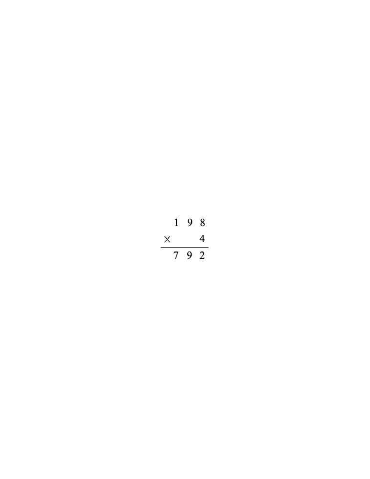

# 第8讲 算式谜

## 一、知识要点与思维方法

一个完整的算式，缺少几个数字，那就成了一道算式谜。
解算式谜，就是要将算式中缺少的数字补齐，使它成为一道完整的算式。
解算式谜的思考方法是推理加上尝试，首先要仔细观察算式特征，由推理能确定的数先填上；不能确定的，要分几种情况，逐一尝试。
分析时要认真
分析已知数字与所缺数字的关系，抓准
解题的突破口。

---

## 二、精选例题精讲与思维导航

### [[小学/奥数/小学奥数举一反三三年级/第08讲_算式谜/例题/Q00094844.md|例题 1]]

![[小学/奥数/小学奥数举一反三三年级/第08讲_算式谜/例题/Q00094844.md]]

### [[小学/奥数/小学奥数举一反三三年级/第08讲_算式谜/例题/Q00094845.md|例题 2]]

![[小学/奥数/小学奥数举一反三三年级/第08讲_算式谜/例题/Q00094845.md]]

### [[小学/奥数/小学奥数举一反三三年级/第08讲_算式谜/例题/Q00094846.md|例题 3]]

![[小学/奥数/小学奥数举一反三三年级/第08讲_算式谜/例题/Q00094846.md]]

### [[小学/奥数/小学奥数举一反三三年级/第08讲_算式谜/例题/Q00094847.md|例题 4]]

![[小学/奥数/小学奥数举一反三三年级/第08讲_算式谜/例题/Q00094847.md]]

### [[小学/奥数/小学奥数举一反三三年级/第08讲_算式谜/例题/Q00094848.md|例题 5]]

![[小学/奥数/小学奥数举一反三三年级/第08讲_算式谜/例题/Q00094848.md]]

---

## 三、变式拓展与举一反三练习

### [[小学/奥数/小学奥数举一反三三年级/第08讲_算式谜/练习/Q00094849.md|练习 1]]

![[小学/奥数/小学奥数举一反三三年级/第08讲_算式谜/练习/Q00094849.md]]

### [[小学/奥数/小学奥数举一反三三年级/第08讲_算式谜/练习/Q00094850.md|练习 2]]

![[小学/奥数/小学奥数举一反三三年级/第08讲_算式谜/练习/Q00094850.md]]

### [[小学/奥数/小学奥数举一反三三年级/第08讲_算式谜/练习/Q00094851.md|练习 3]]

![[小学/奥数/小学奥数举一反三三年级/第08讲_算式谜/练习/Q00094851.md]]

### [[小学/奥数/小学奥数举一反三三年级/第08讲_算式谜/练习/Q00094852.md|练习 4]]

![[小学/奥数/小学奥数举一反三三年级/第08讲_算式谜/练习/Q00094852.md]]

### [[小学/奥数/小学奥数举一反三三年级/第08讲_算式谜/练习/Q00094853.md|练习 5]]

![[小学/奥数/小学奥数举一反三三年级/第08讲_算式谜/练习/Q00094853.md]]

