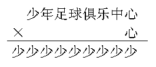

# 第11讲 文字算式谜

## 一、知识要点与思维方法

一般说来，算式都是由一些数字和运算符号组成的，可有些算式却由汉字或英文字母组成，我们称它为文字算式。
文字算式是一种数字谜，
解答时要注意在同一道题中，相同的文字或英文字母应表示相同的数字，不同的文字或英文字母应表示不同的数字。
通过本周的学习，我们可以发现
解文字算式谜与添运算符号、填竖式的步骤与方法基本是一样的，都要仔细观察算式的特征，认真
分析，正确选择
解题的突破口，最后通过尝试找寻正确
答案。

---

## 二、精选例题精讲与思维导航

### [[小学/奥数/小学奥数举一反三三年级/第11讲_文字算式谜/例题/Q00094874.md|例题 1]]

![[小学/奥数/小学奥数举一反三三年级/第11讲_文字算式谜/例题/Q00094874.md]]

### [[小学/奥数/小学奥数举一反三三年级/第11讲_文字算式谜/例题/Q00094875.md|例题 2]]

![[小学/奥数/小学奥数举一反三三年级/第11讲_文字算式谜/例题/Q00094875.md]]

### [[小学/奥数/小学奥数举一反三三年级/第11讲_文字算式谜/例题/Q00094876.md|例题 3]]

![[小学/奥数/小学奥数举一反三三年级/第11讲_文字算式谜/例题/Q00094876.md]]

### [[小学/奥数/小学奥数举一反三三年级/第11讲_文字算式谜/例题/Q00094877.md|例题 4]]

![[小学/奥数/小学奥数举一反三三年级/第11讲_文字算式谜/例题/Q00094877.md]]

### [[小学/奥数/小学奥数举一反三三年级/第11讲_文字算式谜/例题/Q00094878.md|例题 5]]

![[小学/奥数/小学奥数举一反三三年级/第11讲_文字算式谜/例题/Q00094878.md]]

---

## 三、变式拓展与举一反三练习

### [[小学/奥数/小学奥数举一反三三年级/第11讲_文字算式谜/练习/Q00094879.md|练习 1]]

![[小学/奥数/小学奥数举一反三三年级/第11讲_文字算式谜/练习/Q00094879.md]]

### [[小学/奥数/小学奥数举一反三三年级/第11讲_文字算式谜/练习/Q00094880.md|练习 2]]

![[小学/奥数/小学奥数举一反三三年级/第11讲_文字算式谜/练习/Q00094880.md]]

### [[小学/奥数/小学奥数举一反三三年级/第11讲_文字算式谜/练习/Q00094881.md|练习 3]]

![[小学/奥数/小学奥数举一反三三年级/第11讲_文字算式谜/练习/Q00094881.md]]

### [[小学/奥数/小学奥数举一反三三年级/第11讲_文字算式谜/练习/Q00094882.md|练习 4]]

![[小学/奥数/小学奥数举一反三三年级/第11讲_文字算式谜/练习/Q00094882.md]]

### [[小学/奥数/小学奥数举一反三三年级/第11讲_文字算式谜/练习/Q00094883.md|练习 5]]

![[小学/奥数/小学奥数举一反三三年级/第11讲_文字算式谜/练习/Q00094883.md]]

