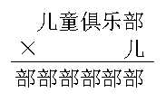

<!-- question-source:start -->
【练习 1】 1.  下面（左下）每个字代表不同的数字，这些汉字分别代表几？
2．如果A、B满足下面算式，它们各代表几？（上中）
3．上右图各个汉字分别代表几？
<!-- question-source:end -->

![[小学/奥数/小学奥数举一反三三年级/第11讲_文字算式谜/练习/answers/Q00094879A1.md]]
