<!-- question-source:start -->
【练习 5】 1．下面（左下）算式中相同的汉字代表相同的数字，不同的汉字代表不同的数字，请问这些汉字各代表几？
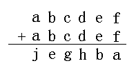
2．上面（上中）各字母分别代表几？
3．上面（上右）竖式中每个字母代表不同的数字，想想下面的算式怎样写？
2.A=1 B=0 C=8 D=9 E=9
3.a=4 b=6 c=8 d=5 e=3 f=2 g=7 h=0 j=9
二、课后作业：
1.下面各题中○、☆各代表一个数，求出它们各代表什么数。
（1）☆+☆－8＝14 11
（2）18×○－16×○＝48 24
2.在下面竖式的方框里填上合适的数字使竖式成立。
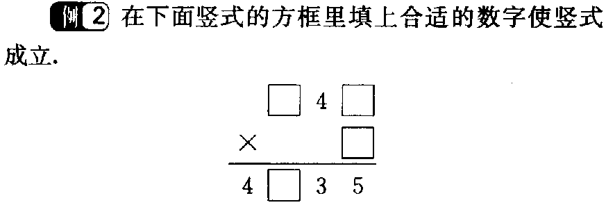
847×5=4235
3.求下列各题中△各代表什么数。
（1）△+△＝18－6 6
（2）2×△+4×△＝24×4 16
4.在□里填上合适的数，使竖式成立。
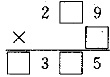
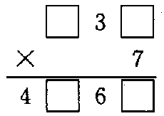
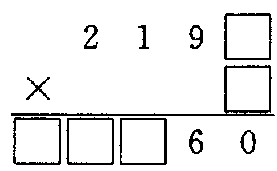
【解析】
根据积的个位数字是5可得，一位数因数是5，又因为最高位是2×5=10，而积的百位数字是3，即第二次乘得的积进位3，则根据5的乘法口诀可得三位数因数的十位数字是6或7，即可得：269×5=1345，符合题意；279×5=1395，也符合题意．

638×7=4466
 2192×5=10960
5.在□里填上合适的数，使竖式成立。
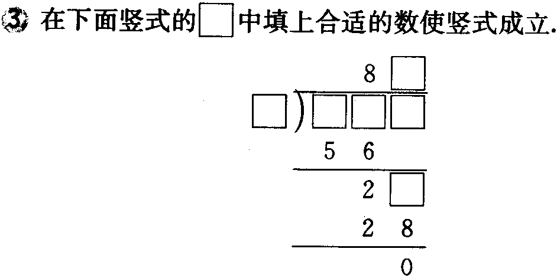
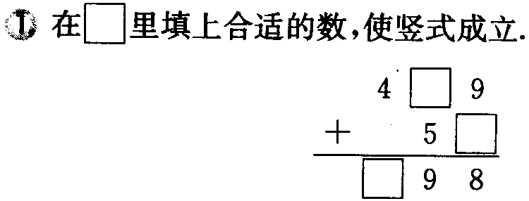
439＋59=498 588÷7=84
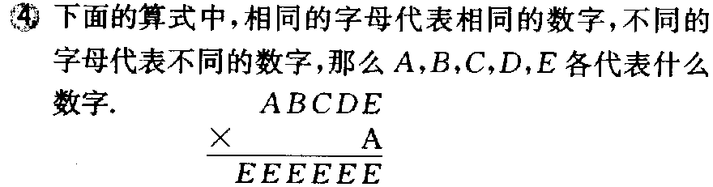6.下面的算式中，相同的字母代表相同的数字，不同的字母代表不同的数字，那么A,B,C,D,E各代表什么数字。
7 9 3 6 5
7.下面各题中的☆、△各代表什么数字？
（1）4+△×2＝18 7
（2）7×3+△÷2＝35 28
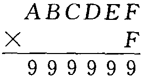8.下面竖式中相同的字母代表相同的数字，不同的字母代表不同的数字，那么各个字母代表什么数呢？
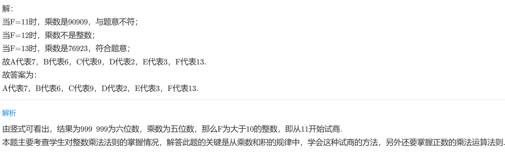
9.下面题中不同的汉子代表不同的数字，相同的汉字代表相同的数字，当每个汉字代表什么数字时竖式成立？
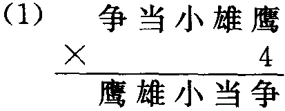
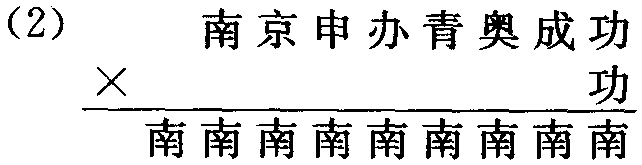
<!-- question-source:end -->

![[小学/奥数/小学奥数举一反三三年级/第11讲_文字算式谜/练习/answers/Q00094883A1.md]]
