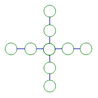

# 第12讲 填数游戏

## 一、知识要点与思维方法

小朋友都喜爱做游戏。填数游戏不但非常有趣，而且能促使你积极地思考问题、
分析问题、发展能力。但有时也有一定的难度，不过，只要你掌握了填写方法，填起来就很轻松了。
填数时，要仔细观察图形，确定图形中关键的位置应填几，一般是图形的顶点及中间位置。另外，要将所填的空与所提供的数字联系起来，一般要先计算所填数的总和与所提供数字的和之差，从而确定关键位置应填几。关键位置的数确定好了，其他问题就迎刃而
解了。

---

## 二、精选例题精讲与思维导航

### [[小学/奥数/小学奥数举一反三三年级/第12讲_填数游戏/例题/Q00094884.md|例题 1]]

![[小学/奥数/小学奥数举一反三三年级/第12讲_填数游戏/例题/Q00094884.md]]

### [[小学/奥数/小学奥数举一反三三年级/第12讲_填数游戏/例题/Q00094885.md|例题 2]]

![[小学/奥数/小学奥数举一反三三年级/第12讲_填数游戏/例题/Q00094885.md]]

### [[小学/奥数/小学奥数举一反三三年级/第12讲_填数游戏/例题/Q00094886.md|例题 3]]

![[小学/奥数/小学奥数举一反三三年级/第12讲_填数游戏/例题/Q00094886.md]]

### [[小学/奥数/小学奥数举一反三三年级/第12讲_填数游戏/例题/Q00094887.md|例题 4]]

![[小学/奥数/小学奥数举一反三三年级/第12讲_填数游戏/例题/Q00094887.md]]

### [[小学/奥数/小学奥数举一反三三年级/第12讲_填数游戏/例题/Q00094888.md|例题 5]]

![[小学/奥数/小学奥数举一反三三年级/第12讲_填数游戏/例题/Q00094888.md]]

---

## 三、变式拓展与举一反三练习

### [[小学/奥数/小学奥数举一反三三年级/第12讲_填数游戏/练习/Q00094889.md|练习 1]]

![[小学/奥数/小学奥数举一反三三年级/第12讲_填数游戏/练习/Q00094889.md]]

### [[小学/奥数/小学奥数举一反三三年级/第12讲_填数游戏/练习/Q00094890.md|练习 2]]

![[小学/奥数/小学奥数举一反三三年级/第12讲_填数游戏/练习/Q00094890.md]]

### [[小学/奥数/小学奥数举一反三三年级/第12讲_填数游戏/练习/Q00094891.md|练习 3]]

![[小学/奥数/小学奥数举一反三三年级/第12讲_填数游戏/练习/Q00094891.md]]

### [[小学/奥数/小学奥数举一反三三年级/第12讲_填数游戏/练习/Q00094892.md|练习 4]]

![[小学/奥数/小学奥数举一反三三年级/第12讲_填数游戏/练习/Q00094892.md]]

### [[小学/奥数/小学奥数举一反三三年级/第12讲_填数游戏/练习/Q00094893.md|练习 5]]

![[小学/奥数/小学奥数举一反三三年级/第12讲_填数游戏/练习/Q00094893.md]]

