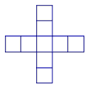
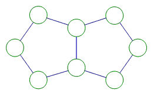

<!-- question-source:start -->
【练习 1】 1.在下图（左下）中填入2------10，使横行、竖行中的五个数的和相同。和是多少呢？

29 47 38 56 中间10
2.把1、4、7、10、13、16、19七个数填入图（中上图）中7朵花里，使每条直线上三个数的和相等。
中间的一朵上填10，然后在周围对边的两朵上成对的填（1，19），（4，16），（7，13），这样每三个数的和均是33.
3.把6、8、10、12、14、16、18七个数填在右上图的○中，使每排三个数及外圆上三个数的和都是32。
**14 12 6**
**8 18 6**
**10 16 6**

<!-- question-source:end -->

![[小学/奥数/小学奥数举一反三三年级/第12讲_填数游戏/练习/answers/Q00094889A1.md]]
