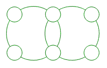
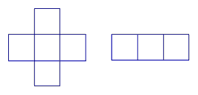
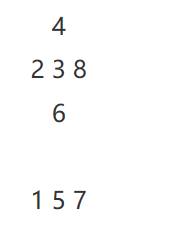

<!-- question-source:start -->
【练习 2】 1.将数字1------6填入下图（左下）中的小圆圈内，使每个大圆上4个数的和都是15。

4 1 7
8 2 5
2.把5、6、7、8、9、10这六个数填入右上图三角形三条边的○内，使得每条边上的三个数的和是21。
5
10 9
6 8 7
3.把1------8这八个数，分别填入下图的各个□内，使得每一横行、每一竖行的三个数的和是13。

<!-- question-source:end -->

![[小学/奥数/小学奥数举一反三三年级/第12讲_填数游戏/练习/answers/Q00094890A1.md]]
