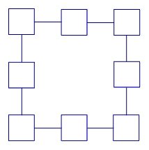
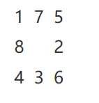
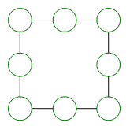

<!-- question-source:start -->
【练习 3】 1.把1------8填入下图（下左）中，使每边3个数的和等于13。

2.将1------9这九个数填入中上图中，使三角形每条边上四个数的和等于19，且有一个顶点的数字为1。
3.把1------10这十个数填入右上图中，使每个正方形顶点圆圈内四个数之和都相等，而且最大。这个和是多少？

<!-- question-source:end -->

![[小学/奥数/小学奥数举一反三三年级/第12讲_填数游戏/练习/answers/Q00094891A1.md]]
