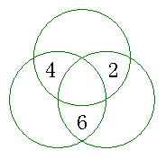

<!-- question-source:start -->
【练习 4】 1.把3------10填入下图（左下）○中，使每边上三个数的和最大，求最大的和是多少？

1 5 6 7 2 3 4 8
2.把1------8填入中上图○中，使每边上三个数的和最小。最小的和是多少？
1 5 6
8 4
3 7 2
3.将数字1------8填入右上图中，使横行□中的数之和等于竖行□中的数之和，这个和可以是多少？
2 3 4 5 6
1
7
8

<!-- question-source:end -->

![[小学/奥数/小学奥数举一反三三年级/第12讲_填数游戏/练习/answers/Q00094892A1.md]]
