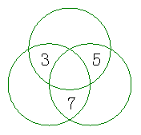

<!-- question-source:start -->
【练习 5】 1.在图（左下图）中各圆的空余部分分别填上1、2、4、6，使每个圆中4个数的和是15。
中间是1 上面是6 左边是4 右边是2
2.在图（中上图）中各圆空余部分分别填上4、5、7、9，使每个圆中4个数的和是27。
中间是4 左边是7 右边是5 上边是9
3.在图（右上图）中各圆空余部分分别填上6、8、10、11.使每个圆中4个数的和是33。
中间11 左边8 右边6 上边10
<!-- question-source:end -->

![[小学/奥数/小学奥数举一反三三年级/第12讲_填数游戏/练习/answers/Q00094893A1.md]]
