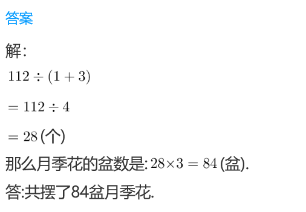
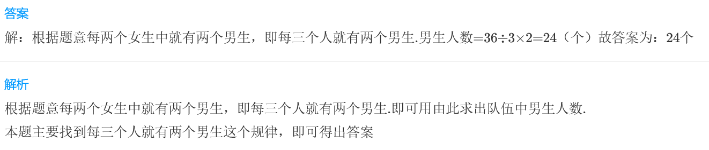
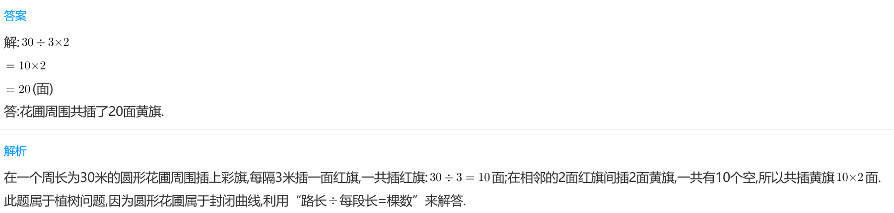

<!-- question-source:start -->
【练习 5】 1.  校门口摆了一排花，每两盆菊花之间摆3盆月季，共摆了112盆花。如果第一盆花是菊花，那么共摆了多少盆月季花？

2.  同学们做早操，36个同学排成一列，每两个女生中间是两个男生，第一个是女生，这列队伍中男生有多少人？

3.一个圆形花辅周围长30米，沿周围每隔3米插一面红旗，每两面红旗中间插两面黄旗。花辅周围共插了多少面黄旗？

<!-- question-source:end -->

![[小学/奥数/小学奥数举一反三三年级/第13讲_周期问题/练习/answers/Q00094903A1.md]]
