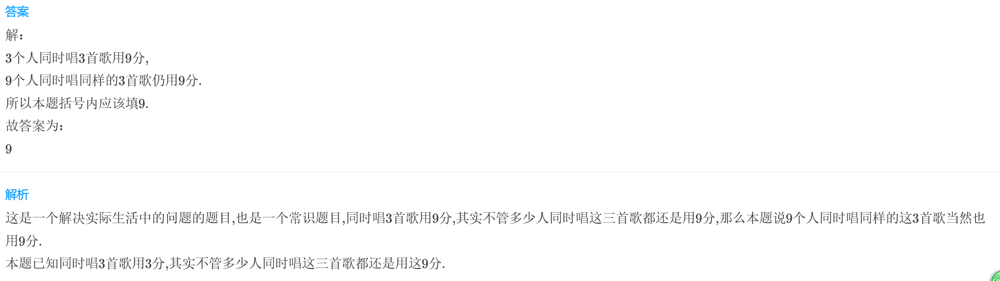
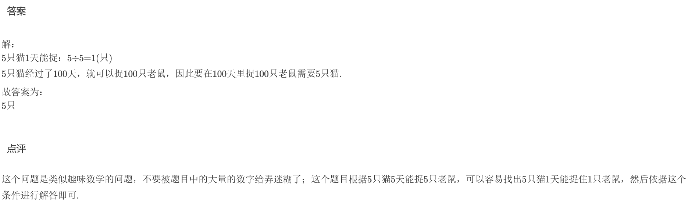

<!-- question-source:start -->
【练习 1】 1.3个人同时唱3首歌用9分钟，9个人同时唱同样的3首歌用几分钟？

2.5只猫5天能捉5只老鼠，照这样计算，要在100天里捉100只老鼠要多少只猫？

3.6个人从甲地到乙地用4小时，如果每人的步行速度相同，那么3个人从甲地到乙地要用几小时？
<!-- question-source:end -->

![[小学/奥数/小学奥数举一反三三年级/第14讲_数学趣题/练习/answers/Q00094909A1.md]]
