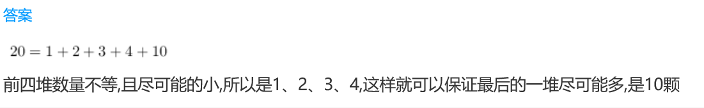
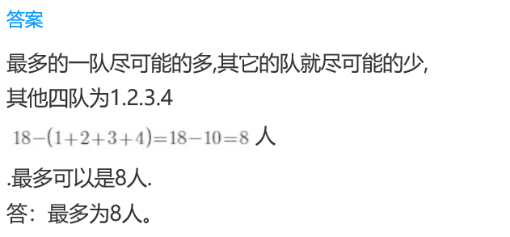

<!-- question-source:start -->
【练习 3】 1.  小明要把20颗珠子分成数量不等的5堆，问最多的一堆中最多可放几颗珠子？

2.  老师为共有18人的舞蹈队设计队形，要求分成人数不等的5队，问最多的一队最多可排几人？

3.  兔妈妈拿来1盘萝卜共25个，分给4只小兔，要使每只小兔分得的个数都不同。问分得最多的一只小兔至多分得几个？
<!-- question-source:end -->

![[小学/奥数/小学奥数举一反三三年级/第14讲_数学趣题/练习/answers/Q00094911A1.md]]
