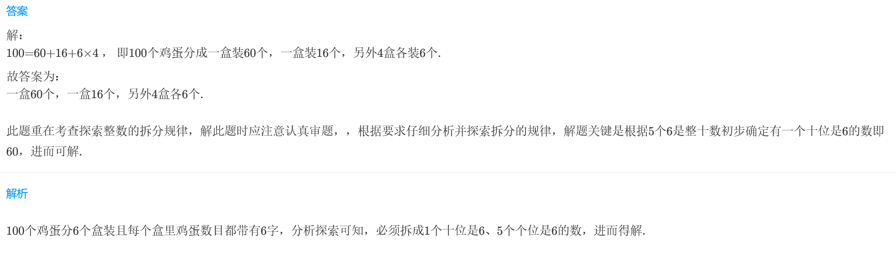
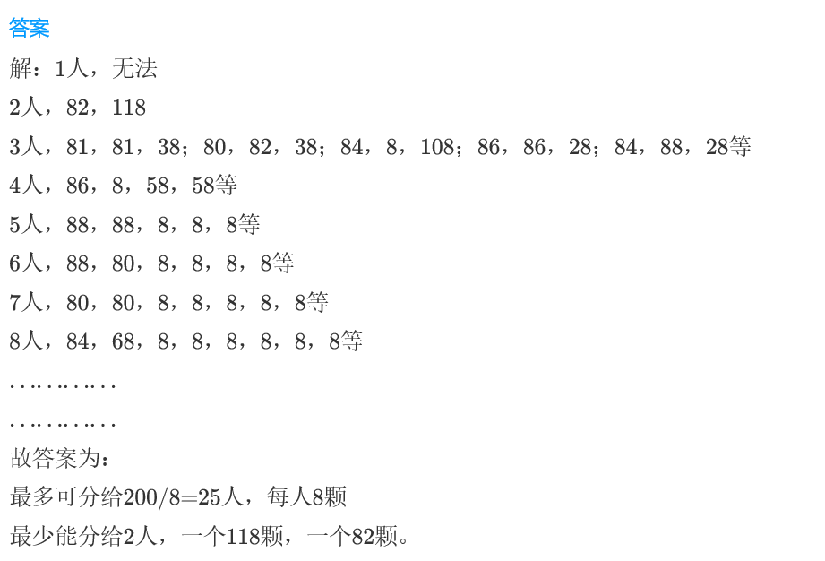
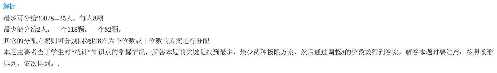
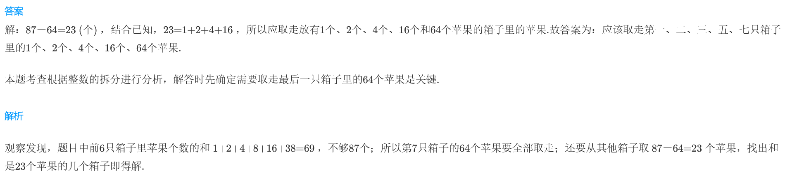

<!-- question-source:start -->
【练习 4】 1.  把100个鸡蛋分装在6个盒里，要求每个盒里装的鸡蛋的数目都带有6字，想想看，应该怎样分？

2.  有人认为8是个吉祥数字，他们得到的东西的数量都要含有数字8。现在有200块糖要分给一些人，请你帮助设计一个吉祥的分糖方案。

3.7只箱子分别放有1只、2只、4只、8只、16只、32只、64只苹果，现在要从这7只箱子里取出87只苹果，但每只箱子内的苹果要么全部取走，要么不取。你看该怎么取？

<!-- question-source:end -->

![[小学/奥数/小学奥数举一反三三年级/第14讲_数学趣题/练习/answers/Q00094912A1.md]]
