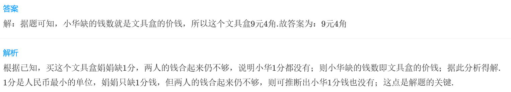
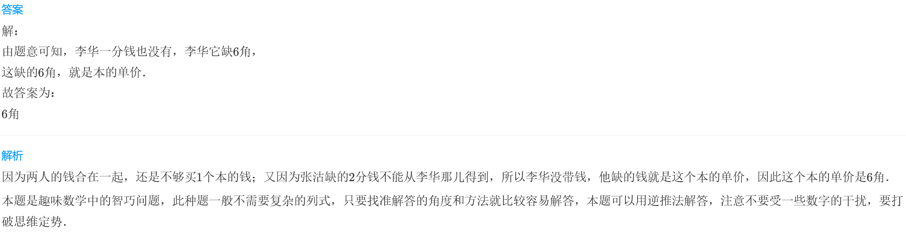
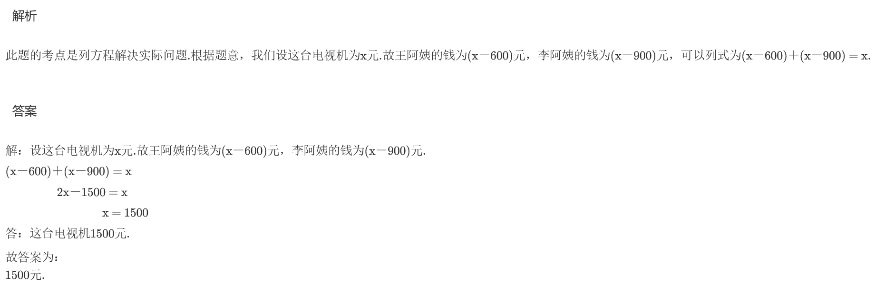

<!-- question-source:start -->
【练习 5】 1.  小华和娟娟到商店买文具盒，两人看中同一个文具盒，但钱都不够。小华缺9元4角，娟娟缺1分，两人合起来买一个仍然不够。这个文具盒多少钱？

2.  李华和张洁到商店买同一种练本，但发现钱都没带够，李华缺6角，张洁缺2分钱，但两人合起来买一本仍不够。这种本子一本多少钱？

3.王阿姨和李阿姨到商场买电视机，两人都看中同一种电视机，但王阿姨缺600元，李阿姨缺900元，用两人带的钱合起来买这一台电视机正好。这台电视机多少钱？

<!-- question-source:end -->

![[小学/奥数/小学奥数举一反三三年级/第14讲_数学趣题/练习/answers/Q00094913A1.md]]
