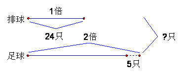

# 第16讲 应用题（一）

## 一、知识要点与思维方法

应用题是小学数学中非常重要的一部分内容，它需要我们小朋友用学到的数学知识来
解决生产、生活中的一些实际问题。学好应用题的关键在于认真
分析题意，掌握数量关系，找到问题的突破口。
在
分析应用题的数量关系时，我们可以从条件出发，逐步推出所求的问题；也可以从问题出发，找到必须的两个条件。在实际
解答时，我们可以根据题目中的数量关系，灵活运用这两种方法。有时，借助线段图来
分析应用题的数量关系，
解答就更容易了。

---

## 二、精选例题精讲与思维导航

### [[小学/奥数/小学奥数举一反三三年级/第16讲_应用题(一)/例题/Q00094924.md|例题 1]]

![[小学/奥数/小学奥数举一反三三年级/第16讲_应用题(一)/例题/Q00094924.md]]

### [[小学/奥数/小学奥数举一反三三年级/第16讲_应用题(一)/例题/Q00094925.md|例题 2]]

![[小学/奥数/小学奥数举一反三三年级/第16讲_应用题(一)/例题/Q00094925.md]]

### [[小学/奥数/小学奥数举一反三三年级/第16讲_应用题(一)/例题/Q00094926.md|例题 3]]

![[小学/奥数/小学奥数举一反三三年级/第16讲_应用题(一)/例题/Q00094926.md]]

### [[小学/奥数/小学奥数举一反三三年级/第16讲_应用题(一)/例题/Q00094927.md|例题 4]]

![[小学/奥数/小学奥数举一反三三年级/第16讲_应用题(一)/例题/Q00094927.md]]

### [[小学/奥数/小学奥数举一反三三年级/第16讲_应用题(一)/例题/Q00094928.md|例题 5]]

![[小学/奥数/小学奥数举一反三三年级/第16讲_应用题(一)/例题/Q00094928.md]]

---

## 三、变式拓展与举一反三练习

### [[小学/奥数/小学奥数举一反三三年级/第16讲_应用题(一)/练习/Q00094929.md|练习 1]]

![[小学/奥数/小学奥数举一反三三年级/第16讲_应用题(一)/练习/Q00094929.md]]

### [[小学/奥数/小学奥数举一反三三年级/第16讲_应用题(一)/练习/Q00094930.md|练习 2]]

![[小学/奥数/小学奥数举一反三三年级/第16讲_应用题(一)/练习/Q00094930.md]]

### [[小学/奥数/小学奥数举一反三三年级/第16讲_应用题(一)/练习/Q00094931.md|练习 3]]

![[小学/奥数/小学奥数举一反三三年级/第16讲_应用题(一)/练习/Q00094931.md]]

### [[小学/奥数/小学奥数举一反三三年级/第16讲_应用题(一)/练习/Q00094932.md|练习 4]]

![[小学/奥数/小学奥数举一反三三年级/第16讲_应用题(一)/练习/Q00094932.md]]

### [[小学/奥数/小学奥数举一反三三年级/第16讲_应用题(一)/练习/Q00094933.md|练习 5]]

![[小学/奥数/小学奥数举一反三三年级/第16讲_应用题(一)/练习/Q00094933.md]]

