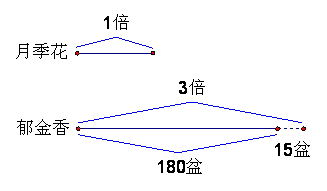

<!-- question-source:start -->
【练习 1】 1.小红每分钟跳绳25下，小军每分钟跳的下数比小红的3倍少16下，小军每分钟比小红多跳几下？

2.王奶奶家养鸡12只，养鹅的只数比鸡的只数的4倍还多7只。王奶奶家共养鸡、鹅多少只？

3.少先队员种柳树30棵，种的杨树的棵数比柳树棵数的3倍多14棵。少先队员种的杨树、柳树共多少棵？

<!-- question-source:end -->

![[小学/奥数/小学奥数举一反三三年级/第16讲_应用题(一)/练习/answers/Q00094929A1.md]]
