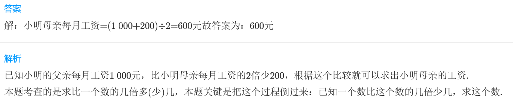
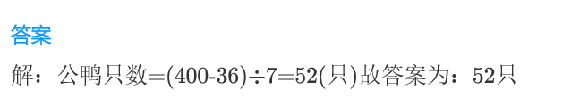
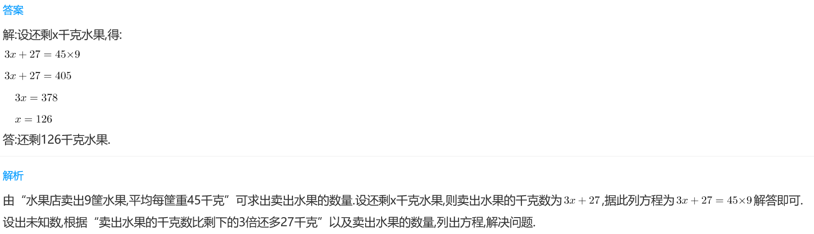

<!-- question-source:start -->
【练习 2】 1.小明的父亲每月工资1000元，比小明母亲每月工资的2倍少200元。小明母亲每月工资多少元？

2.饲养场养母鸭400只，比公鸭只数的7倍还多36只。饲养场养公鸭多少只？

3.  水果店卖出9筐水果，平均每筐重45千克。卖出水果的千克数比剩下的3倍还多27千克，还剩多少千克水果？

<!-- question-source:end -->

![[小学/奥数/小学奥数举一反三三年级/第16讲_应用题(一)/练习/answers/Q00094930A1.md]]
