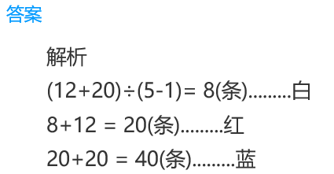
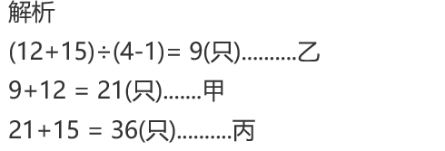
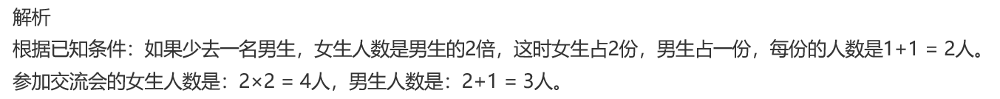

<!-- question-source:start -->
【练习 3】 1.商店里有红、白、蓝三种围巾，其中红围巾比白围巾多12条，蓝围巾比红围巾多20条，蓝围巾的条数正好是白围巾的5倍。红围巾、白围巾、蓝围巾各多少条？

2.有甲、乙、丙三筐苹果，甲筐比乙筐多12只苹果，丙筐比甲筐多15只苹果，丙筐苹果个数是乙筐的4倍。甲、乙、丙筐各有多少只苹果？

3.男女学生参加小组交流会，如果少去1名女生，男女生人数相等；如果少去一名男生，女生人数是男生的2倍。参加交流会的男女生各多少人？

<!-- question-source:end -->

![[小学/奥数/小学奥数举一反三三年级/第16讲_应用题(一)/练习/answers/Q00094931A1.md]]
