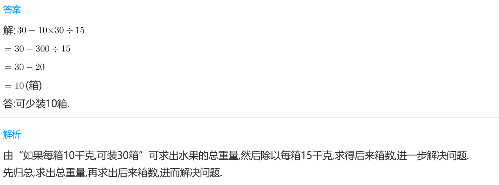
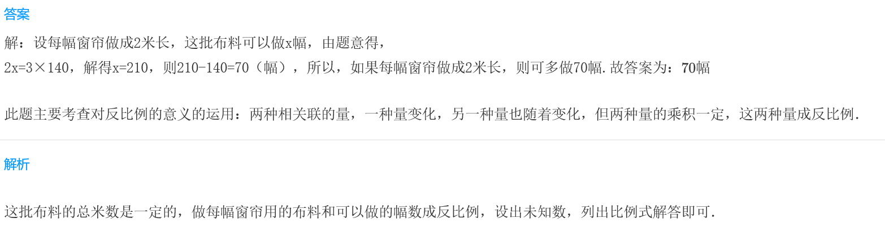
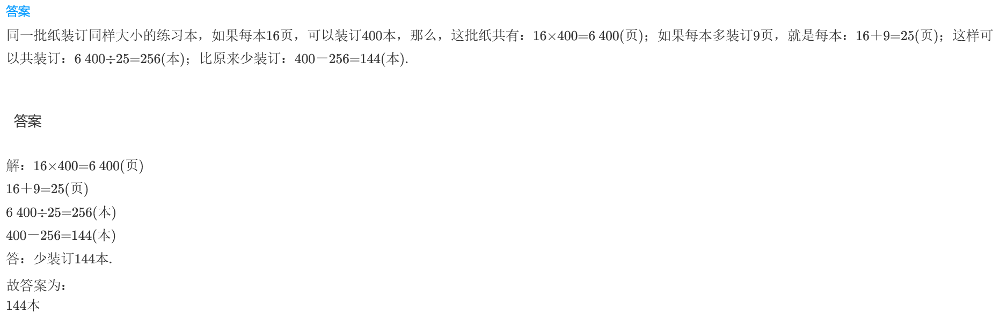

<!-- question-source:start -->
【练习 4】 1.水果市场要将一些水果装箱，如果每箱10千克，可装30箱。如果每箱15千克，可少装多少箱？

3.  服装厂有一些布料加工窗帘，如果把窗帘做成3米长，可做140幅。如果每幅窗帘做成2米长，则可多做多少幅？

4.  同一批纸装订同样大小的练习本，如果每本16页，可装订400本。如果每本多装订9页，则少装订多少本？

<!-- question-source:end -->

![[小学/奥数/小学奥数举一反三三年级/第16讲_应用题(一)/练习/answers/Q00094932A1.md]]
