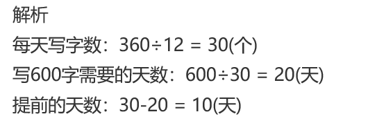
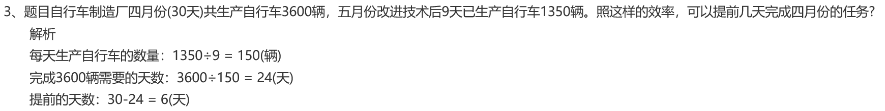

<!-- question-source:start -->
【练习 5】 1.王奶奶计划10小时做纸盒400个，实际3小时已加工150个。照这样的效率，可以提前几小时完成？

> [2]{.mark}暑假中，小宁30天共要写大字600个，实际12天已写大字360个。照这样的速度，小宁可以提前几天写完同样多的字？

3.自行车制造厂四月份（30天）共生产自行车3600辆，五月份改进技术后9天已生产自行车1350辆。照这样的效率，可以提前几天完成四月份的任务？

<!-- question-source:end -->

![[小学/奥数/小学奥数举一反三三年级/第16讲_应用题(一)/练习/answers/Q00094933A1.md]]
