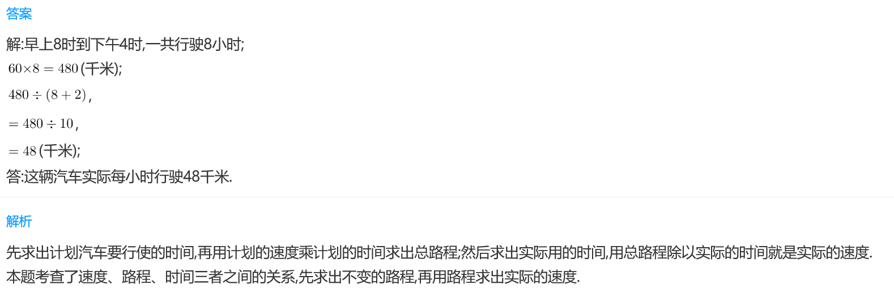
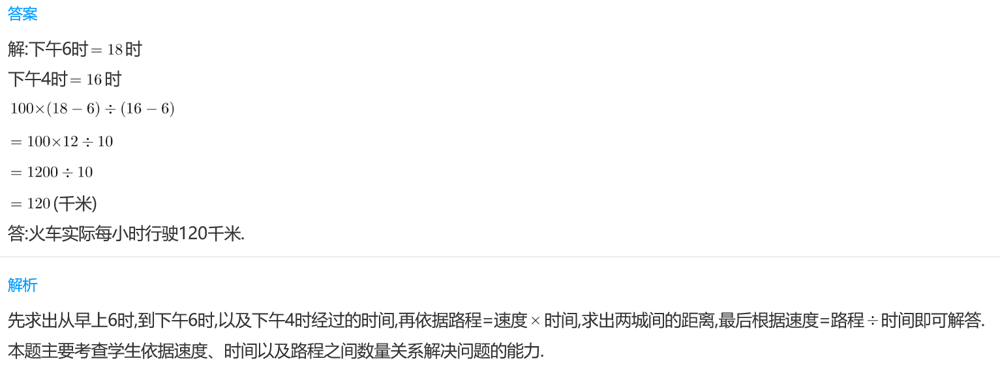
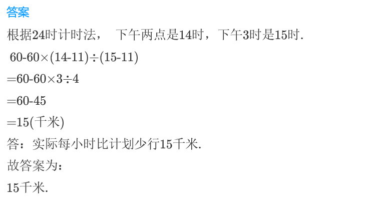

<!-- question-source:start -->
【练习 1】 1.一辆汽车早上8点从甲地开往乙地，按原计划每小时行驶60千米，下午4时到达乙地。但实际晚点2小时到达，这辆汽车实际每小时行驶多少千米？

2.一列火车早上6时从甲城开往乙城，计划每小时行驶100千米，下午6时到达乙城。但实际到达时间是下午4时，提前2小时。问火车实际每小时行驶多少千米？

3.王叔叔驾驶一辆摩托车，上午11时从城东开到城西，计划每小时行驶60千米，下午2时到达城西，实际到达时间是下午3时，晚到1小时。问实际每小时比计划少行多少千米？

<!-- question-source:end -->

![[小学/奥数/小学奥数举一反三三年级/第17讲_应用题(二)/练习/answers/Q00094939A1.md]]
