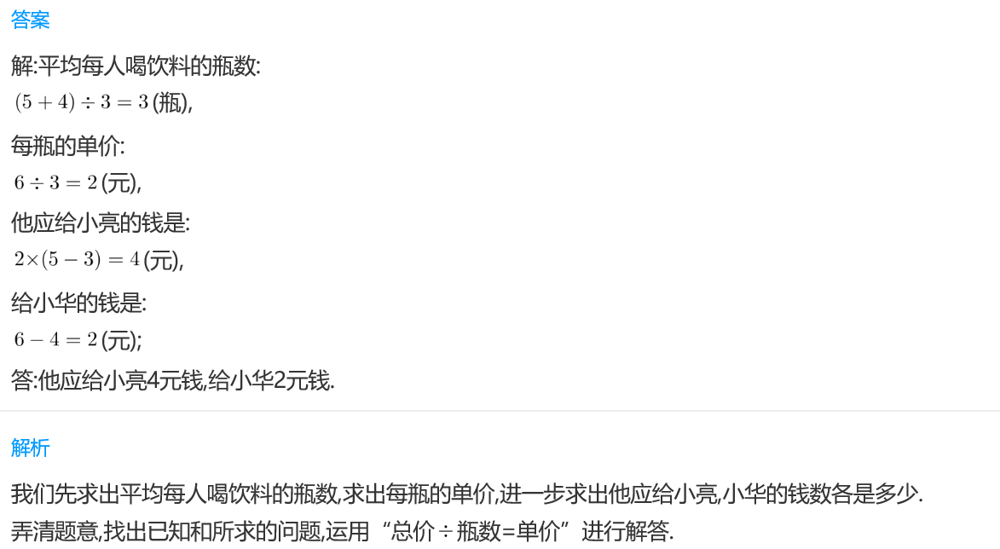
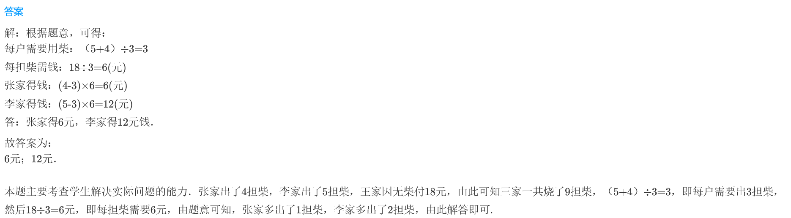

<!-- question-source:start -->
【练习 2】 1.三个好朋友去买饮料，小亮买了5瓶，小华买了4瓶，阳阳没有买。到家后，三个人平均喝完饮料，阳阳拿出6元钱，他应给小亮多少钱？给小华多少钱？

2.甲、乙、丙3人一起买了6个面包分着吃，甲、乙各拿出3个面包的钱，丙没有带钱。那么吃完后，丙应拿出4元8角钱，他应分别给甲、乙多少钱？
2.4元
3.张、王、李三家合用一个炉灶，他们烧的柴同样多，张家出了4担柴，李家出了5担柴，王家因无柴付18元。张、李家各得多少钱？

<!-- question-source:end -->

![[小学/奥数/小学奥数举一反三三年级/第17讲_应用题(二)/练习/answers/Q00094940A1.md]]
