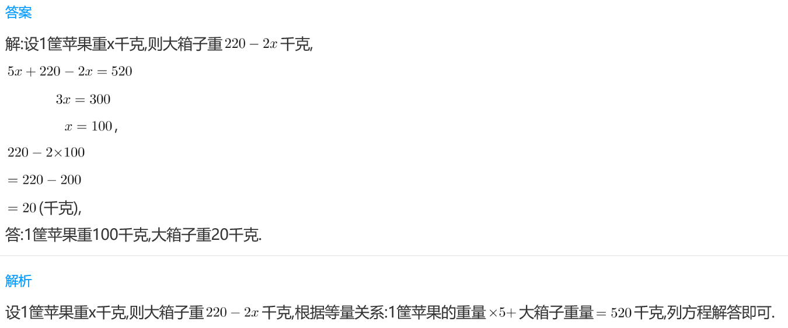
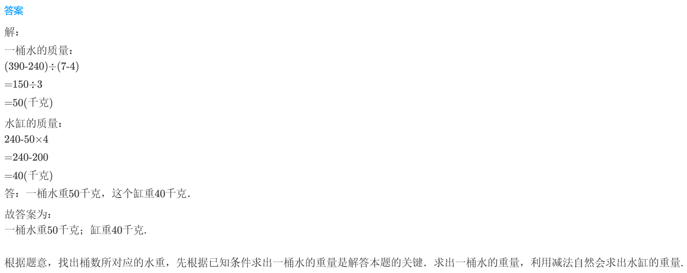
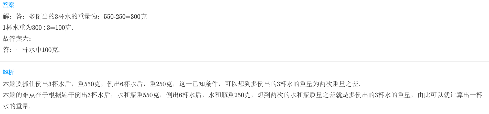

<!-- question-source:start -->
【练习 3】 1.有12筐苹果，它们重量相等，我们把它们装入一个大箱子里，如果装进2筐苹果，连箱共重量220千克；如果装进5筐苹果，连箱共重520千克。1筐苹果和大箱子各重多少千克？

2.有一个木桶向一个水缸中倒水，如果倒进4桶水，连缸共重240千克；如果倒进7桶水，连缸共重390千克。一桶水和一个水缸各重多少千克？

3.有一瓶水，向几个相同的杯子里注水，如果注满3杯水，连瓶重550克；如果注满6杯水，连瓶共重250克。一杯水多重？

<!-- question-source:end -->

![[小学/奥数/小学奥数举一反三三年级/第17讲_应用题(二)/练习/answers/Q00094941A1.md]]
