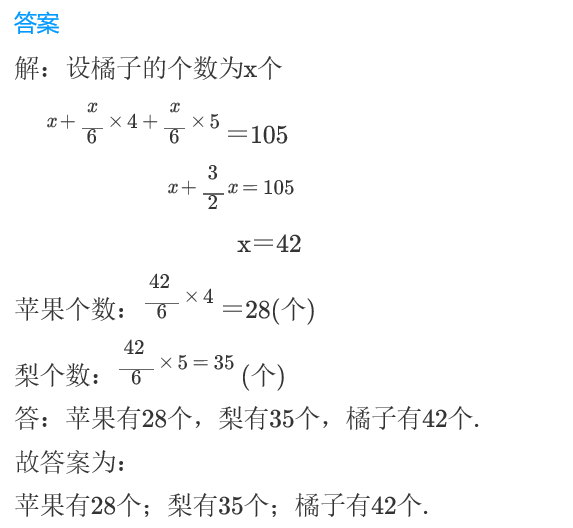
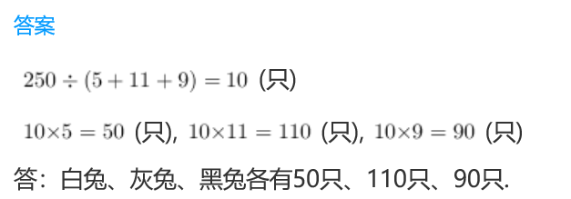
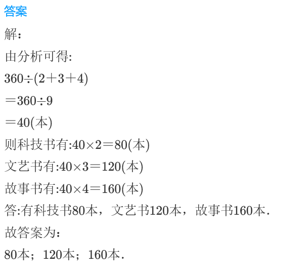

<!-- question-source:start -->
【练习 4】 1.一共有苹果、梨、橘子共105个，如果把苹果分放到4个盘中，把梨分放到5个盘中，把橘子分放到6个盘中，那么每个盘子的水果个数相等。三种水果各多少个？

2.一共有白兔、灰兔、黑兔共250只，如果把白兔分放到5个笼中，把灰兔分放到11个笼中，把黑兔分放到9个笼中，这样每个笼中的兔子的只数相等。三种兔子各多少只？

3.共有科技书、文艺书和故事书共360本，若把科技书分放到2个书架上，把文艺书分放到3个书架上，把故事书分放到4个书架上，则每个书架上的本数相等。三种书各有多少本？

<!-- question-source:end -->

![[小学/奥数/小学奥数举一反三三年级/第17讲_应用题(二)/练习/answers/Q00094942A1.md]]
