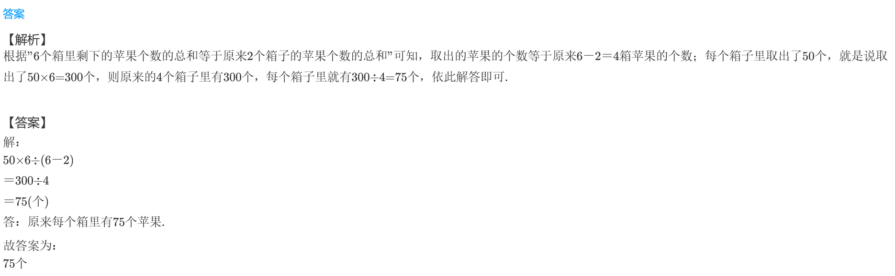
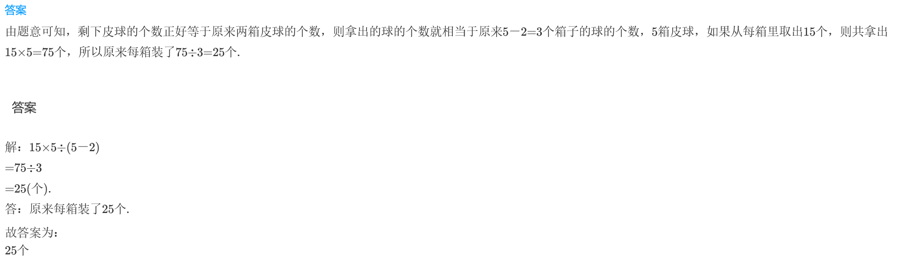
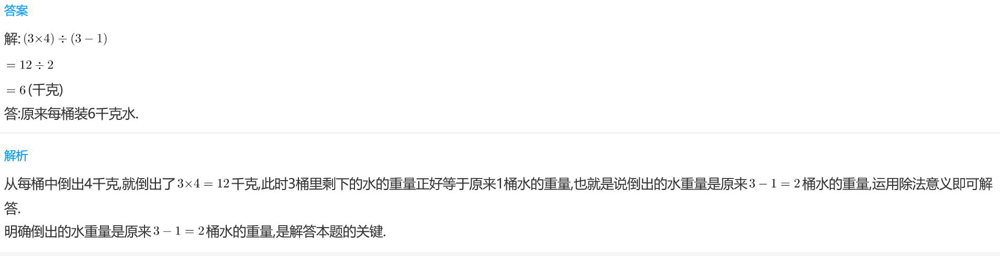

<!-- question-source:start -->
【练习 5】 1.在6个纸箱中放着同样多的苹果。如果从每个纸箱里拿出50个苹果，则6个箱里剩下的苹果个数的总和等于原来2个箱子的苹果个数的总和。原来每个箱里有多少个苹果？

2.某商店有5箱皮球，如果从每箱里取出15个，那么5个箱里剩下皮球的个数正好等于原来2箱皮球的个数。原来每箱装了多少个皮球？

3.有3个水桶，如果从每桶中倒出4千克水，那么3桶里剩下的水的重量正好等于原来1桶的重量。原来每桶装多少千克水？
<!-- question-source:end -->

![[小学/奥数/小学奥数举一反三三年级/第17讲_应用题(二)/练习/answers/Q00094943A1.md]]
