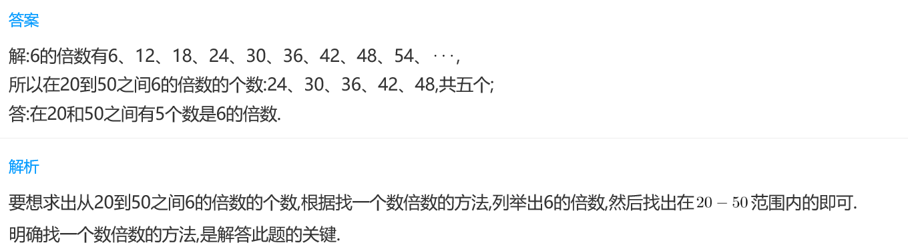
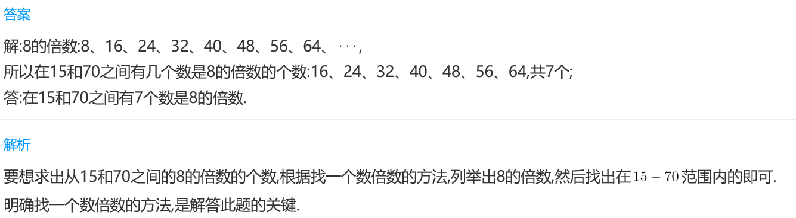
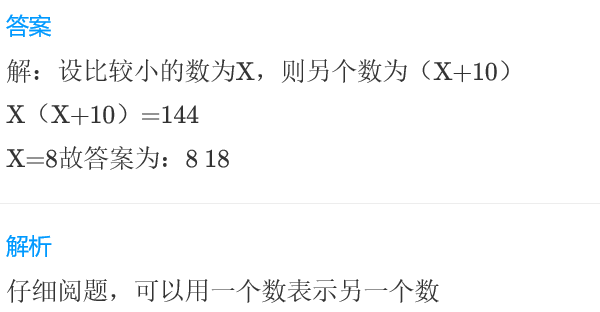

<!-- question-source:start -->
【练习 1】 1.  在20和50之间有多少个数是6的倍数？

2.  在15和70之间有多少个数是8的倍数？

3.两个整数之积为144，差为10，求这两个数。

<!-- question-source:end -->

![[小学/奥数/小学奥数举一反三三年级/第18讲_数字趣谈/练习/answers/Q00094949A1.md]]
