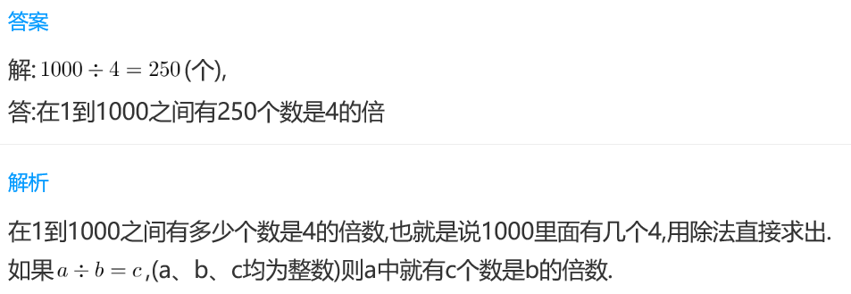
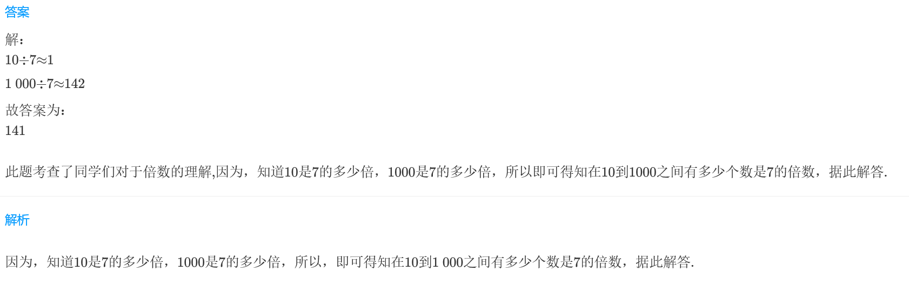
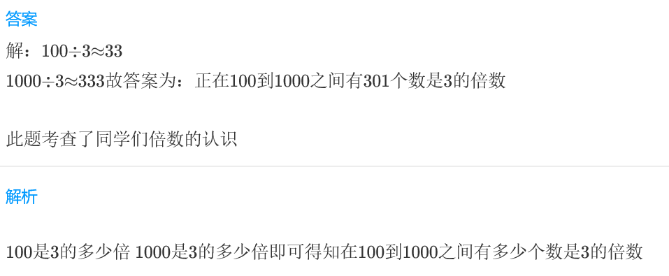

<!-- question-source:start -->
【练习 2】 1.  在1到1000之间有多少个数是4的倍数？

2.  在10到1000之间有多少个数是7的倍数？
3.  在100到1000之间有多少个数是3的倍数？

<!-- question-source:end -->

![[小学/奥数/小学奥数举一反三三年级/第18讲_数字趣谈/练习/answers/Q00094950A1.md]]
