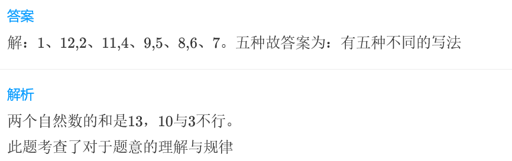
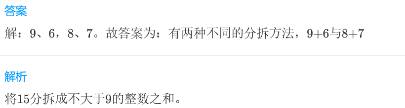
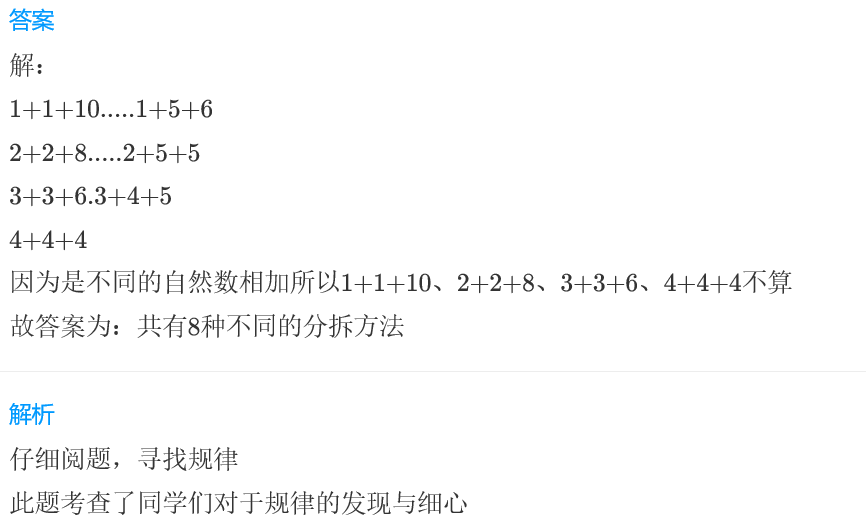

<!-- question-source:start -->
【练习 3】 1.从1------9九个数中选取，将13写成两个不同的自然数之和，有多少种不同的写法？

2.将15分拆成不大于9的两个整数之和，有多少种不同的分拆方法，请列出来。

3.将12分拆成3个不同的自然数相加之和，共有多少种不同的分拆方法？

<!-- question-source:end -->

![[小学/奥数/小学奥数举一反三三年级/第18讲_数字趣谈/练习/answers/Q00094951A1.md]]
