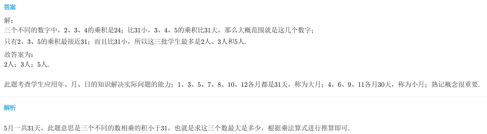
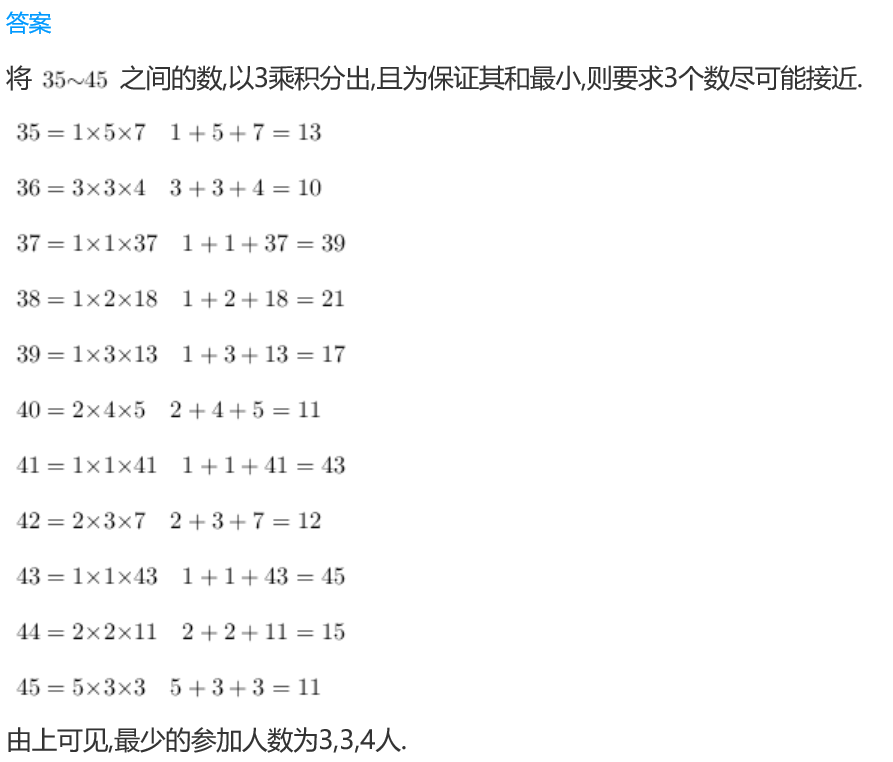
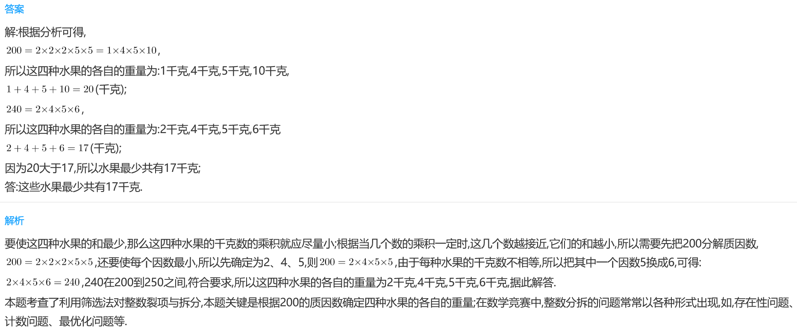

<!-- question-source:start -->
【练习 4】 1.2001年5月的一天，有三批学生去参加助残活动，每批人数不相等，三批人数的乘积正好等于这一天的日期。想一想，这三批学生最多各有多少人？

2.学校进行运动会比赛，三（2）班参加其中三项体育比赛的人数各不相同，而且这三项参赛人数之积在35到45之间。那么三（2）班最少各有多少人参加这三项比赛？

3.小明家有四种水果，每种水果的千克数不相等，这四种水果的千克数的乘积在200到250之间，那么这些水果最少共有多少千克？

<!-- question-source:end -->

![[小学/奥数/小学奥数举一反三三年级/第18讲_数字趣谈/练习/answers/Q00094952A1.md]]
