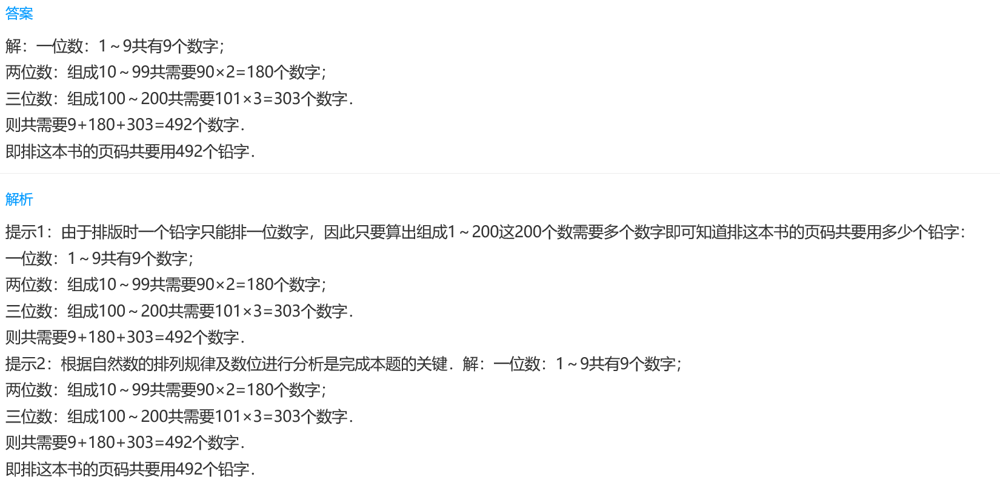
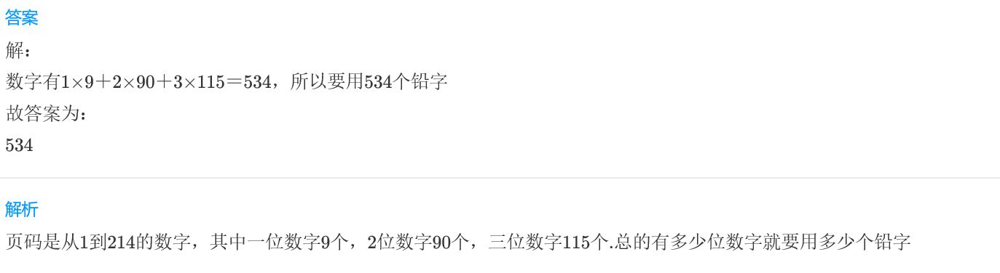
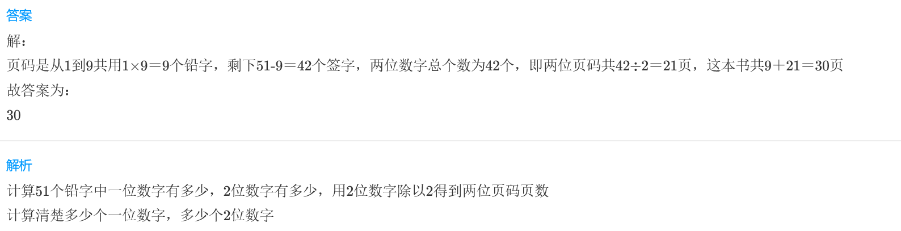

<!-- question-source:start -->
【练习 5】 1.  一本书共200页，排版时一个铅字只能排一位数字，那么排这本书的页码共用了多少个铅字？

2.《宇宙历险记》这本书共214页，编排这本书时共用多少个数码？

3.编排《儿童漫画》的页码时共用了51个数码，这本书共多少页？

<!-- question-source:end -->

![[小学/奥数/小学奥数举一反三三年级/第18讲_数字趣谈/练习/answers/Q00094953A1.md]]
