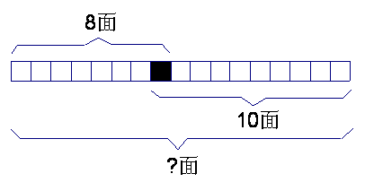

# 第19讲 重叠问题

## 一、知识要点与思维方法

三（1）班准备给参加班级绘画比赛的16位同学和参加朗读比赛的12位同学每人发一份纪念品，当中队长玲玲将28份纪念品发下去时，却多出5份，这是怎么回事？对了，因为有5位同学既参加了绘画比赛，又参加了朗读比赛，所以奖品就多出了5份。数学中，我们将这样的问题称为重叠问题。
解答重叠问题要用到数学中的一个重要原理------包含与排除原理，即当两个计数部分有重复包含时，为了不重复计数，应从它们的和中排除重复部分。
解答重叠问题的应用题，必须从条件入手进行认真的
分析，有时还要画出图示，借助图形进行思考，找出哪些是重复的，重复了几次？明确求的是哪一部分，从而找出
解答方法。

---

## 二、精选例题精讲与思维导航

### [[小学/奥数/小学奥数举一反三三年级/第19讲_重叠问题/例题/Q00094954.md|例题 1]]

![[小学/奥数/小学奥数举一反三三年级/第19讲_重叠问题/例题/Q00094954.md]]

### [[小学/奥数/小学奥数举一反三三年级/第19讲_重叠问题/例题/Q00094955.md|例题 2]]

![[小学/奥数/小学奥数举一反三三年级/第19讲_重叠问题/例题/Q00094955.md]]

### [[小学/奥数/小学奥数举一反三三年级/第19讲_重叠问题/例题/Q00094956.md|例题 3]]

![[小学/奥数/小学奥数举一反三三年级/第19讲_重叠问题/例题/Q00094956.md]]

### [[小学/奥数/小学奥数举一反三三年级/第19讲_重叠问题/例题/Q00094957.md|例题 4]]

![[小学/奥数/小学奥数举一反三三年级/第19讲_重叠问题/例题/Q00094957.md]]

### [[小学/奥数/小学奥数举一反三三年级/第19讲_重叠问题/例题/Q00094958.md|例题 5]]

![[小学/奥数/小学奥数举一反三三年级/第19讲_重叠问题/例题/Q00094958.md]]

---

## 三、变式拓展与举一反三练习

### [[小学/奥数/小学奥数举一反三三年级/第19讲_重叠问题/练习/Q00094959.md|练习 1]]

![[小学/奥数/小学奥数举一反三三年级/第19讲_重叠问题/练习/Q00094959.md]]

### [[小学/奥数/小学奥数举一反三三年级/第19讲_重叠问题/练习/Q00094960.md|练习 2]]

![[小学/奥数/小学奥数举一反三三年级/第19讲_重叠问题/练习/Q00094960.md]]

### [[小学/奥数/小学奥数举一反三三年级/第19讲_重叠问题/练习/Q00094961.md|练习 3]]

![[小学/奥数/小学奥数举一反三三年级/第19讲_重叠问题/练习/Q00094961.md]]

### [[小学/奥数/小学奥数举一反三三年级/第19讲_重叠问题/练习/Q00094962.md|练习 4]]

![[小学/奥数/小学奥数举一反三三年级/第19讲_重叠问题/练习/Q00094962.md]]

### [[小学/奥数/小学奥数举一反三三年级/第19讲_重叠问题/练习/Q00094963.md|练习 5]]

![[小学/奥数/小学奥数举一反三三年级/第19讲_重叠问题/练习/Q00094963.md]]

