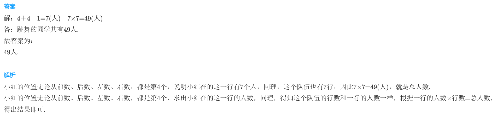
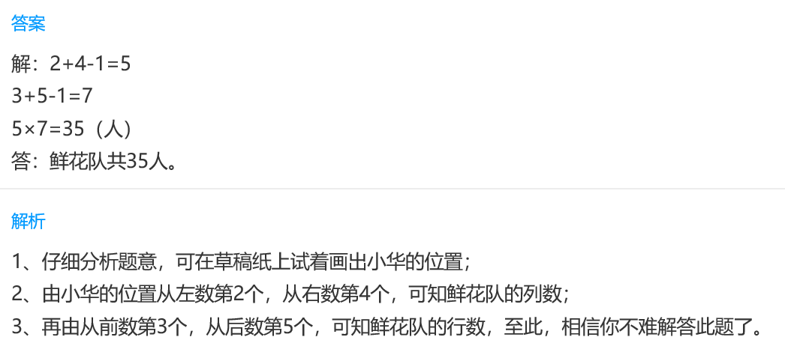
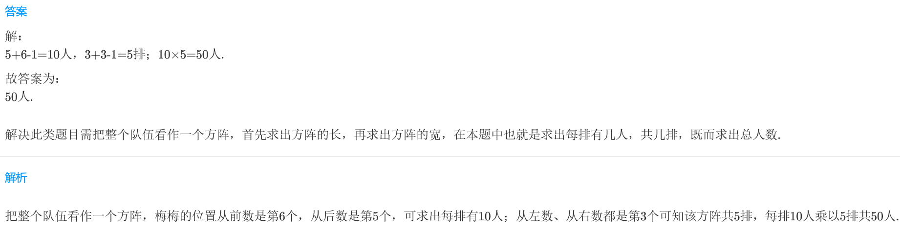

<!-- question-source:start -->
【练习 2】 1.同学们排队跳舞，每行、每列人数同样多。小红的位置无论从前数从后数，从左数还是从右数起都是第4个。跳舞的共有多少人？

2.为庆祝"六一"，同学们排成每行人数相同的鲜花队，小华的位置从左数第2个，从右数第4个；从前数第3个，从后数第5个。鲜花队共多少人？

3.三（4）班排成每行人数相同的队伍入场参加校运动会，梅梅的位置从前数是第6个，从后数是第5个；从左数、从右数都是第3个。三（4）班共有学生多少人？

<!-- question-source:end -->

![[小学/奥数/小学奥数举一反三三年级/第19讲_重叠问题/练习/answers/Q00094960A1.md]]
