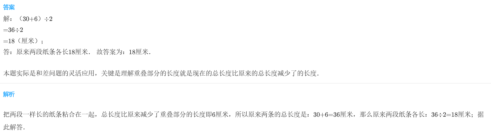
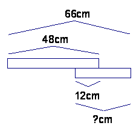
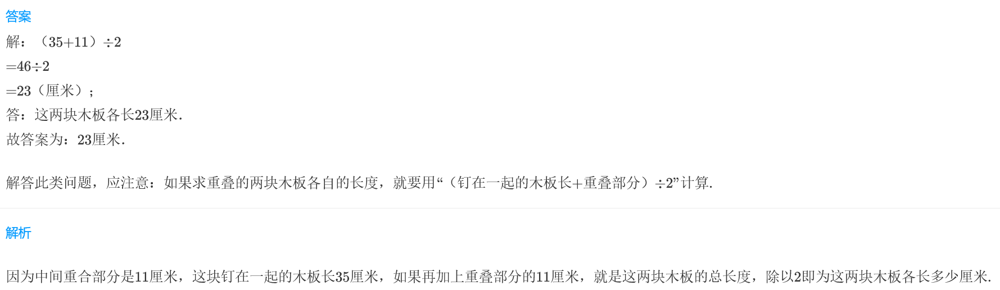
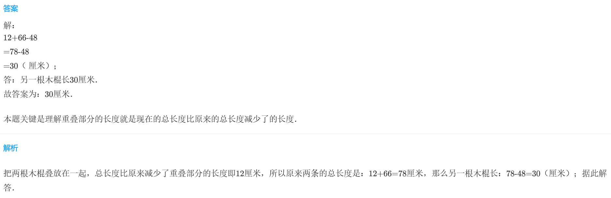

<!-- question-source:start -->
【练习 3】 1.  把两段一样长的纸条粘合在一起，形成一段更长的纸条。这段更长的纸条长30厘米，中间重叠部分是6厘米，原来两段纸条各长多少厘米？

2.把两块一样长的木板钉在一起，钉成一块长35厘米的木板。中间重合部分长11厘
米，这两块木板各长多少厘米？

3.两根木棍放在一起（如图），从头到尾共长66厘米，其中一根木棍长48厘米，中间重叠部分长12厘米。另一根木棍长多少厘米？

<!-- question-source:end -->

![[小学/奥数/小学奥数举一反三三年级/第19讲_重叠问题/练习/answers/Q00094961A1.md]]
