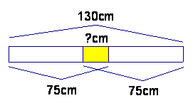
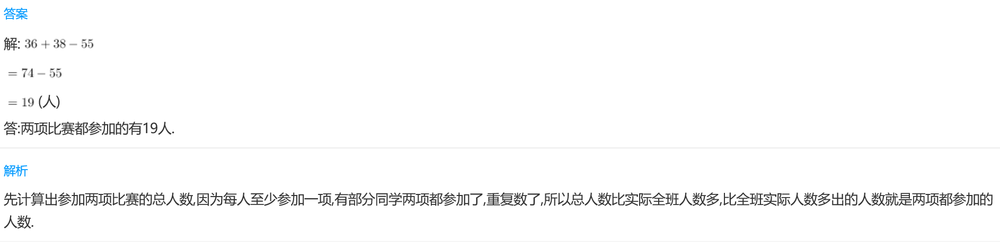
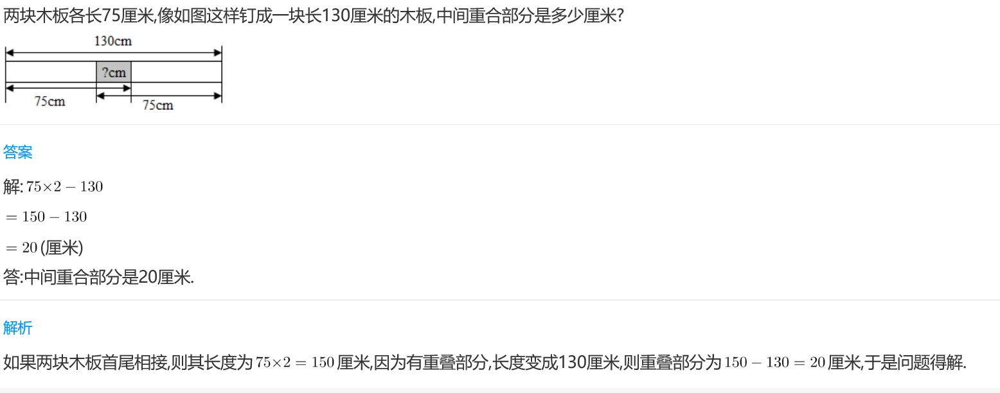
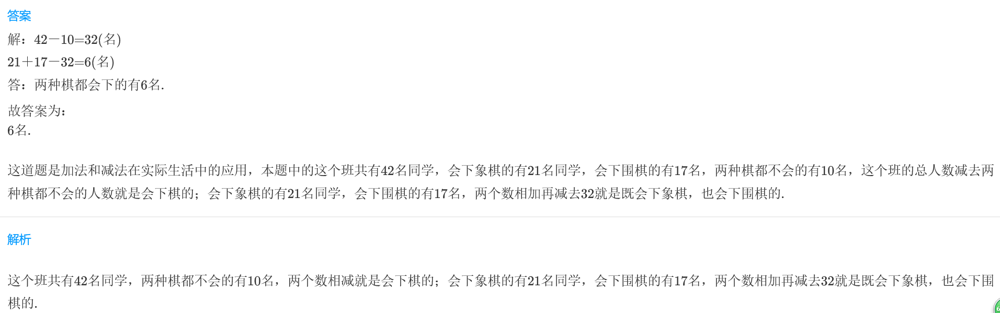

<!-- question-source:start -->
【练习 4】 1.三（1）班有学生55人，每人至少参加赛跑和跳绳比赛中的一种。已知参加赛跑的有36人，参加跳绳的有38人。两项比赛都参加的有几人？

2.两块木板各长75厘米，像下图这样钉成一块长130厘米的木板，中间重合部分是多少厘米？

3.三（5）班有42名同学，会下象棋的有21名同学，会下围棋的有17名，两种棋都不会的有10名。两种棋都会下的有多少名？

<!-- question-source:end -->

![[小学/奥数/小学奥数举一反三三年级/第19讲_重叠问题/练习/answers/Q00094962A1.md]]
