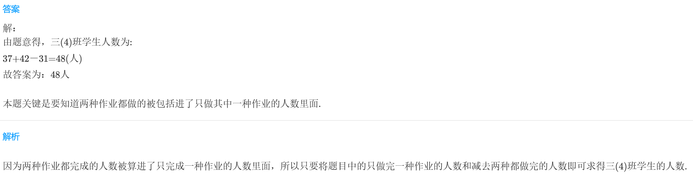
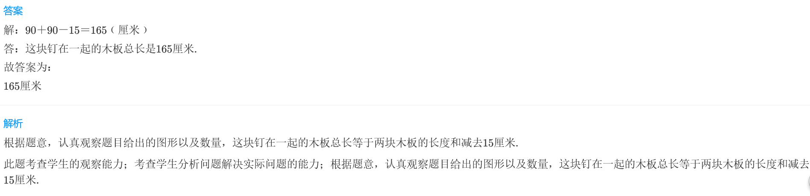
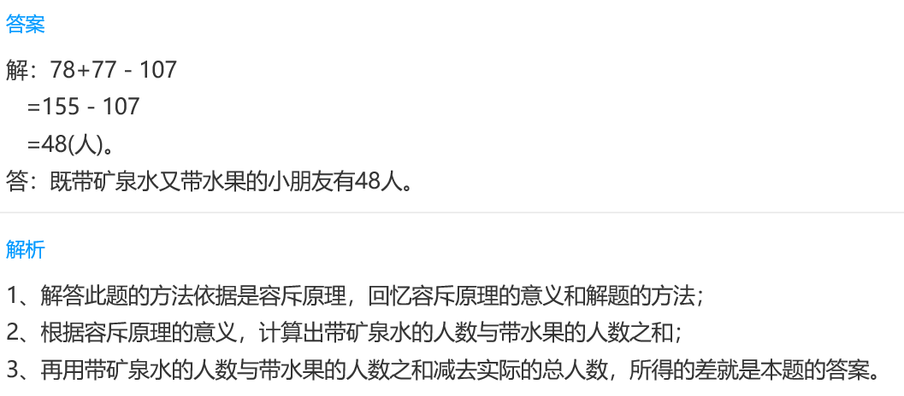

<!-- question-source:start -->
【练习 5】 1.三（4）班做完语文作业的有37人，做完数学作业的有42人，两种作业都完成的有31人，每人至少完成一种作业。三（4）班共有学生多少人？

2.两块木板各长90厘米，像下图这样钉成一块木板，中间重合部分是15厘米，这块钉在一起的木板总长多少厘米？

3.三年级有107个小朋友去春游，带矿泉水的有78人，带水果的有77人，每人至少带一种。三年级既带矿泉水又带水果的小朋友有多少人？

<!-- question-source:end -->

![[小学/奥数/小学奥数举一反三三年级/第19讲_重叠问题/练习/answers/Q00094963A1.md]]
