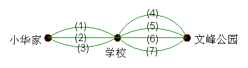

# 第20讲 简单枚举

## 一、知识要点与思维方法

枚举是一种常见的
分析问题、
解决问题的方法。一般地，要根据问题要求，一一列举问题
解答。运用枚举法
解应用题时，必须注意无重复、无遗漏，因此必须有次序、有规律地进行枚举。
运用枚举法
解题的关键是要正确分类，要注意以下两点：一是分类要全，不能造成遗漏；二是枚举要清，要将每一个符合条件的对象都列举出来。

---

## 二、精选例题精讲与思维导航

### [[小学/奥数/小学奥数举一反三三年级/第20讲_简单枚举/例题/Q00094964.md|例题 1]]

![[小学/奥数/小学奥数举一反三三年级/第20讲_简单枚举/例题/Q00094964.md]]

### [[小学/奥数/小学奥数举一反三三年级/第20讲_简单枚举/例题/Q00094965.md|例题 2]]

![[小学/奥数/小学奥数举一反三三年级/第20讲_简单枚举/例题/Q00094965.md]]

### [[小学/奥数/小学奥数举一反三三年级/第20讲_简单枚举/例题/Q00094966.md|例题 3]]

![[小学/奥数/小学奥数举一反三三年级/第20讲_简单枚举/例题/Q00094966.md]]

### [[小学/奥数/小学奥数举一反三三年级/第20讲_简单枚举/例题/Q00094967.md|例题 4]]

![[小学/奥数/小学奥数举一反三三年级/第20讲_简单枚举/例题/Q00094967.md]]

### [[小学/奥数/小学奥数举一反三三年级/第20讲_简单枚举/例题/Q00094968.md|例题 5]]

![[小学/奥数/小学奥数举一反三三年级/第20讲_简单枚举/例题/Q00094968.md]]

---

## 三、变式拓展与举一反三练习

### [[小学/奥数/小学奥数举一反三三年级/第20讲_简单枚举/练习/Q00094969.md|练习 1]]

![[小学/奥数/小学奥数举一反三三年级/第20讲_简单枚举/练习/Q00094969.md]]

### [[小学/奥数/小学奥数举一反三三年级/第20讲_简单枚举/练习/Q00094970.md|练习 2]]

![[小学/奥数/小学奥数举一反三三年级/第20讲_简单枚举/练习/Q00094970.md]]

### [[小学/奥数/小学奥数举一反三三年级/第20讲_简单枚举/练习/Q00094971.md|练习 3]]

![[小学/奥数/小学奥数举一反三三年级/第20讲_简单枚举/练习/Q00094971.md]]

### [[小学/奥数/小学奥数举一反三三年级/第20讲_简单枚举/练习/Q00094972.md|练习 4]]

![[小学/奥数/小学奥数举一反三三年级/第20讲_简单枚举/练习/Q00094972.md]]

### [[小学/奥数/小学奥数举一反三三年级/第20讲_简单枚举/练习/Q00094973.md|练习 5]]

![[小学/奥数/小学奥数举一反三三年级/第20讲_简单枚举/练习/Q00094973.md]]

