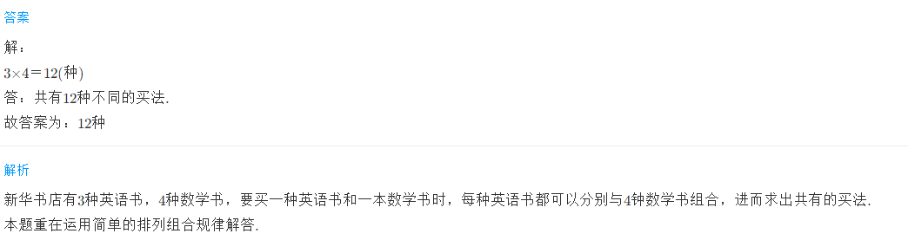
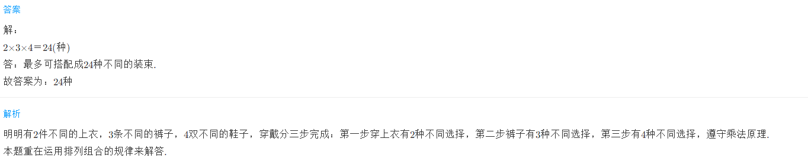

<!-- question-source:start -->
【练习 1】 1.从甲地到乙地，有3条公路直达，从乙地到丙地有2条铁路直达。从甲地到丙地有多少种不同走法？

2.  新华书店有3种不同的英语书，4种不同的数学读物销售。小明想买一种英语书和一种数学读物，共有多少种不同买法？

3.  明明有2件不同的上衣，3条不同的裤子，4双不同的鞋子。最多可搭配成多少种不同的装束？

<!-- question-source:end -->

![[小学/奥数/小学奥数举一反三三年级/第20讲_简单枚举/练习/answers/Q00094969A1.md]]
