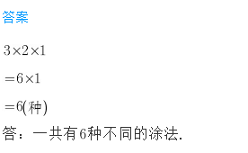
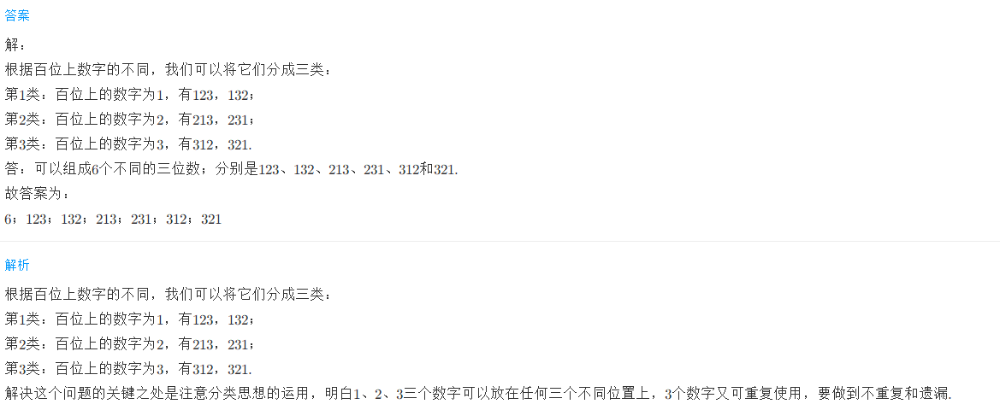
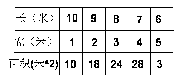

<!-- question-source:start -->
【练习 2】 1.用红、黄、蓝三种颜色涂圆圈，每个圆圈涂一种颜色，一共有多少种不同的涂法？○○○

2.用数字1、2、3.可以组成多少个不同的三位数？分别是哪几个数？

3.用2、3、5、7四个数字，可以组成多少个不同的四位数？
**4×3×2=24**

<!-- question-source:end -->

![[小学/奥数/小学奥数举一反三三年级/第20讲_简单枚举/练习/answers/Q00094970A1.md]]
