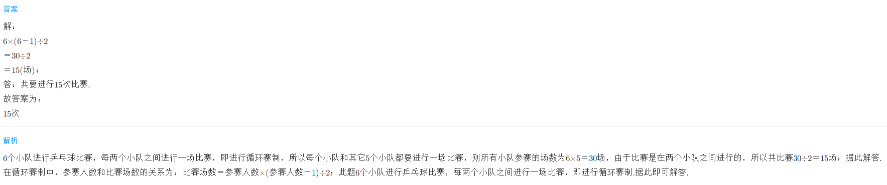
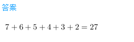
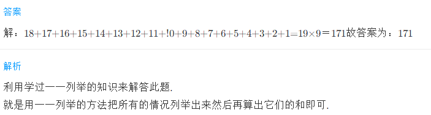

<!-- question-source:start -->
【练习 4】 1.6个小队进行排球比赛，每两队比赛一场，共要进行多少次比赛？

2.有8位小朋友，要互通一次电话，他们一共打了多少次电话？

3.小芳出席由19人参加的联欢会，散会后，每两人都要握一次手，他们一共握了多少次手？

<!-- question-source:end -->

![[小学/奥数/小学奥数举一反三三年级/第20讲_简单枚举/练习/answers/Q00094972A1.md]]
