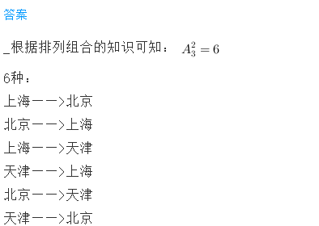

<!-- question-source:start -->
【练习 5】 1.上海、北京、天津三个城市分别设有一个飞机场，它们之间通航一共需要多少种不同的机票？

2.一条公路上，共有8个站点。如果每个起点到终点只用一种车票（中间至少相隔3个车站），那么共有多少种不同的车票？

3.在长江的某一航线上共有6个码头，如果每个起点终点只许用一种船票（中间至少要相隔2个码头），那么这样的船票共有多少种？

<!-- question-source:end -->

![[小学/奥数/小学奥数举一反三三年级/第20讲_简单枚举/练习/answers/Q00094973A1.md]]
