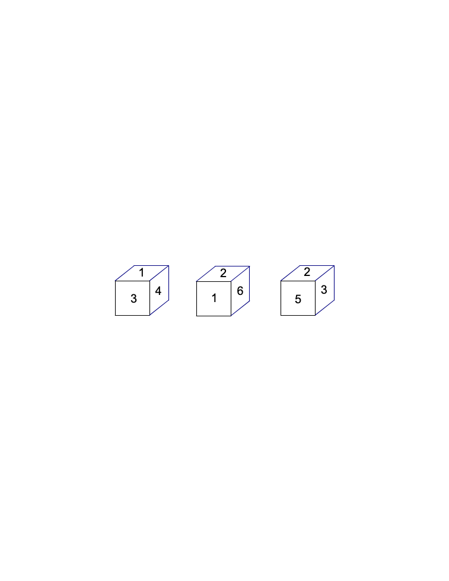
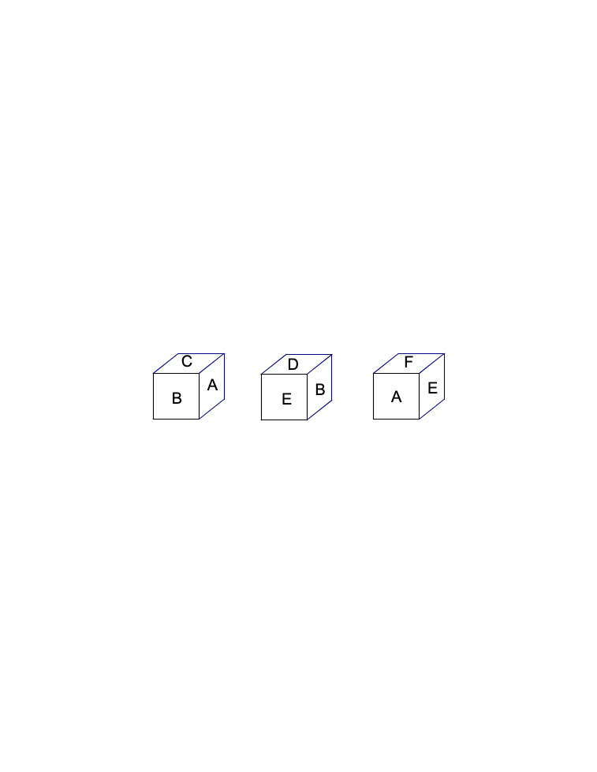

<!-- question-source:start -->
【练习 2】 1，有一个正方体，每个面上分别写着1、2、3、4、5、6，有三个人从不同的角度观察，结果如下：

2，一个正方体，每个面上分别写有A、B、C、D、E、F，根据它三种不同的摆法，判断这个正方体每个字母的对面是什么？

<!-- question-source:end -->

![[小学/奥数/小学奥数举一反三三年级/第34讲_简单推理(二)/练习/answers/Q00095110A1.md]]
