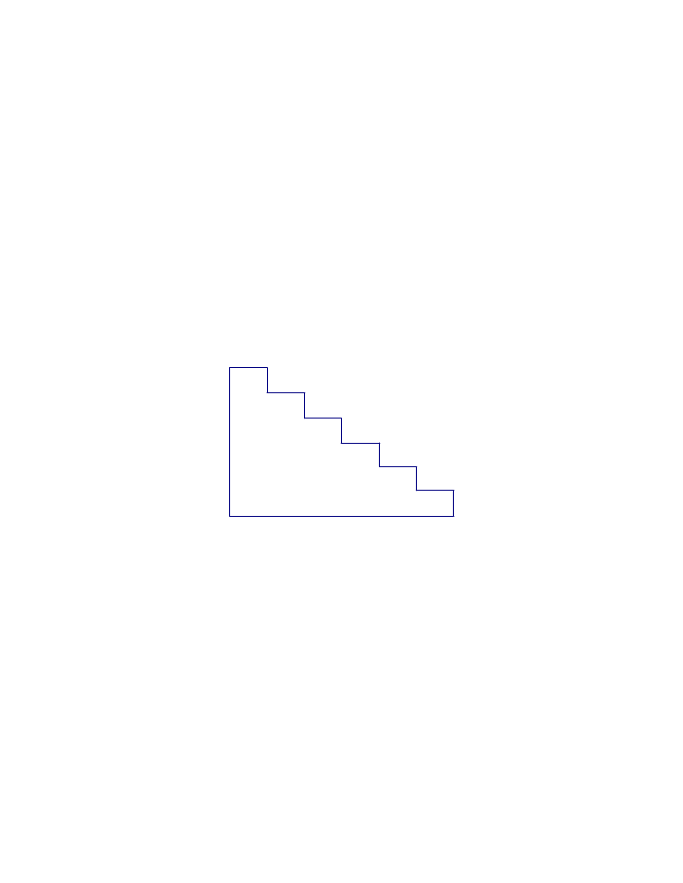
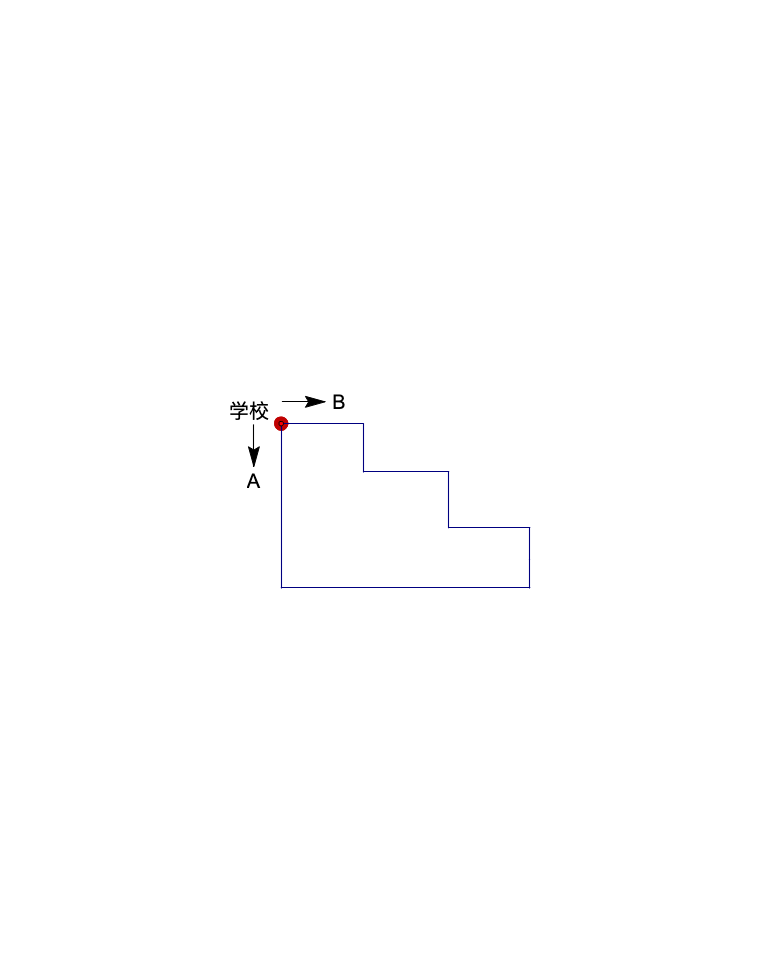
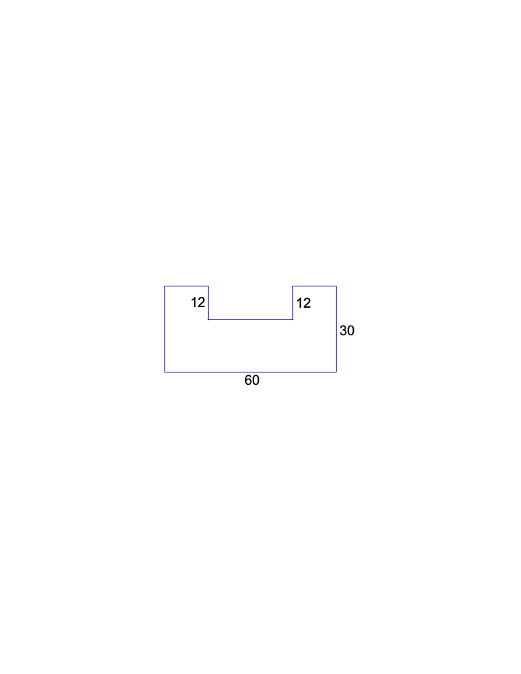

<!-- question-source:start -->
【练习 1】 1，下图是一个楼梯的侧面，如果在阶梯上铺地毯，要计算地毯的长度，可以怎样测量？

2，如下图所示，小明和小玲同时从学校到少儿书店，小明沿A路线行走，小玲沿B路线行走。如果两人速度一样，谁先到少儿书店？为什么？

3，下图是一个"凹"字形的花园，求花园的周长。（单位：米）

<!-- question-source:end -->

![[小学/奥数/小学奥数举一反三三年级/第35讲_巧求周长(一)/练习/answers/Q00095119A1.md]]
