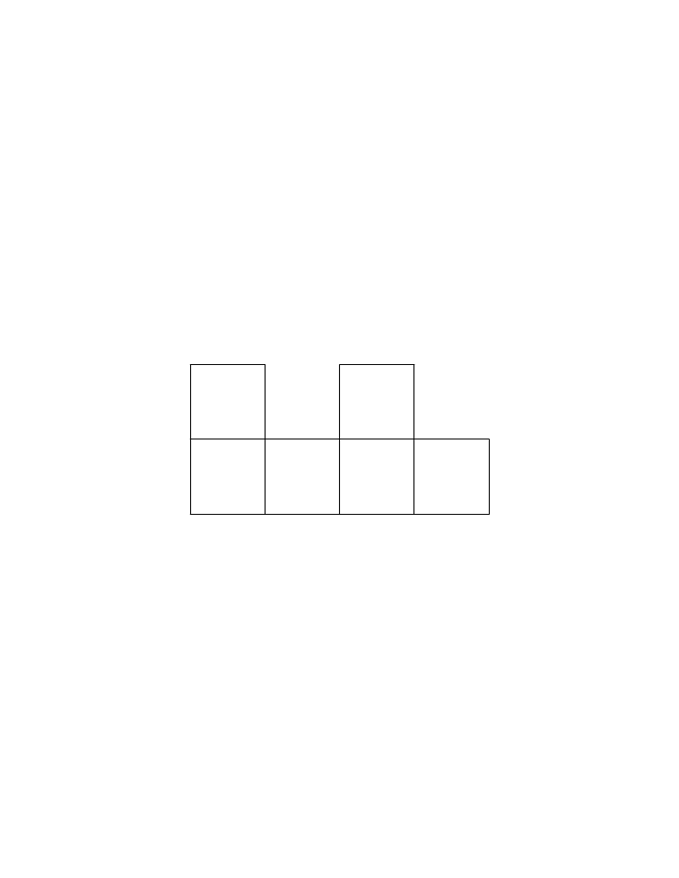

<!-- question-source:start -->
【练习 2】 1，下图是由5个边长为3厘为的正方形组成的图形，求此图形的周长。
2，下图是由6个边长为2厘米的正方形组成的，求此图形的周长。

3，用24个边长是1厘米的正方形拼成一个长方形，这个长方形的周长是多少厘米？
解：（4×1+1）×2=10（厘米）；
（1×2）×4=8（厘米）；
答：这个长方形的周长是10厘米，这个正方形的周长是8厘米；
故
<!-- question-source:end -->

![[小学/奥数/小学奥数举一反三三年级/第35讲_巧求周长(一)/练习/answers/Q00095120A1.md]]
