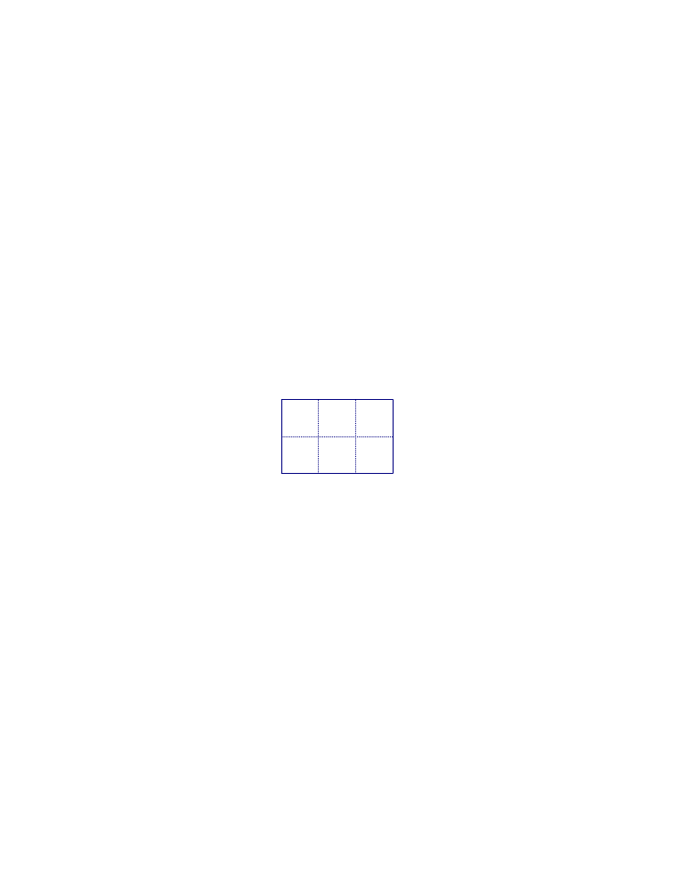

<!-- question-source:start -->
【练习 4】 1，把16个边长为3厘米的小正方形拼成一个大正方形，这个大正方形的周长是多少厘米？
2，把6个边长为4厘米的小正方形如下图拼成一个长方形，这个长方形的周长为多少厘米？

3，把6个长为3厘米、宽为2厘米的小长方形如下图拼成一个大长方形，这个大长方形的周长是多少？
<!-- question-source:end -->

![[小学/奥数/小学奥数举一反三三年级/第35讲_巧求周长(一)/练习/answers/Q00095122A1.md]]
