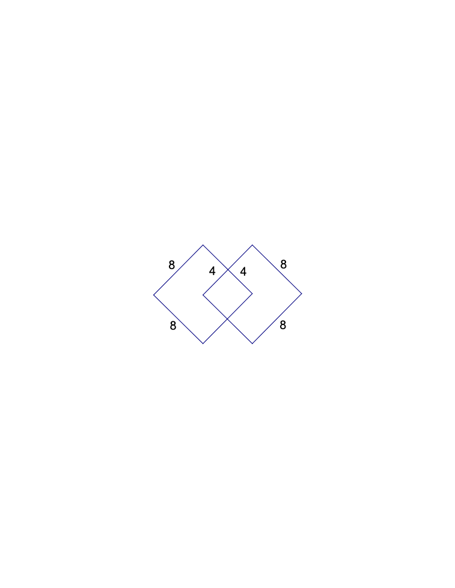
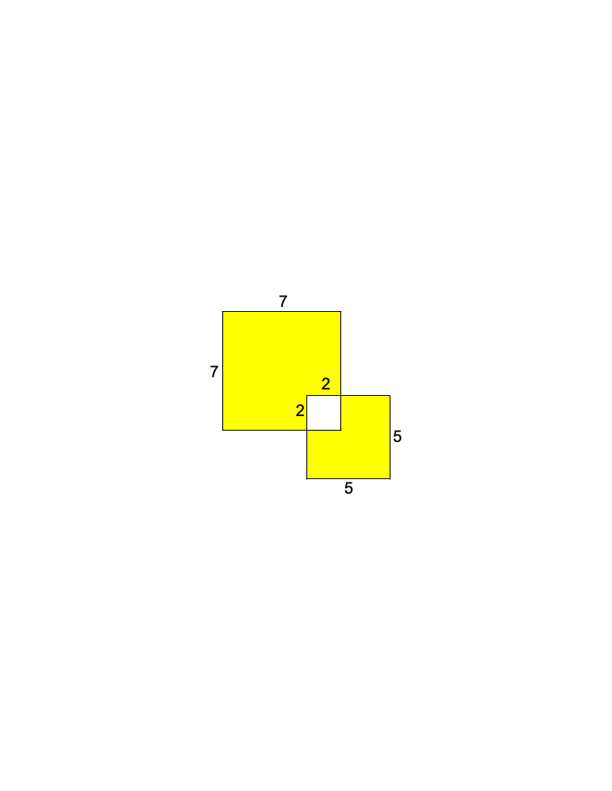
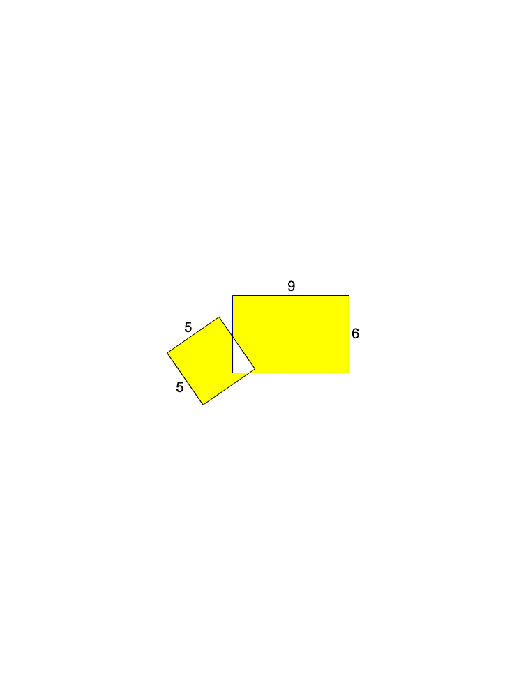

<!-- question-source:start -->
【练习 4】 1，两张边长8厘米的正方形纸，一部分叠在一起放在桌上（如下图），桌面被盖住的面积是多少？
答：桌面被盖住的面积是112平方厘米．
2，求下图中阴影部分的面积。（单位：分米）

3，一个长方形与一个正方形部分重合（如下图），求没有重合的阴影部分面积相差多少？（单位：厘米）

<!-- question-source:end -->

![[小学/奥数/小学奥数举一反三三年级/第37讲_面积计算/练习/answers/Q00095142A1.md]]
