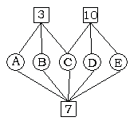

<!-- question-source:start -->
【练习 5】 1.甲、乙、丙三人的平均年龄为22岁，如果甲、乙的平均年龄是18岁，乙、丙的平均年龄是25岁，那么乙的年龄是多少岁？
2.十名参赛者的平均分是82分，前6人的平均分是83分，后6人的平均分是80分。那么第5人和第6人的平均分是多少分？
3.下图中的○内有五个数A、B、C、D、E，□内的数表示与它相连的所有○中的平均数。求C是多少？
<!-- question-source:end -->

![[小学/奥数/小学奥数举一反三五年级/第01讲_平均数(一)/练习/answers/Q00093983A1.md]]
