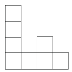

<!-- question-source:start -->
【练习 1】 1.下图由8个边长都是2厘米的正方形组成，求这个图形的周长。
2.下图由1个正方形和2个长方形组成，求这个图形的周长。
3.有6块边长是1厘米的正方形，如例题中所说的这样重叠着，求重叠后图形的周长。

<!-- question-source:end -->

![[小学/奥数/小学奥数举一反三五年级/第03讲_长方形正方形周长/练习/answers/Q00093999A1.md]]
